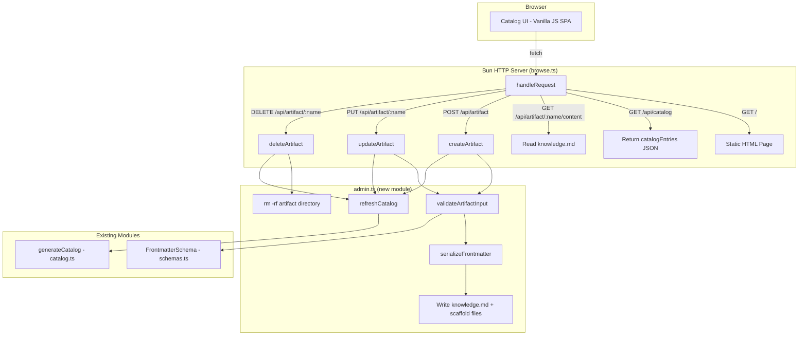

# Design Document: Catalog Admin Management

## Overview

This feature extends the existing `forge catalog browse` server with full CRUD (Create, Read, Update, Delete) capabilities for knowledge artifacts. Currently the browse server is read-only — it serves a static HTML SPA with a JSON API for listing and viewing artifacts. The admin management feature adds three new API endpoints (`POST /api/artifact`, `PUT /api/artifact/:name`, `DELETE /api/artifact/:name`) and corresponding frontend UI (create form, edit form, delete confirmation, notifications) to allow knowledge authors to manage artifacts directly from the browser.

The design follows the existing architectural patterns: the `handleRequest` function in `browse.ts` gains new route branches, a new `admin.ts` module encapsulates all mutation logic (validation, file I/O, frontmatter serialization), and the in-memory catalog is refreshed after each mutation by re-running `generateCatalog`. The frontend remains vanilla JS embedded in the HTML template string, with new form components and a notification system added inline.

## Architecture



The key architectural decisions:

1. **New `admin.ts` module** — Keeps mutation logic separate from the read-only browse server. This module exports pure functions for validation, serialization, and file operations, making them independently testable.

2. **Mutable catalog reference** — The `startBrowseServer` function currently passes `catalogEntries` as a const to `handleRequest`. We change this to pass a mutable wrapper object (`{ entries: CatalogEntry[] }`) so mutations can update the in-memory catalog without restarting the server.

3. **Synchronous catalog refresh** — After each successful mutation, we call `generateCatalog("knowledge")` and replace the entries array. This is simple and correct — the knowledge directory is local and small, so re-scanning is fast.

4. **Frontend stays vanilla JS** — Consistent with the existing approach. Forms are built with DOM manipulation, no framework needed.

## Components and Interfaces

### `admin.ts` — New Module

```typescript
/** Input shape for create/update requests */
export interface ArtifactInput {
  name: string;
  displayName?: string;
  description: string;
  keywords: string[];
  author: string;
  version: string;
  harnesses: string[];
  type: string;
  inclusion?: string;
  categories: string[];
  ecosystem: string[];
  depends: string[];
  enhances: string[];
  body: string;
}

/** Validates ArtifactInput against FrontmatterSchema + name pattern */
export function validateArtifactInput(
  input: ArtifactInput
): { success: true; data: Frontmatter } | { success: false; errors: Array<{ field: string; message: string }> };

/** Converts Frontmatter + body into a knowledge.md string (YAML frontmatter + markdown) */
export function serializeFrontmatter(frontmatter: Frontmatter, body: string): string;

/** Creates a new artifact directory with knowledge.md, hooks.yaml, mcp-servers.yaml, workflows/ */
export async function createArtifact(
  knowledgeDir: string,
  input: ArtifactInput
): Promise<CatalogEntry>;

/** Updates an existing artifact's knowledge.md (preserves other files) */
export async function updateArtifact(
  knowledgeDir: string,
  name: string,
  input: ArtifactInput
): Promise<CatalogEntry>;

/** Deletes an artifact directory recursively */
export async function deleteArtifact(
  knowledgeDir: string,
  name: string
): Promise<void>;
```

### `browse.ts` — Modified

- `handleRequest` gains new route branches for `POST /api/artifact`, `PUT /api/artifact/:name`, `DELETE /api/artifact/:name`
- `startBrowseServer` changes `catalogEntries` from a plain array to a mutable wrapper `{ entries: CatalogEntry[] }` so the `handleRequest` closure can see refreshed data
- A new `refreshCatalog` helper re-scans the knowledge directory and updates the wrapper

### `generateHtmlPage()` — Modified

The HTML template string gains:
- A "New Artifact" button in the header
- A create/edit form component (shared form, toggled between create and edit modes)
- A delete confirmation modal
- A toast notification system for success/error feedback
- Client-side validation for the artifact name field (kebab-case pattern)
- Auto-generation of kebab-case name from displayName

## Data Models

### ArtifactInput (Request Body)

The JSON body sent by the frontend for create and update operations:

```typescript
{
  name: string;           // kebab-case, e.g. "my-new-skill"
  displayName?: string;   // human-readable, e.g. "My New Skill"
  description: string;
  keywords: string[];     // parsed from comma-separated input
  author: string;
  version: string;        // semver, e.g. "0.1.0"
  harnesses: string[];    // subset of SUPPORTED_HARNESSES
  type: string;           // "skill" | "power" | "rule"
  inclusion?: string;     // "always" | "fileMatch" | "manual"
  categories: string[];   // subset of CATEGORIES
  ecosystem: string[];    // kebab-case strings
  depends: string[];      // kebab-case strings
  enhances: string[];     // kebab-case strings
  body: string;           // markdown content
}
```

### Serialized knowledge.md Format

```
---
name: my-new-skill
displayName: My New Skill
description: A description
keywords:
  - keyword1
  - keyword2
author: author-name
version: 0.1.0
harnesses:
  - kiro
  - claude-code
type: skill
inclusion: always
categories:
  - testing
ecosystem: []
depends: []
enhances: []
---

Markdown body content here...
```

The serialization uses `js-yaml` (already a dependency) to dump the frontmatter object, wrapped in `---` delimiters, followed by the body content. This is the inverse of what `gray-matter` does during parsing.

### API Response Shapes

**Success (Create/Update):**
```json
{ "entry": { /* CatalogEntry */ } }
```

**Success (Delete):**
HTTP 204 No Content (empty body)

**Validation Error (400):**
```json
{ "error": "Validation failed", "details": [{ "field": "name", "message": "..." }] }
```

**Conflict Error (409):**
```json
{ "error": "Artifact 'name' already exists" }
```

**Not Found Error (404):**
```json
{ "error": "Artifact 'name' not found" }
```

**Server Error (500):**
```json
{ "error": "Failed to refresh catalog after operation" }
```

## Correctness Properties

*A property is a characteristic or behavior that should hold true across all valid executions of a system — essentially, a formal statement about what the system should do. Properties serve as the bridge between human-readable specifications and machine-verifiable correctness guarantees.*

### Property 1: Frontmatter serialization round-trip

*For any* valid Frontmatter object and any body string, serializing them into a `knowledge.md` string (YAML frontmatter + markdown body) and then parsing that string back with `gray-matter` and `FrontmatterSchema` shall produce an equivalent Frontmatter object and identical body content.

**Validates: Requirements 2.3**

### Property 2: Validation consistency with FrontmatterSchema

*For any* ArtifactInput object, `validateArtifactInput` shall accept the input if and only if the frontmatter fields pass `FrontmatterSchema.safeParse` and the name matches the kebab-case pattern. The validation errors returned shall correspond to the Zod validation issues.

**Validates: Requirements 1.4, 2.2**

### Property 3: Kebab-case name validation

*For any* string, the admin API shall accept it as an Artifact_Name if and only if it matches the pattern `^[a-z0-9]+(-[a-z0-9]+)*$`.

**Validates: Requirements 1.6, 5.1**

### Property 4: Create produces correct file structure

*For any* valid ArtifactInput, calling `createArtifact` shall produce a directory under `knowledge/` containing exactly: `knowledge.md` (parseable with valid frontmatter), `hooks.yaml`, `mcp-servers.yaml`, and a `workflows/` subdirectory.

**Validates: Requirements 1.3**

### Property 5: Update preserves non-knowledge.md files

*For any* existing artifact with arbitrary `hooks.yaml` and `mcp-servers.yaml` content, calling `updateArtifact` with new frontmatter and body shall leave the `hooks.yaml` and `mcp-servers.yaml` files byte-identical to their pre-update state.

**Validates: Requirements 2.4**

### Property 6: Delete removes artifact directory

*For any* existing artifact, calling `deleteArtifact` shall result in the artifact's directory no longer existing under `knowledge/`.

**Validates: Requirements 3.2**

### Property 7: Catalog consistency after mutations

*For any* sequence of create, update, and delete operations, after each operation completes, the in-memory catalog entries shall be equivalent to a fresh call to `generateCatalog("knowledge")`.

**Validates: Requirements 4.4, 6.1**

### Property 8: toKebabCase produces valid kebab-case

*For any* non-empty display name string containing at least one alphanumeric character, the `toKebabCase` conversion function shall produce a string matching the pattern `^[a-z0-9]+(-[a-z0-9]+)*$`.

**Validates: Requirements 5.3**

### Property 9: Comma-separated string parsing round-trip

*For any* array of non-empty strings that do not contain commas, joining them with commas and then splitting/trimming back into an array shall produce the original array.

**Validates: Requirements 7.3**

## Error Handling

### Server-Side Error Handling

| Condition | HTTP Status | Response |
|---|---|---|
| Invalid/missing Content-Type header | 400 | `{ "error": "Content-Type must be application/json" }` |
| Malformed JSON body | 400 | `{ "error": "Invalid JSON body" }` |
| Frontmatter validation failure | 400 | `{ "error": "Validation failed", "details": [{ "field": "...", "message": "..." }] }` |
| Invalid artifact name pattern | 400 | `{ "error": "Validation failed", "details": [{ "field": "name", "message": "..." }] }` |
| Artifact already exists (create) | 409 | `{ "error": "Artifact 'name' already exists" }` |
| Artifact not found (update/delete) | 404 | `{ "error": "Artifact 'name' not found" }` |
| File system error during write | 500 | `{ "error": "Failed to create/update artifact" }` |
| Catalog refresh failure | 500 | `{ "error": "Operation succeeded but catalog refresh failed" }` |

All error responses use `Content-Type: application/json`. The `handleRequest` function wraps mutation calls in try/catch to ensure errors are always returned as structured JSON, never as raw stack traces.

### Client-Side Error Handling

- **Validation errors (400)**: Parse the `details` array and display each error message next to the corresponding form field. Highlight invalid fields with a red border.
- **Conflict errors (409)**: Display an inline message below the name field indicating the name is taken.
- **Not-found errors (404)**: Display a toast notification and navigate back to the card grid (the artifact was likely deleted externally).
- **Server errors (500)**: Display a generic toast notification: "Something went wrong. Please try again."
- **Network errors**: Display a toast notification: "Unable to reach the server."

### Input Validation Strategy

Validation happens at two layers:

1. **Client-side (immediate feedback)**: The name field validates against the kebab-case regex on every keystroke. Required fields are checked before submission. This prevents unnecessary round-trips.
2. **Server-side (authoritative)**: `validateArtifactInput` runs the full `FrontmatterSchema` validation via Zod. The server is the source of truth — client-side validation is a UX convenience, not a security boundary.

## Testing Strategy

### Property-Based Tests (fast-check)

The project already uses `fast-check` for property-based testing. Each correctness property maps to a single property-based test with a minimum of 100 iterations.

**Test file**: `src/__tests__/admin.property.test.ts`

Properties to implement:
- Property 1: Frontmatter serialization round-trip — reuse the existing `frontmatterArb` generator from `schema-roundtrip.property.test.ts`, serialize with `serializeFrontmatter`, parse back with `gray-matter` + `FrontmatterSchema`
- Property 2: Validation consistency — generate random objects (both valid and invalid), verify `validateArtifactInput` agrees with `FrontmatterSchema.safeParse`
- Property 3: Kebab-case validation — generate random strings, verify acceptance matches regex
- Property 4: Create file structure — generate valid inputs, create in a temp directory, verify file structure
- Property 5: Update preserves files — create artifact with known hooks/mcp content, update, verify those files unchanged
- Property 6: Delete removes directory — create then delete, verify directory gone
- Property 7: Catalog consistency — sequence of operations, verify in-memory matches fresh scan
- Property 8: toKebabCase output — generate display names, verify output matches pattern
- Property 9: Comma-separated round-trip — generate string arrays, join/split, verify equivalence

Tag format: `Feature: catalog-admin-management, Property N: <title>`

### Unit Tests (example-based)

**Test file**: `src/__tests__/admin.test.ts`

- `serializeFrontmatter` with known inputs produces expected YAML output
- `validateArtifactInput` rejects specific invalid cases (empty name, invalid harness, etc.)
- `createArtifact` conflict error when directory exists
- `updateArtifact` not-found error when directory missing
- `deleteArtifact` not-found error when directory missing
- `handleRequest` routes POST/PUT/DELETE correctly (status codes, response shapes)
- Content-Type validation on mutation endpoints

### Integration Tests

**Test file**: `src/__tests__/browse.test.ts` (extend existing)

- Full HTTP round-trip: POST create → GET catalog → verify entry present
- Full HTTP round-trip: PUT update → GET catalog → verify entry updated
- Full HTTP round-trip: DELETE → GET catalog → verify entry removed
- Error responses have correct JSON shape for all error codes

