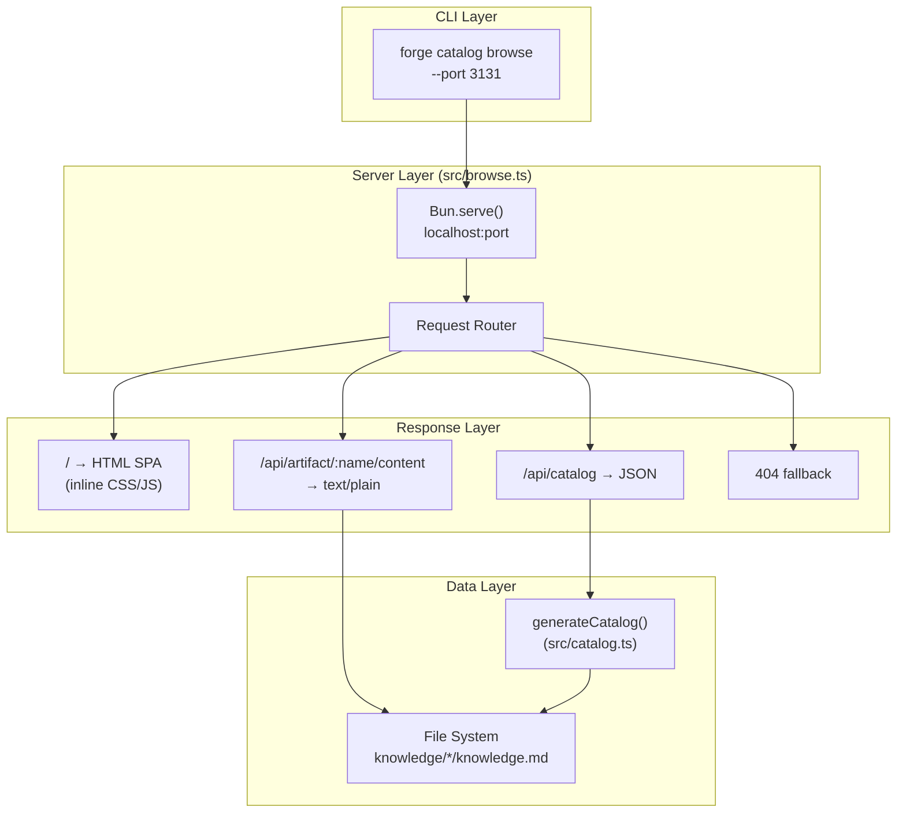
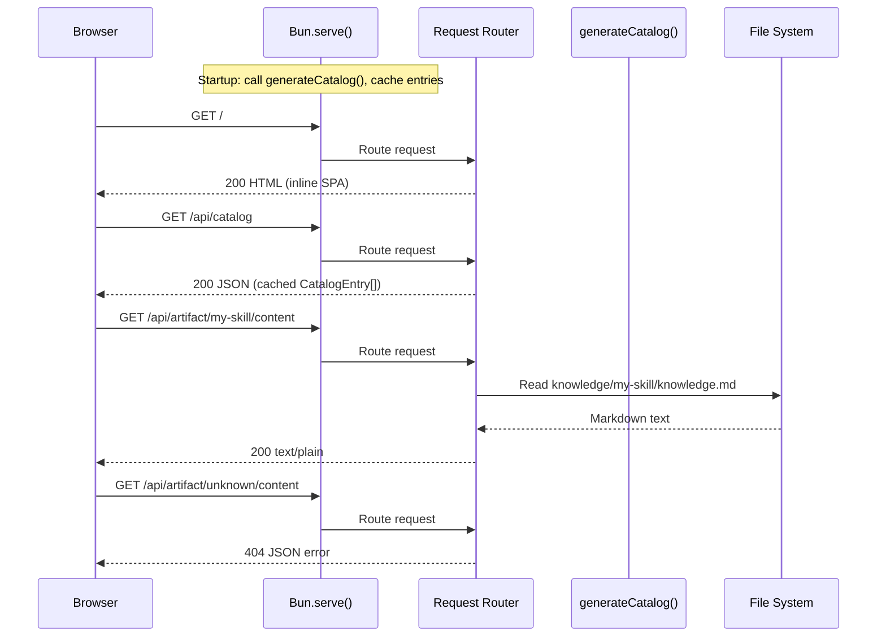
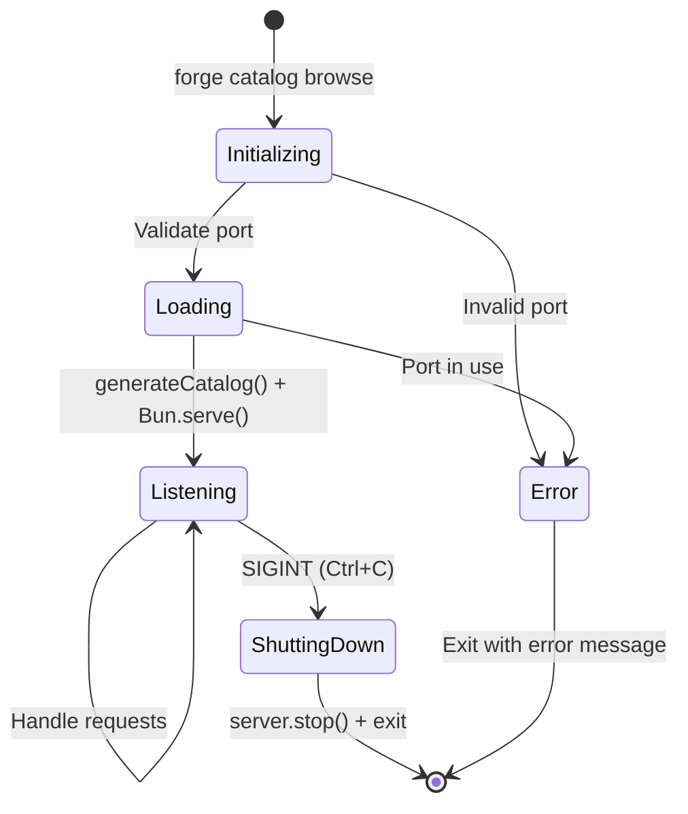

# Design Document: Catalog Browse

## Overview

The `forge catalog browse` feature adds a local web-based catalog browser to the Skill Forge CLI. It introduces a new `browse` subcommand under the existing `catalog` command group that starts a temporary `Bun.serve()` HTTP server serving a self-contained single-page application (SPA). The SPA displays knowledge artifact metadata as cards with search, filtering by harness/type, and a detail view that previews the raw `knowledge.md` content.

The implementation requires a single new module (`src/browse.ts`) and a small registration change in `src/cli.ts`. No new npm dependencies are needed — the server uses Bun's built-in HTTP primitives, and the frontend is entirely inline HTML/CSS/JS.

### Key Design Decisions

- **Bun.serve() over Express/Hono**: The project already runs on Bun. `Bun.serve()` provides a zero-dependency HTTP server with excellent performance. No framework overhead is needed for three endpoints.
- **Inline SPA over template files**: The HTML/CSS/JS is generated as a single string in TypeScript and served from memory. This avoids file I/O at request time, keeps the feature self-contained, and means no Nunjucks templates are needed for the browse UI.
- **On-the-fly catalog generation**: Rather than reading a stale `catalog.json` from disk, the server calls `generateCatalog()` at startup to ensure the data reflects the current state of the `knowledge/` directory.
- **Content endpoint reads from disk**: The `/api/artifact/:name/content` endpoint reads `knowledge.md` on each request. This keeps memory usage low and always returns the latest file content.

## Architecture



### Request Flow



### Server Lifecycle



## Components and Interfaces

### 1. CLI Registration (`src/cli.ts` modification)

The existing `catalog` command is converted from a simple command to a command group with subcommands. The current `forge catalog` behavior (generating `catalog.json`) becomes `forge catalog generate`, and `forge catalog browse` is added.

```typescript
// src/cli.ts — modified catalog command registration
const catalogCmd = program
  .command("catalog")
  .description("Manage the artifact catalog");

catalogCmd
  .command("generate")
  .description("Generate catalog.json")
  .action(catalogCommand);

catalogCmd
  .command("browse")
  .description("Browse the artifact catalog in your browser")
  .option("--port <number>", "Port to serve on", "3131")
  .action(browseCommand);
```

### 2. Browse Module (`src/browse.ts`)

The core module containing server setup, routing, HTML generation, and lifecycle management.

```typescript
// src/browse.ts
export interface BrowseOptions {
  port: number;
}

/**
 * Validates the port option and starts the browse server.
 * Called by Commander.js action handler.
 */
export async function browseCommand(options: { port: string }): Promise<void>;

/**
 * Starts the Bun HTTP server, registers SIGINT handler, opens browser.
 */
export async function startBrowseServer(options: BrowseOptions): Promise<void>;
```

### 3. Request Router

A simple function-based router inside `browse.ts` that matches URL patterns. No framework needed for three routes.

```typescript
// Internal to src/browse.ts
function handleRequest(
  req: Request,
  catalogEntries: CatalogEntry[],
  htmlPage: string,
): Response;
```

Route table:
| Method | Path Pattern | Handler | Content-Type |
|--------|-------------|---------|-------------|
| GET | `/` | Serve cached HTML string | `text/html; charset=utf-8` |
| GET | `/api/catalog` | Return JSON catalog | `application/json` |
| GET | `/api/artifact/:name/content` | Read & return knowledge.md | `text/plain` |
| * | Everything else | 404 JSON error | `application/json` |

### 4. HTML Generator

A function that produces the complete HTML5 document as a string. All CSS and JS are inlined. The HTML is generated once at server startup and cached in memory.

```typescript
// Internal to src/browse.ts
function generateHtmlPage(): string;
```

The SPA architecture:
- On load, fetches `/api/catalog` and renders artifact cards
- Search input filters cards client-side (no server round-trip)
- Harness and type filter dropdowns/checkboxes apply AND logic with search
- Clicking a card fetches `/api/artifact/:name/content` and shows the detail view
- Back button returns to the card grid
- All state management via vanilla JS (no framework)

### 5. HTML Escaping Utility

A utility function to escape user-provided content embedded in HTML to prevent XSS.

```typescript
// Internal to src/browse.ts
function escapeHtml(str: string): string;
```

Escapes `&`, `<`, `>`, `"`, and `'` characters.

### 6. Port Validation

```typescript
// Internal to src/browse.ts
function validatePort(portStr: string): number;
```

Parses the string to an integer and validates it's in the range 1–65535. Throws a descriptive error on invalid input.

## Data Models

This feature introduces no new persistent data models. It reuses the existing `CatalogEntry` schema from `src/schemas.ts` and reads `knowledge.md` files from disk.

### Runtime Data Structures

```typescript
/** Cached at server startup */
interface BrowseServerState {
  /** Catalog entries generated on-the-fly from knowledge/ */
  catalogEntries: CatalogEntry[];
  /** Pre-generated HTML string for the SPA */
  htmlPage: string;
  /** Bun server instance for lifecycle management */
  server: ReturnType<typeof Bun.serve>;
}
```

### API Response Shapes

```typescript
// GET /api/catalog
type CatalogResponse = CatalogEntry[]; // Existing schema from src/schemas.ts

// GET /api/artifact/:name/content (success)
// Response body: raw markdown string, Content-Type: text/plain

// GET /api/artifact/:name/content (not found)
interface ErrorResponse {
  error: string; // e.g., "Artifact 'unknown' not found"
}

// 404 fallback
interface NotFoundResponse {
  error: string; // "Not found"
}
```

