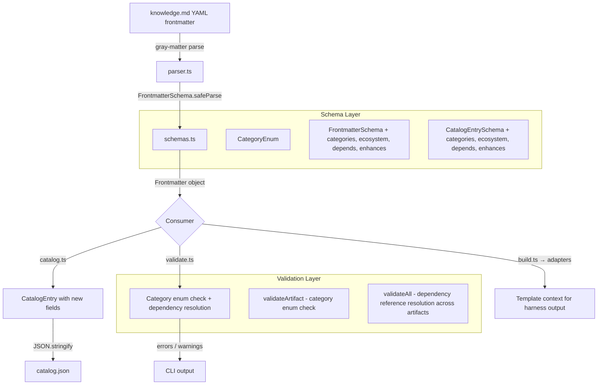

# Design Document: Catalog Metadata Evolution

## Overview

This feature extends the Skill Forge schema layer (`src/schemas.ts`) with three new metadata dimensions — categories, ecosystem, and dependency graph — and propagates them through the parser, catalog generator, validator, and scaffold template. The design prioritizes backward compatibility: all new fields default to empty arrays, so existing artifacts parse and validate without modification.

The changes are scoped to six files:

1. **`src/schemas.ts`** — Add `CategoryEnum`, extend `FrontmatterSchema`, `CatalogEntrySchema`, and `KnowledgeArtifactSchema`
2. **`src/parser.ts`** — No code changes needed; `FrontmatterSchema.passthrough()` already forwards unknown fields, and the new fields are now known to the schema
3. **`src/catalog.ts`** — Map the four new frontmatter fields into `CatalogEntry` objects
4. **`src/validate.ts`** — Add category enum validation (error-level) and dependency reference resolution checks (warning-level)
5. **`src/new.ts`** — No code changes needed; the template drives scaffold output
6. **`templates/knowledge/knowledge.md.njk`** — Add YAML frontmatter blocks for `categories`, `ecosystem`, `depends`, and `enhances` with guiding comments

### Design Rationale

- **Zod-first schema evolution**: All field definitions live in `schemas.ts` as Zod schemas. The parser already delegates to `FrontmatterSchema.safeParse()`, so adding fields to the schema is the single source of truth — no parser changes required.
- **Warning vs. error distinction for dependency references**: Category values come from a controlled enum, so invalid values are errors. Dependency references point to other artifacts that may not exist yet (e.g., during incremental authoring), so unresolved references are warnings.
- **Template-driven scaffolding**: `forge new` renders `knowledge.md.njk` via Nunjucks. Adding fields to the template is sufficient — no `new.ts` code changes needed.

## Architecture



### Data Flow

1. **Parse**: `gray-matter` extracts YAML frontmatter → `FrontmatterSchema.safeParse()` validates and applies defaults
2. **Build**: `loadKnowledgeArtifact()` returns `KnowledgeArtifact` with new fields in `frontmatter` → adapters receive full object
3. **Catalog**: `generateCatalog()` maps `frontmatter.categories`, `.ecosystem`, `.depends`, `.enhances` into `CatalogEntry`
4. **Validate**: `validateArtifact()` checks category enum membership (per-artifact). `validateAll()` collects all artifact names, then checks `depends`/`enhances` references across the set (cross-artifact)

## Components and Interfaces

### 1. `CategoryEnum` (new Zod enum in `schemas.ts`)

```typescript
export const CATEGORIES = [
  "testing", "security", "code-style", "devops", "documentation",
  "architecture", "debugging", "performance", "accessibility",
] as const;

export const CategoryEnum = z.enum(CATEGORIES);
export type Category = z.infer<typeof CategoryEnum>;
```

Extensible by appending new values to the `CATEGORIES` tuple.

### 2. `FrontmatterSchema` extensions (in `schemas.ts`)

Four new optional fields with empty-array defaults:

```typescript
categories: z.array(CategoryEnum).default([]),
ecosystem: z.array(
  z.string().min(1).regex(/^[a-z0-9]+(-[a-z0-9]+)*$/)
).default([]),
depends: z.array(
  z.string().min(1).regex(/^[a-z0-9]+(-[a-z0-9]+)*$/)
).default([]),
enhances: z.array(
  z.string().min(1).regex(/^[a-z0-9]+(-[a-z0-9]+)*$/)
).default([]),
```

### 3. `CatalogEntrySchema` extensions (in `schemas.ts`)

Mirror the frontmatter fields:

```typescript
categories: z.array(CategoryEnum),
ecosystem: z.array(z.string()),
depends: z.array(z.string()),
enhances: z.array(z.string()),
```

### 4. `generateCatalog()` changes (in `catalog.ts`)

Map the four new fields from parsed frontmatter into each `CatalogEntry`:

```typescript
entries.push({
  // ... existing fields ...
  categories: fm.categories,
  ecosystem: fm.ecosystem,
  depends: fm.depends,
  enhances: fm.enhances,
});
```

### 5. Validation extensions (in `validate.ts`)

**Per-artifact** (in `validateArtifact`):
- Category enum validation is already handled by `FrontmatterSchema.safeParse()` — Zod rejects invalid enum values with a descriptive error. No additional code needed in `validateArtifact`.

**Cross-artifact** (in `validateAll`):
- After collecting all `ValidationResult`s, build a `Set<string>` of all artifact names
- For each artifact, check `depends` and `enhances` values against the name set
- Emit warnings (not errors) for unresolved references
- Add a `warnings` field to `ValidationResult` to distinguish from errors

```typescript
export interface ValidationWarning {
  field: string;
  message: string;
  filePath: string;
}
```

The `ValidationResult` type gains an optional `warnings` array. Warnings do not affect the `valid` flag.

### 6. Template update (`templates/knowledge/knowledge.md.njk`)

Add new fields to the YAML frontmatter block with guiding comments:

```yaml
# Categories: testing, security, code-style, devops, documentation, architecture, debugging, performance, accessibility
categories: []
# Ecosystem: freeform kebab-case values, e.g. typescript, python, react, bun
ecosystem: []
# Depends: artifact names this artifact depends on
depends: []
# Enhances: artifact names this artifact enhances
enhances: []
```

### 7. `KNOWN_FRONTMATTER_FIELDS` update (in `parser.ts`)

Add `"categories"`, `"ecosystem"`, `"depends"`, `"enhances"` to the `KNOWN_FRONTMATTER_FIELDS` set so they are not treated as extra fields.

## Data Models

### CategoryEnum Values

| Value | Description |
|---|---|
| `testing` | Test frameworks, test patterns, TDD |
| `security` | Security practices, vulnerability prevention |
| `code-style` | Linting, formatting, naming conventions |
| `devops` | CI/CD, deployment, infrastructure |
| `documentation` | Documentation standards, API docs |
| `architecture` | Design patterns, system architecture |
| `debugging` | Debugging techniques, error analysis |
| `performance` | Performance optimization, profiling |
| `accessibility` | Accessibility standards, a11y testing |

### Extended Frontmatter Shape

```typescript
interface Frontmatter {
  // ... existing fields ...
  name: string;
  displayName?: string;
  description: string;
  keywords: string[];
  author: string;
  version: string;
  harnesses: HarnessName[];
  type: ArtifactType;
  inclusion: InclusionMode;
  file_patterns?: string[];
  // New fields
  categories: Category[];      // default: []
  ecosystem: string[];         // default: [], kebab-case pattern
  depends: string[];           // default: [], kebab-case artifact names
  enhances: string[];          // default: [], kebab-case artifact names
}
```

### Extended CatalogEntry Shape

```typescript
interface CatalogEntry {
  // ... existing fields ...
  name: string;
  displayName: string;
  description: string;
  keywords: string[];
  author: string;
  version: string;
  harnesses: HarnessName[];
  type: ArtifactType;
  path: string;
  evals: boolean;
  // New fields
  categories: Category[];
  ecosystem: string[];
  depends: string[];
  enhances: string[];
}
```

### ValidationResult Extension

```typescript
interface ValidationResult {
  artifactName: string;
  valid: boolean;
  errors: ValidationError[];
  warnings?: ValidationWarning[];  // new — does not affect `valid`
}

interface ValidationWarning {
  field: string;
  message: string;
  filePath: string;
}
```

## Correctness Properties

*A property is a characteristic or behavior that should hold true across all valid executions of a system — essentially, a formal statement about what the system should do. Properties serve as the bridge between human-readable specifications and machine-verifiable correctness guarantees.*

### Property 1: Frontmatter YAML round-trip preserves new metadata fields

*For any* valid frontmatter object containing `categories` (random subset of CategoryEnum), `ecosystem` (random valid kebab-case strings), `depends` (random valid kebab-case strings), and `enhances` (random valid kebab-case strings), serializing to YAML then parsing back through `FrontmatterSchema` shall produce equivalent values for all fields, preserving both content and order.

**Validates: Requirements 9.3, 10.2, 11.2, 4.3**

### Property 2: Catalog JSON round-trip preserves new metadata fields

*For any* valid `CatalogEntry` object containing `categories`, `ecosystem`, `depends`, and `enhances` arrays, serializing to JSON via `serializeCatalog` then deserializing and validating through `CatalogSchema` shall produce an equivalent object with all new fields intact, preserving content and order.

**Validates: Requirements 5.6, 10.1, 11.1**

### Property 3: Category enum membership validation

*For any* string, `FrontmatterSchema` shall accept it as a `categories` element if and only if it is a member of the defined `CategoryEnum` values. Invalid values shall cause a Zod validation error.

**Validates: Requirements 1.3, 1.5, 7.1, 7.2, 7.3**

### Property 4: Kebab-case pattern validation for ecosystem and dependency fields

*For any* string, `FrontmatterSchema` shall accept it as an `ecosystem`, `depends`, or `enhances` element if and only if it matches the pattern `^[a-z0-9]+(-[a-z0-9]+)*$`. Strings not matching the pattern shall cause a Zod validation error.

**Validates: Requirements 2.2, 2.4, 2.5, 3.5**

### Property 5: Backward compatibility — legacy frontmatter parses with defaults

*For any* valid frontmatter object that omits `categories`, `ecosystem`, `depends`, and `enhances` fields, parsing through `FrontmatterSchema` shall succeed and produce a result where all four new fields default to empty arrays, while all existing fields retain their original values.

**Validates: Requirements 4.1, 4.2**

### Property 6: Unresolved dependency references produce warnings without affecting validity

*For any* set of artifact names and any artifact whose `depends` and `enhances` arrays contain references not present in that set, the validator shall emit a warning for each unresolved reference while keeping the artifact's `valid` flag `true`.

**Validates: Requirements 6.1, 6.2, 6.3, 6.4, 6.5**

## Error Handling

### Schema Validation Errors (Zod-level)

| Condition | Severity | Behavior |
|---|---|---|
| `categories` contains value not in CategoryEnum | Error | `FrontmatterSchema.safeParse()` returns `success: false` with issue identifying the invalid value and listing allowed values |
| `ecosystem` contains value not matching kebab-case pattern | Error | `FrontmatterSchema.safeParse()` returns `success: false` with issue identifying the invalid value |
| `depends` or `enhances` contains value not matching kebab-case pattern | Error | `FrontmatterSchema.safeParse()` returns `success: false` with issue identifying the invalid value |
| `categories`, `ecosystem`, `depends`, or `enhances` is not an array | Error | Zod type mismatch error |

### Validation Warnings (cross-artifact)

| Condition | Severity | Behavior |
|---|---|---|
| `depends` references an artifact name not found in the knowledge directory | Warning | Emitted during `validateAll`; artifact remains `valid: true` |
| `enhances` references an artifact name not found in the knowledge directory | Warning | Emitted during `validateAll`; artifact remains `valid: true` |

### Backward Compatibility Guarantees

- Missing new fields default to `[]` — no error, no warning
- Existing fields are unaffected by the schema extension
- `FrontmatterSchema.passthrough()` continues to forward unknown fields

## Testing Strategy

### Property-Based Tests (fast-check, minimum 100 iterations each)

The project already uses `fast-check` with `bun test`. Existing property test files (`schema-roundtrip.property.test.ts`, `catalog-roundtrip.property.test.ts`) need to be extended with arbitraries for the new fields.

| Property | Test File | What It Covers |
|---|---|---|
| Property 1: Frontmatter YAML round-trip | `schema-roundtrip.property.test.ts` | Extend existing `frontmatterArb` with `categories`, `ecosystem`, `depends`, `enhances` |
| Property 2: Catalog JSON round-trip | `catalog-roundtrip.property.test.ts` | Extend existing `catalogEntryArb` with new fields |
| Property 3: Category enum membership | New test or extend `schema-roundtrip.property.test.ts` | Generate random strings, verify accept/reject matches enum membership |
| Property 4: Kebab-case pattern validation | New test or extend `schema-roundtrip.property.test.ts` | Generate random strings, verify accept/reject matches regex |
| Property 5: Backward compatibility | New test in `schema-roundtrip.property.test.ts` | Generate legacy frontmatter, verify defaults applied |
| Property 6: Dependency reference resolution | New property test file | Generate artifact name sets and references, verify warning behavior |

Each property test must be tagged with a comment: `Feature: catalog-metadata-evolution, Property {N}: {title}`

### Unit Tests (example-based)

| Test | File | What It Covers |
|---|---|---|
| CategoryEnum contains all 9 initial values | `validate.test.ts` or `schemas.test.ts` | Req 1.2 |
| Default values for omitted fields | `validate.test.ts` | Req 1.4, 2.3, 3.3, 3.4 |
| Same name in both depends and enhances | `validate.test.ts` | Req 11.3 |
| Duplicate ecosystem values preserved | `validate.test.ts` | Req 10.3 |
| Template renders new fields with comments | `new.test.ts` | Req 8.1–8.4 |
| Catalog entry populated from frontmatter | `catalog.test.ts` | Req 5.5 |
| Schema does not enforce reference existence | `validate.test.ts` | Req 3.6 |
| Adapter receives new frontmatter fields | Adapter tests | Req 9.2 |

### Test Configuration

- Runtime: Bun (`bun test`)
- PBT library: `fast-check` (already in devDependencies)
- Minimum iterations: 100 per property test (`{ numRuns: 100 }`)
- Arbitraries: Extend existing `frontmatterArb` and `catalogEntryArb` with new field generators

