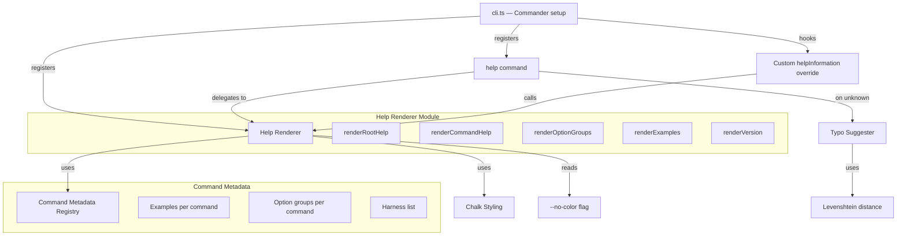

# Design Document: Help Screen Improvements

## Overview

This design introduces a `Help_Renderer` module and a `forge help` command to replace Commander.js's default help output with styled, structured, and deterministic help screens. The renderer applies chalk-based color styling, organizes options into logical groups, injects per-command usage examples, and supports a `--no-color` flag for plain-text output. A Levenshtein-based typo correction system handles unknown commands.

The design keeps all help metadata co-located with command definitions via a declarative registry, making it easy to add examples or option groups when new commands are introduced. The renderer is a set of pure functions that take structured data and produce strings — no side effects, no terminal-width sniffing — which makes the output deterministic and testable.

## Architecture



The architecture follows a layered approach:

1. **Metadata layer** — A `CommandMetadata` registry maps each command name to its examples, option groups, and harness-list flag. This is static data, defined once.
2. **Rendering layer** — Pure functions (`renderRootHelp`, `renderCommandHelp`, `renderVersion`) consume metadata and a `useColor` boolean, returning plain strings. No `console.log` calls inside the renderer.
3. **Integration layer** — `cli.ts` wires the renderer into Commander via `configureHelp()` and a custom `help` subcommand. The banner logic is adjusted so it only fires on bare `forge` invocations.

### Design Decisions

- **Pure rendering functions over Commander's built-in help**: Commander's `configureHelp` API is limited — it doesn't support option grouping or example sections natively. Overriding `helpInformation()` on each command gives full control while still leveraging Commander for parsing.
- **Declarative metadata registry**: Keeping examples and option groups in a typed data structure (not scattered across `.addHelpText()` calls) makes the data testable independently of rendering.
- **`fastest-levenshtein` for typo suggestions**: Already in `node_modules` as a transitive dependency. No new dependency needed.
- **`--no-color` via chalk's built-in detection**: chalk respects `--no-color`, `NO_COLOR` env var, and `FORCE_COLOR=0`. We additionally check `process.argv` for `--no-color` and set `chalk.level = 0` early.

## Components and Interfaces

### 1. `CommandMetadata` (type + registry)

```typescript
// src/help/metadata.ts

export interface UsageExample {
  comment: string;   // e.g., "Build for all harnesses"
  invocation: string; // e.g., "forge build"
}

export interface OptionGroup {
  label: string;     // e.g., "Output Options"
  options: string[]; // flag names, e.g., ["--output", "--ci", "--no-context"]
}

export interface CommandHelpMeta {
  examples: UsageExample[];
  optionGroups?: OptionGroup[];
  showHarnessList?: boolean; // if true, append harness names to --harness description
}

// Registry keyed by command name (e.g., "build", "install", "catalog generate")
export const commandMetaRegistry: Record<string, CommandHelpMeta>;
```

### 2. `HelpRenderer` (pure functions)

```typescript
// src/help/renderer.ts

export interface RenderOptions {
  useColor: boolean;
}

export function renderRootHelp(
  commands: { name: string; description: string }[],
  opts: RenderOptions
): string;

export function renderCommandHelp(
  commandName: string,
  description: string,
  usage: string,
  options: { flags: string; description: string }[],
  meta: CommandHelpMeta | undefined,
  opts: RenderOptions
): string;

export function renderVersion(
  version: string,
  opts: RenderOptions
): string;
```

### 3. `TypoSuggester`

```typescript
// src/help/typo-suggester.ts

export function suggestCommand(
  input: string,
  validCommands: string[]
): string | null; // returns closest match if Levenshtein distance ≤ 2, else null
```

### 4. CLI Integration

```typescript
// Modifications to src/cli.ts

// 1. Register `forge help [command]` subcommand
// 2. Override helpInformation() on each command to use HelpRenderer
// 3. Move banner logic: only print on `process.argv.length <= 2` AND not --help
// 4. Override version output to include Bun version + OS platform
// 5. Handle unknown commands with typo suggestion
```

## Data Models

### CommandHelpMeta Registry (static data)

The registry is a plain `Record<string, CommandHelpMeta>` object. Key examples:

```typescript
{
  "build": {
    examples: [
      { comment: "Build for all harnesses", invocation: "forge build" },
      { comment: "Build for Kiro only", invocation: "forge build --harness kiro" },
    ],
    showHarnessList: true,
  },
  "install": {
    examples: [
      { comment: "Install all artifacts for Kiro", invocation: "forge install --harness kiro --all" },
      { comment: "Dry-run install from a release", invocation: "forge install --from-release v0.1.0 --dry-run" },
    ],
    optionGroups: [
      { label: "Source Options", options: ["--source", "--from-release", "--harness"] },
      { label: "Behavior Options", options: ["--force", "--dry-run", "--all"] },
    ],
    showHarnessList: true,
  },
  "eval": {
    examples: [
      { comment: "Run evals for all harnesses", invocation: "forge eval" },
      { comment: "Run evals for Cursor with a custom threshold", invocation: "forge eval --harness cursor --threshold 0.8" },
    ],
    optionGroups: [
      { label: "Execution Options", options: ["--harness", "--provider", "--threshold"] },
      { label: "Output Options", options: ["--output", "--ci", "--no-context"] },
    ],
    showHarnessList: true,
  },
}
```

### Rendering Output Structure

Each help screen is a single string composed of ordered sections. The root help follows this layout:

```
  Skill Forge — write knowledge once, compile to every harness

  Usage: forge <command> [options]

  Commands:
    build              Compile knowledge artifacts to harness-native formats
    install [artifact] Install compiled artifacts into the current project
    new <name>         Scaffold a new knowledge artifact
    validate [path]    Validate knowledge artifacts
    catalog            Manage the artifact catalog
    eval [artifact]    Run eval tests against compiled artifacts
    help [command]     Show help for a command

  Global Options:
    -V, --version      Output version information
    -h, --help         Show help
    --no-color         Disable color output

  Getting Started:
    Run forge new <name> to create your first knowledge artifact.
```

Command help follows this layout:

```
  <description>

  Usage: forge <command> [args] [options]

  <Option Group 1>:
    --flag <arg>  Description
    ...

  <Option Group 2>:
    ...

  Examples:
    # Comment describing intent
    $ forge command --flag value

    # Another example
    $ forge command --other-flag
```


## Correctness Properties

*A property is a characteristic or behavior that should hold true across all valid executions of a system — essentially, a formal statement about what the system should do. Properties serve as the bridge between human-readable specifications and machine-verifiable correctness guarantees.*

### Property 1: No-color rendering produces zero ANSI escape codes

*For any* command metadata (commands list, option groups, examples) and *for any* render function (`renderRootHelp`, `renderCommandHelp`, `renderVersion`), when rendered with `useColor: false`, the output string SHALL contain zero ANSI escape sequences (no bytes matching the pattern `\x1b[`).

**Validates: Requirements 1.5, 6.3**

### Property 2: Command table column alignment consistency

*For any* list of commands with varying name lengths, when rendered by `renderRootHelp`, all command names SHALL start at the same column offset and all descriptions SHALL start at the same column offset, producing visually aligned columns.

**Validates: Requirements 1.3**

### Property 3: Example rendering format

*For any* `CommandHelpMeta` containing at least one `UsageExample`, when rendered by `renderCommandHelp`, the output SHALL contain an "Examples" section where each example consists of a comment line (containing the `#` character followed by the example's comment text) and an invocation line (containing the example's invocation text).

**Validates: Requirements 2.1, 2.2**

### Property 4: Option group structure

*For any* command with defined `OptionGroup` entries in its metadata, when rendered by `renderCommandHelp`, the output SHALL contain each group's label as a header, and each option flag listed under a group header SHALL appear after that header and before the next group header (or end of options section).

**Validates: Requirements 3.1, 3.2**

### Property 5: Help output equivalence across invocation paths

*For any* valid command name, the output produced by rendering that command's help (as invoked via `forge help <command>`) SHALL be identical to the output produced by rendering it via `forge <command> --help`, given the same `useColor` setting.

**Validates: Requirements 4.2, 7.3**

### Property 6: Help output determinism

*For any* command name and *for any* fixed set of command metadata, calling the render function twice with identical inputs SHALL produce identical output strings.

**Validates: Requirements 7.1**

### Property 7: Typo suggestion correctness

*For any* input string and *for any* list of valid command names, `suggestCommand` SHALL return the closest matching command name if and only if the minimum Levenshtein distance between the input and any valid command is ≤ 2. If no command is within distance 2, it SHALL return `null`.

**Validates: Requirements 9.2, 9.4**

### Property 8: Unknown command error includes available commands

*For any* string that is not a valid command name, the error output SHALL contain the input string and SHALL list all available command names.

**Validates: Requirements 4.4, 9.1, 9.3**

## Error Handling

| Scenario | Behavior |
|---|---|
| `forge <unknown-command>` | Print error with unrecognized command name. If Levenshtein distance ≤ 2 from a valid command, suggest it (`Did you mean "build"?`). Always list available commands. Exit code 1. |
| `forge help <unknown-command>` | Same behavior as above — error message, optional suggestion, available commands list. Exit code 1. |
| `--no-color` with color-dependent terminal | chalk level set to 0 early in CLI bootstrap. All render functions receive `useColor: false`. No ANSI codes emitted. |
| `--version` in non-Bun runtime | Gracefully degrade: show "unknown" for Bun version if `Bun.version` is unavailable. `process.platform` and `process.arch` are always available in Node-compatible runtimes. |
| Metadata registry missing entry for a command | Render command help without examples or option groups — fall back to a flat option list. No crash. |

## Testing Strategy

### Property-Based Tests (fast-check)

The project already uses `fast-check` (in devDependencies). Each correctness property maps to one property-based test with a minimum of 100 iterations.

- **Property 1** — Generate random `CommandHelpMeta` objects (random strings for command names, descriptions, example comments/invocations). Render with `useColor: false`. Assert no `\x1b[` in output.
- **Property 2** — Generate random lists of `{ name, description }` with varying string lengths. Render root help. Parse lines in the Commands section and assert all names share a column offset and all descriptions share a column offset.
- **Property 3** — Generate random `UsageExample[]` arrays (1–5 examples). Render command help. Assert the Examples section contains a `#`-prefixed comment line and the invocation text for each example.
- **Property 4** — Generate random `OptionGroup[]` arrays with random labels and option flags. Render command help. Assert each group label appears as a header and its options appear between it and the next header.
- **Property 5** — For each valid command name, render help via both code paths and assert string equality. (This is closer to an exhaustive example test over the finite command set, but the property framing ensures it's checked systematically.)
- **Property 6** — Generate random metadata, render twice, assert equality. This validates the pure-function contract.
- **Property 7** — Generate random strings by mutating valid command names (0–3 character edits). Assert `suggestCommand` returns the original command when distance ≤ 2 and `null` when distance > 2.
- **Property 8** — Generate random non-command strings. Call the error handler. Assert output contains the input string and all valid command names.

### Unit Tests (example-based)

- Root help contains all required sections in order (1.1)
- Root help contains "Getting Started" tip with `forge new` (1.4)
- Color styling is applied when `useColor: true` (1.2)
- Example comment lines use muted styling, invocations use bright styling (2.4)
- Metadata registry has examples for all 7 required commands (2.3)
- Install command has ≥ 2 option groups (3.3)
- Eval command has ≥ 2 option groups (3.4)
- `forge help` with no args produces root help (4.3)
- Build/install/eval help shows all 7 harness names inline (5.1, 5.2, 5.3, 5.4)
- Version output includes version number, Bun version, and platform (6.1, 6.2)
- No timestamps in help output (7.2)
- Banner shown on bare `forge`, suppressed on `--help` and `help` (8.1–8.4)

### Test Configuration

- PBT library: `fast-check` (already installed)
- Minimum iterations: 100 per property test
- Tag format: `Feature: help-screen-improvements, Property {N}: {title}`
- Test files: `src/__tests__/help-renderer.property.test.ts` and `src/__tests__/help-renderer.test.ts`
