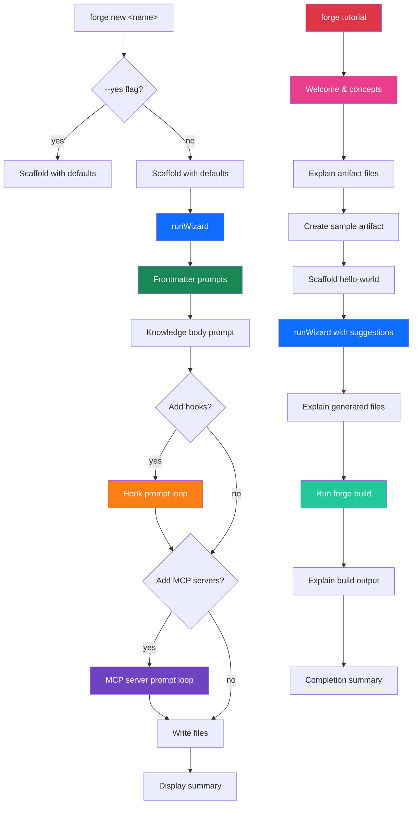

# Design Document: Interactive New Command

## Overview

This design transforms the `forge new` command from a passive scaffold-and-print-instructions flow into a guided interactive wizard powered by `@clack/prompts`. The wizard walks artifact authors — including researchers with no YAML/schema knowledge — through every frontmatter field, optional hook and MCP server configuration, and knowledge body content, then writes validated files and prints a summary.

The existing `newCommand` function in `src/new.ts` is refactored into two phases:
1. **Scaffold phase** — unchanged directory/file creation via Nunjucks templates.
2. **Wizard phase** — a new `runWizard()` function that collects input, validates against Zod schemas, and overwrites scaffold files with user-provided data.

A `--yes` flag bypasses the wizard for CI/scripting use cases, preserving template defaults.

Additionally, a new `forge tutorial` command provides a guided first-run walkthrough for new users. The tutorial is implemented in a separate `src/tutorial.ts` module that reuses the existing wizard from `src/wizard.ts` rather than reimplementing prompts. It walks users through the full workflow — creating a sample artifact, understanding the generated files, and building — using friendly, jargon-free language aimed at researchers with no development background.

## Architecture



The wizard is a linear pipeline of prompt groups. Each group collects data, validates it against the corresponding Zod schema, and stores the result. Cancellation at any point exits cleanly without writing partial data.

### Key Design Decisions

1. **Scaffold-first, overwrite-on-success**: The scaffold is created before the wizard starts. If the user cancels, they still have valid template-default files. On wizard completion, files are overwritten with user data. This avoids partial-write corruption.

2. **@clack/prompts over raw readline**: The codebase already uses `@clack/prompts` in `install.ts`. Reusing it gives a consistent UX and avoids a new dependency.

3. **Validation at the field level, not at the end**: Each prompt validates inline using Zod schema field extractors. Users get immediate feedback rather than a wall of errors at the end.

4. **Separate wizard module**: The wizard logic lives in a new `src/wizard.ts` module, keeping `src/new.ts` thin. This makes the wizard independently testable and reusable.

5. **Tutorial reuses the wizard**: The `forge tutorial` command delegates artifact creation to `runWizard()` from `src/wizard.ts` rather than reimplementing prompts. This keeps the tutorial thin — it only adds educational narration and orchestration around the existing wizard flow.

6. **Tutorial as a linear step sequence**: The tutorial is modeled as an ordered array of `TutorialStep` objects, each with an explanation phase and an optional action phase. This makes steps easy to add, remove, or reorder without changing control flow logic.

## Components and Interfaces

### Module: `src/wizard.ts` (new)

The core wizard module. Exports a single entry point and internal prompt-group functions.

```typescript
import * as p from "@clack/prompts";
import type { Frontmatter, CanonicalHook, McpServerDefinition } from "./schemas";

/** Collected wizard results — everything needed to write files. */
export interface WizardResult {
  frontmatter: Frontmatter;
  knowledgeBody: string;
  hooks: CanonicalHook[];
  mcpServers: McpServerDefinition[];
}

/**
 * Run the full interactive wizard.
 * Throws CancelError if the user cancels at any prompt.
 */
export async function runWizard(artifactName: string, displayName: string): Promise<WizardResult>;
```

Internal (non-exported) functions:

| Function | Purpose |
|---|---|
| `promptFrontmatter(name, displayName)` | Collects all frontmatter fields via @clack/prompts, returns a validated `Frontmatter` object |
| `promptKnowledgeBody()` | Collects the markdown body content |
| `promptHooks()` | Loop: collect hook definitions until user declines to add more |
| `promptSingleHook()` | Collect one hook's fields (event, condition, action, name) |
| `promptMcpServers()` | Loop: collect MCP server definitions until user declines |
| `promptSingleMcpServer()` | Collect one MCP server's fields (name, command, args, env) |
| `handleCancel(value)` | Check `p.isCancel(value)`, display message, exit |
| `parseCommaSeparated(input)` | Split comma-separated string into trimmed array, filter empties |
| `parseKeyValuePairs(input)` | Parse `KEY=VALUE,KEY=VALUE` into `Record<string, string>` |
| `validateField<T>(schema, value)` | Run a Zod schema `.safeParse()`, return result or error message string |

### Module: `src/new.ts` (modified)

```typescript
export interface NewCommandOptions {
  yes?: boolean;
}

export async function newCommand(
  artifactName: string,
  options: NewCommandOptions
): Promise<void>;
```

Changes:
- Accept `options` parameter with `yes` flag.
- After scaffold creation, call `runWizard()` unless `--yes` is set.
- On wizard success, call `writeWizardResult()` to overwrite scaffold files.

### Module: `src/file-writer.ts` (new)

Responsible for serializing wizard results to disk.

```typescript
import type { WizardResult } from "./wizard";

/**
 * Write wizard results to the artifact directory.
 * Overwrites knowledge.md, hooks.yaml, and mcp-servers.yaml.
 */
export async function writeWizardResult(
  artifactDir: string,
  result: WizardResult
): Promise<string[]>;  // returns list of written file paths
```

Internal functions:

| Function | Purpose |
|---|---|
| `buildKnowledgeMd(result)` | Serialize frontmatter to YAML via `js-yaml`, combine with body into a gray-matter-compatible markdown string |
| `buildHooksYaml(hooks)` | Serialize hooks array to YAML string via `js-yaml` |
| `buildMcpServersYaml(servers)` | Serialize MCP servers array to YAML string via `js-yaml` |

### Module: `src/cli.ts` (modified)

Add `--yes` option to the `new` command and register the `tutorial` command:

```typescript
program
  .command("new <artifact-name>")
  .description("Scaffold a new knowledge artifact")
  .option("--yes", "Skip interactive wizard, use template defaults")
  .action(newCommand);

program
  .command("tutorial")
  .description("Guided walkthrough for first-time artifact authors")
  .action(tutorialCommand);
```

### Module: `src/tutorial.ts` (new)

The tutorial module. Orchestrates a step-by-step walkthrough that reuses the wizard for artifact creation.

```typescript
import * as p from "@clack/prompts";
import chalk from "chalk";
import type { WizardResult } from "./wizard";
import { runWizard } from "./wizard";
import { writeWizardResult } from "./file-writer";
import { newCommand } from "./new";
import { buildCommand } from "./build";

/** A single step in the tutorial flow. */
export interface TutorialStep {
  title: string;
  explanation: string;
  action?: () => Promise<void>;
}

/** Suggested default values shown as placeholders during the tutorial wizard. */
export interface TutorialDefaults {
  artifactName: string;
  description: string;
  keywords: string;
  author: string;
}

export const TUTORIAL_DEFAULTS: TutorialDefaults = {
  artifactName: "hello-world",
  description: "A sample artifact created during the Skill Forge tutorial",
  keywords: "tutorial, sample, getting-started",
  author: "Tutorial User",
};

/**
 * Entry point for `forge tutorial`.
 * Runs the full guided walkthrough.
 */
export async function tutorialCommand(): Promise<void>;

/**
 * Build the ordered list of tutorial steps.
 * Pure function — no side effects, easy to test.
 */
export function buildTutorialSteps(artifactName: string): TutorialStep[];

/**
 * Display a progress indicator for the current step.
 * Outputs "Step N of M" using @clack/prompts log.
 */
export function showProgress(current: number, total: number): void;

/**
 * Display the welcome message explaining Skill Forge and artifacts.
 */
export function showWelcome(): void;

/**
 * Explain what each generated file does, using plain language.
 * Reads the actual file contents and annotates them.
 */
export function explainGeneratedFiles(artifactDir: string): Promise<void>;

/**
 * Explain the build output after `forge build` completes.
 */
export function explainBuildOutput(): void;

/**
 * Display the completion summary and next steps.
 */
export function showCompletion(): void;

/**
 * Check if the sample artifact already exists and prompt for resolution.
 * Returns the artifact name to use (original or user-chosen alternative).
 */
export async function resolveArtifactName(defaultName: string): Promise<string>;
```

Internal (non-exported) functions:

| Function | Purpose |
|---|---|
| `explainConcept(term, definition)` | Display an inline definition for a technical term (e.g., "YAML", "frontmatter") using `p.log.info` with chalk styling |
| `waitForContinue(message?)` | Display a "Press Enter to continue" prompt using `p.text` with an empty default, allowing the user to read at their own pace |
| `runTutorialBuild(artifactName)` | Execute `forge build` programmatically for the sample artifact and capture output |

### Prompt Flow Detail

The wizard presents prompts in this order, using friendly labels that hide schema complexity:

| Step | Prompt Type | Field | Friendly Label |
|---|---|---|---|
| 1 | `p.text` | `description` | "Describe your artifact in a sentence or two" |
| 2 | `p.text` | `keywords` | "Keywords (comma-separated, e.g. react, testing, hooks)" |
| 3 | `p.text` | `author` | "Author name" |
| 4 | `p.select` | `type` | "What kind of artifact is this?" |
| 5 | `p.select` | `inclusion` | "When should this artifact be included?" |
| 5a | `p.text` | `file_patterns` | "File patterns to match (comma-separated globs)" — only if `fileMatch` |
| 6 | `p.multiselect` | `categories` | "Pick the categories that apply" |
| 7 | `p.multiselect` | `harnesses` | "Which AI coding tools should this target?" |
| 8 | `p.text` | `ecosystem` | "Ecosystem tags (comma-separated, e.g. typescript, bun, react)" |
| 9 | `p.text` | `knowledgeBody` | "Write your knowledge content (or leave blank to fill in later)" |
| 10 | `p.confirm` | — | "Would you like to add a hook?" |
| 11+ | Hook sub-prompts | — | (loop) |
| N | `p.confirm` | — | "Would you like to add an MCP server?" |
| N+1 | MCP sub-prompts | — | (loop) |

### Tutorial Prompt Flow Detail

The tutorial presents a linear sequence of steps. Each step shows a progress indicator, an explanation, and optionally an interactive action.

| Step | Phase | What Happens | User Action |
|---|---|---|---|
| 1 | Welcome | Display Skill Forge overview: what it is, what artifacts are, why they matter | Press Enter to continue |
| 2 | Concepts | Explain the three core files (knowledge.md, hooks.yaml, mcp-servers.yaml) in plain language, defining YAML and frontmatter inline | Press Enter to continue |
| 3 | Create | Scaffold the sample artifact directory, then launch `runWizard()` with tutorial-friendly placeholder suggestions | Complete the wizard prompts |
| 4 | Explain | Read each generated file and display annotated explanations of what the user's inputs produced; explain the `workflows/` directory | Press Enter to continue |
| 5 | Build | Run `forge build` on the sample artifact and display the output | Automatic (build runs programmatically) |
| 6 | Results | Explain what the build produced, where compiled output lives, and how harnesses consume it | Press Enter to continue |
| 7 | Complete | Show completion summary, list what was accomplished, suggest `forge new` for a real artifact and link to docs | None (tutorial ends) |

The tutorial uses `p.log.info`, `p.log.step`, and `p.note` for explanatory text rather than prompts that require input, keeping the flow lightweight. Only the wizard step (Step 3) and the "Press Enter to continue" pauses require user interaction.

## Data Models

### WizardResult

```typescript
interface WizardResult {
  frontmatter: Frontmatter;   // from schemas.ts — validated Zod output
  knowledgeBody: string;       // markdown body, may be empty string
  hooks: CanonicalHook[];      // 0..n validated hooks
  mcpServers: McpServerDefinition[];  // 0..n validated MCP servers
}
```

### Frontmatter (existing, from schemas.ts)

All fields are collected by the wizard. The `name` and `displayName` fields are derived from the CLI argument (not prompted). The `version` field defaults to `"0.1.0"` (not prompted). The `depends` and `enhances` fields default to `[]` (not prompted — advanced use case).

### CanonicalHook (existing, from schemas.ts)

The wizard collects: `name`, `event`, `condition.file_patterns` or `condition.tool_types` (conditional on event type), and `action` (discriminated union: `ask_agent` with `prompt` or `run_command` with `command`).

### McpServerDefinition (existing, from schemas.ts)

The wizard collects: `name`, `command`, `args` (space-separated string → array), `env` (KEY=VALUE pairs → record).

### File Output Formats

**knowledge.md**: Standard gray-matter format — YAML frontmatter between `---` fences, followed by markdown body.

**hooks.yaml**: YAML array of hook objects. Empty array `[]` if no hooks configured.

**mcp-servers.yaml**: YAML array of MCP server objects. Empty array `[]` if no servers configured.

### TutorialStep

```typescript
interface TutorialStep {
  title: string;        // Short step title for progress display (e.g., "Create a sample artifact")
  explanation: string;  // Plain-language explanation shown to the user
  action?: () => Promise<void>;  // Optional async action (e.g., run wizard, run build)
}
```

### TutorialDefaults

```typescript
interface TutorialDefaults {
  artifactName: string;   // "hello-world"
  description: string;    // Pre-filled suggestion for the wizard description prompt
  keywords: string;       // Pre-filled suggestion for keywords
  author: string;         // Pre-filled suggestion for author
}
```


## Correctness Properties

*A property is a characteristic or behavior that should hold true across all valid executions of a system — essentially, a formal statement about what the system should do. Properties serve as the bridge between human-readable specifications and machine-verifiable correctness guarantees.*

### Property 1: Comma-separated parsing preserves all tokens

*For any* string containing comma-separated values (with arbitrary whitespace around commas), `parseCommaSeparated` SHALL produce an array where every element is trimmed and non-empty, no non-whitespace token from the original input is lost, and the array length equals the number of non-empty segments.

**Validates: Requirements 2.2, 3.3**

### Property 2: Valid frontmatter passes schema validation

*For any* `Frontmatter` object constructed from valid field values (valid artifact type, valid inclusion mode, valid categories, valid harnesses, kebab-case ecosystem tags), validation against `FrontmatterSchema` SHALL succeed. Conversely, *for any* frontmatter object containing an invalid field (e.g., an ecosystem tag with uppercase letters or spaces), validation SHALL fail.

**Validates: Requirements 3.1, 3.4**

### Property 3: Knowledge body content replaces placeholder

*For any* non-empty body string, `buildKnowledgeMd` SHALL produce output that contains the provided body string and does NOT contain the literal "TODO" placeholder text.

**Validates: Requirements 4.2**

### Property 4: Hook assembly produces schema-valid objects

*For any* valid combination of event type, conditional fields (file_patterns for file events, tool_types for tool events), action type with its payload, and non-empty name, assembling these into a hook object SHALL pass `CanonicalHookSchema` validation.

**Validates: Requirements 5.10**

### Property 5: MCP server assembly produces schema-valid objects

*For any* non-empty server name, non-empty command string, array of argument strings, and record of string key-value environment variables, assembling these into an MCP server object SHALL pass `McpServerDefinitionSchema` validation.

**Validates: Requirements 6.7**

### Property 6: Space-separated parsing preserves all tokens

*For any* string containing space-separated values, parsing SHALL produce an array where every element is non-empty and no non-whitespace token from the original input is lost.

**Validates: Requirements 6.4**

### Property 7: KEY=VALUE parsing round-trip

*For any* record of string key-value pairs (where keys contain no `=` or `,` characters and values contain no `,` characters), serializing to `KEY=VALUE` comma-separated format and parsing back SHALL produce an equivalent record.

**Validates: Requirements 6.5**

### Property 8: knowledge.md gray-matter round-trip

*For any* valid `WizardResult`, serializing the frontmatter and body into gray-matter markdown format and parsing back with `gray-matter` SHALL produce equivalent frontmatter fields and an equivalent body string.

**Validates: Requirements 7.1**

### Property 9: YAML serialization round-trip for hooks and MCP servers

*For any* array of valid `CanonicalHook` objects or `McpServerDefinition` objects, serializing to YAML via `js-yaml` and parsing back SHALL produce an equivalent array.

**Validates: Requirements 7.2, 7.3**

### Property 10: Tutorial step sequence is complete and ordered

*For any* artifact name, `buildTutorialSteps` SHALL return an array where every step has a non-empty `title` and non-empty `explanation`, the array length equals the expected total number of steps, and no two steps share the same title.

**Validates: Requirements 10.1, 11.1**

### Property 11: Tutorial progress indicator is bounded

*For any* current step number and total step count where `1 <= current <= total`, `showProgress` SHALL produce output containing both the current step number and the total, and the current step SHALL never exceed the total.

**Validates: Requirement 11.1**

### Property 12: Tutorial artifact name resolution handles conflicts

*For any* default artifact name, when the `knowledge/` directory does not contain a directory with that name, `resolveArtifactName` SHALL return the original default name unchanged. This ensures the tutorial proceeds without unnecessary prompts when no conflict exists.

**Validates: Requirement 9.4**

## Error Handling

| Scenario | Handling |
|---|---|
| Artifact directory already exists | Display error via `chalk.red`, exit with code 1 before wizard starts (existing behavior preserved) |
| User cancels at any prompt (Ctrl+C / Escape) | `p.isCancel()` check after every prompt call → `p.cancel()` message → `process.exit(0)`. No files are modified beyond the initial scaffold. |
| Zod validation failure on a field | Display inline error message via the prompt's `validate` callback → re-prompt the same field. User is never shown raw Zod error paths. |
| Hook validation failure (assembled object) | Display friendly error, discard the invalid hook, ask user if they want to retry or skip. |
| MCP server validation failure | Same as hook — display error, offer retry or skip. |
| File write failure (permissions, disk full) | Catch I/O errors, display error via `p.cancel()`, exit with code 1. Scaffold files from the initial creation remain intact. |
| Template engine failure | Propagate existing `TemplateError` handling from `template-engine.ts`. |
| Tutorial: sample artifact already exists | Prompt user to overwrite or choose a different name via `resolveArtifactName()`. If user cancels, exit gracefully. |
| Tutorial: user cancels during walkthrough | `p.isCancel()` check after every prompt → friendly exit message → `process.exit(0)`. Sample artifact files created before cancellation are retained on disk. |
| Tutorial: `forge build` fails during walkthrough | Catch build errors, display a friendly message explaining the build failed, suggest running `forge validate` to diagnose, and continue to the completion step. |

### Cancellation Safety

The scaffold-first design ensures cancellation safety:
1. Scaffold files are written with template defaults **before** the wizard starts.
2. The wizard collects all data in memory (the `WizardResult` object).
3. Files are only overwritten **after** the wizard completes successfully.
4. If the user cancels at any point, the in-memory `WizardResult` is discarded and scaffold files remain untouched.

## Testing Strategy

### Property-Based Tests (fast-check)

The project already has `fast-check` as a dev dependency. Each correctness property maps to a property-based test with a minimum of 100 iterations.

| Property | Test File | What's Generated |
|---|---|---|
| P1: Comma-separated parsing | `src/__tests__/wizard-parsing.test.ts` | Random strings with commas, spaces, empty segments |
| P2: Frontmatter validation | `src/__tests__/wizard-validation.test.ts` | Random valid/invalid Frontmatter objects |
| P3: Body replaces placeholder | `src/__tests__/file-writer.test.ts` | Random non-empty strings |
| P4: Hook assembly validation | `src/__tests__/wizard-validation.test.ts` | Random valid event/action/name combinations |
| P5: MCP server assembly validation | `src/__tests__/wizard-validation.test.ts` | Random valid name/command/args/env combinations |
| P6: Space-separated parsing | `src/__tests__/wizard-parsing.test.ts` | Random strings with spaces |
| P7: KEY=VALUE round-trip | `src/__tests__/wizard-parsing.test.ts` | Random records of safe key-value pairs |
| P8: knowledge.md round-trip | `src/__tests__/file-writer.test.ts` | Random valid WizardResult objects |
| P9: YAML round-trip | `src/__tests__/file-writer.test.ts` | Random valid hook/MCP server arrays |
| P10: Tutorial step completeness | `src/__tests__/tutorial.test.ts` | Random valid artifact names |
| P11: Progress indicator bounds | `src/__tests__/tutorial.test.ts` | Random (current, total) pairs where 1 ≤ current ≤ total |
| P12: Artifact name resolution | `src/__tests__/tutorial.test.ts` | Random artifact names against empty directories |

Each test is tagged: `Feature: interactive-new-command, Property N: <property text>`

### Unit Tests (example-based)

| Area | Test File | Key Scenarios |
|---|---|---|
| CLI flag routing | `src/__tests__/new.test.ts` | `--yes` skips wizard; no flag launches wizard; existing dir errors |
| Conditional prompts | `src/__tests__/wizard.test.ts` | fileMatch shows file_patterns; file events show file_patterns; tool events show tool_types; ask_agent shows prompt field; run_command shows command field |
| Cancellation | `src/__tests__/wizard.test.ts` | Cancel at each major prompt group; verify no file writes |
| Summary output | `src/__tests__/wizard.test.ts` | Verify outro lists written files; verify "forge build" suggestion |
| Edge cases | `src/__tests__/wizard-parsing.test.ts` | Empty input; all-whitespace input; single value (no commas); trailing commas |
| Tutorial: CLI registration | `src/__tests__/tutorial.test.ts` | `forge tutorial` launches tutorial runner; unknown flags are rejected |
| Tutorial: welcome & concepts | `src/__tests__/tutorial.test.ts` | Welcome message contains "Skill Forge" and "artifact"; concepts step explains all three file types |
| Tutorial: wizard integration | `src/__tests__/tutorial.test.ts` | Tutorial calls `runWizard` with correct artifact name; wizard result is written to disk |
| Tutorial: build step | `src/__tests__/tutorial.test.ts` | Build is invoked on sample artifact; build failure is caught and reported gracefully |
| Tutorial: cancellation | `src/__tests__/tutorial.test.ts` | Cancel at welcome step exits cleanly; cancel after wizard retains created files |
| Tutorial: progress display | `src/__tests__/tutorial.test.ts` | Each step shows correct "Step N of M"; final step shows completion |
| Tutorial: existing artifact | `src/__tests__/tutorial.test.ts` | Existing `hello-world` dir prompts for overwrite/rename; user can choose alternative name |

### Test Configuration

- Runner: `bun test`
- Property tests: `fast-check` with `{ numRuns: 100 }` minimum
- Mocking: `@clack/prompts` functions are mocked in wizard tests to simulate user input sequences
- File I/O: Use temp directories for integration tests that write files
