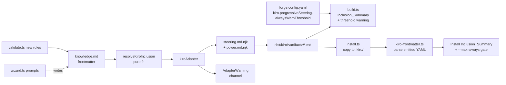

# Design Document

## Overview

Kiro's three steering inclusion modes (`always`, `fileMatch`, `manual`) are the knobs that let authors practise **Progressive Steering** — loading the lightest amount of context that still delivers a steering file at the right moment. Skill Forge's Kiro adapter already emits those three modes mechanically, but the rest of the pipeline treats `inclusion` as an afterthought: it lives on the top-level frontmatter alongside fields meant for other harnesses, defaults silently to `always`, and is never summarized or gated at build or install time.

This design closes that gap end to end. The approach is:

1. Move Kiro inclusion into `harness-config.kiro` so it cannot leak into other adapters and can be audited in one place.
2. Add a small pure resolver (`resolveKiroInclusion`) that centralizes the precedence rule and is the only code path that computes the emitted Kiro inclusion value.
3. Refactor the Kiro steering template to consume the resolved value from explicit render-context fields rather than reading frontmatter directly, so the adapter owns the emission rules.
4. Emit an audit comment in each steering file body, computed by the adapter, so downstream consumers can see what was chosen without re-parsing anything.
5. Build a reusable frontmatter scanner module (`kiro-frontmatter.ts`) used by the install pipeline to read installed files and produce the `Inclusion_Summary` and `--max-always` gating.
6. Wire summaries and threshold warnings into `build.ts` and `install.ts`, surface progressive choices through the validator and wizard, and document the knob in `forge.config.yaml`.

The feature is additive. Existing artifacts continue to build. The only observable change for pre-feature output is the single-line HTML audit comment mandated by Requirement 11.

## Architecture



Key properties of this architecture:

- **`resolveKiroInclusion` is the single source of truth.** Both `kiroAdapter` code paths (steering-format and power-format) call it before rendering, and the validator calls it to compute the resolved mode before applying type/format-conditional rules. There is no other place where inclusion precedence is computed.
- **Templates are dumb.** The steering template no longer reads `artifact.frontmatter.inclusion`. It renders whatever the adapter places in the `inclusion` and `fileMatchPattern` render-context variables.
- **The install scanner is transport-agnostic.** It parses whatever landed on disk, not whatever was in the source artifact. That means it works correctly for hand-edited files, third-party files dropped into a Kiro install dest, and files fetched from remote backends — matching Requirement 7.6 and 12.4.

## Components and Interfaces

### 1. Inclusion resolver (`src/adapters/kiro-inclusion.ts`, new)

A small pure module colocated with the Kiro adapter.

```ts
// src/adapters/kiro-inclusion.ts
import type { InclusionMode, KnowledgeArtifact } from "../schemas";

export type KiroInclusionMode = "always" | "fileMatch" | "manual";

export type KiroInclusionSource =
  | "harness-config"   // resolved from harness-config.kiro.inclusion
  | "top-level"        // resolved from frontmatter.inclusion
  | "default";         // no value set; defaulted to "always"

export interface ResolvedKiroInclusion {
  mode: KiroInclusionMode;
  fileMatchPattern: string | undefined;  // always undefined unless mode === "fileMatch"
  source: KiroInclusionSource;
}

export function resolveKiroInclusion(
  artifact: KnowledgeArtifact,
): ResolvedKiroInclusion;
```

Precedence (Req 2.1):

1. If `harness-config.kiro.inclusion ∈ {"always","fileMatch","manual"}` → use it, source = `"harness-config"`.
2. Else if top-level `frontmatter.inclusion ∈ {"always","fileMatch","manual"}` → use it, source = `"top-level"`. Note: the top-level schema also accepts `"auto"` (for other harnesses); if the top-level value is `"auto"`, treat it as unset for Kiro purposes and fall through to default.
3. Else → `{mode: "always", source: "default"}`.

`fileMatchPattern` is resolved only when `mode === "fileMatch"`, from `harness-config.kiro.fileMatchPattern`, and is `undefined` otherwise (Req 2.4). If `mode === "fileMatch"` but no `fileMatchPattern` is set, the resolver still returns `mode: "fileMatch"` and `fileMatchPattern: undefined` — it is the validator's job (Req 1.4) to surface that as an error, not the resolver's job to silently change the mode.

### 2. Kiro adapter changes (`src/adapters/kiro.ts`)

Two call sites to `renderTemplate` for Kiro steering files: one in the power-format branch (under `steering/<artifact-name>.md`) and one outside (the default steering-format path, `<artifact-name>.md`). Both are changed to:

```ts
const resolved = resolveKiroInclusion(artifact);
const steeringContent = renderTemplate(templateEnv, "kiro/steering.md.njk", {
  artifact,
  harnessConfig: kiroConfig,
  inclusion: resolved.mode,                       // NEW render-context field
  fileMatchPattern: resolved.fileMatchPattern,    // NEW render-context field
  auditComment: buildAuditComment(resolved),      // NEW (Req 11)
});
```

`buildAuditComment` is a local helper that returns:

- `<!-- forge:kiro-inclusion: always -->` for mode `always`
- `<!-- forge:kiro-inclusion: manual -->` for mode `manual`
- `<!-- forge:kiro-inclusion: fileMatch fileMatchPattern=<glob> -->` for mode `fileMatch` with a non-empty pattern
- `<!-- forge:kiro-inclusion: fileMatch -->` for mode `fileMatch` with no pattern (the validator will have already errored for this case in a strict build)

Workflow-file inspection for Req 10.3/10.4 happens in the power-format branch, immediately after `files.push(...workflow)`. For each copied workflow file, the adapter:

1. Uses the new frontmatter scanner (`src/adapters/kiro-frontmatter.ts`) to extract the workflow file's own `inclusion` field.
2. If `inclusion` is absent or equal to `"always"`, emit an `AdapterWarning` naming the file and explaining that workflow files should be disclosed progressively.
3. If `harness-config.kiro.progressiveWorkflowsStrict === true`, the adapter:
   - Pushes an `AdapterError` to the new `errors[]` field on `AdapterResult` (see §10), naming the artifact, harness (`kiro`), the offending workflow filename (via `field`), and a message explaining that strict workflows mode rejects non-progressive workflow files.
   - Omits the offending workflow file from the returned `files[]`.

This relies on a small, additive extension to `AdapterResult` described in §10. Existing adapters do not need to change — the `errors` field is optional and unset by default, so their behaviour is unchanged.

### 3. `AdapterResult` extension (`src/adapters/types.ts`)

The Kiro adapter needs a way to signal "this artifact opted into strict workflows and a workflow file was non-progressive — fail the build unconditionally." That's an error, not a warning — the author opted in, so there's no `--strict` flag needed to escalate. Today `AdapterResult` has no error channel, only `warnings: AdapterWarning[]`.

Rather than overload the warnings channel with a string-prefix convention (the earlier draft of this design used `Strict workflows:` as a recognised prefix, which `build.ts` would then reinterpret as an error), we extend `AdapterResult` with an optional `errors[]` field. It's a real structured channel, type-safe, and other adapters remain unaffected because the field is optional.

```ts
// src/adapters/types.ts
export interface AdapterError {
  artifactName: string;
  harnessName: HarnessName;
  message: string;
  // Optional: the field/path or filename that caused the error
  field?: string;
}

export interface AdapterResult {
  files: OutputFile[];
  warnings: AdapterWarning[];
  errors?: AdapterError[]; // NEW — optional to keep existing adapters compiling; kiro populates it
}
```

Integration in `src/build.ts`: when iterating over the results returned by each adapter, `build()` (and `buildWithWorkspace()`) appends `result.errors ?? []` to the aggregate `errors: BuildError[]` list it already maintains. `buildCommand` already counts that list toward the non-zero exit code decision, so the conversion is mechanical.

Important semantics detail: these `errors[]` entries are **not** gated on `--strict`. That flag is for "promote compatibility/threshold warnings to errors" — a global author preference. `progressiveWorkflowsStrict: true` on an individual artifact is the opposite: an **opt-in strict mode** scoped to that artifact. The author has already declared "I want this to fail the build if workflow files are non-progressive," so no extra flag is needed to honour that.

Other adapters (`claude-code`, `cursor`, `copilot`, `windsurf`, `cline`, `qdeveloper`) continue to return `{files, warnings}` without populating `errors`. Because the field is optional, their call sites and tests don't need to change. The `result.errors ?? []` coalescing in `build.ts` is the only caller-side change required.

### 4. Template refactor (`templates/harness-adapters/kiro/steering.md.njk`)

Today:

```njk


---
inclusion: {{ artifact.frontmatter.inclusion | default("always") }}

fileMatchPattern: "{{ harnessConfig.fileMatchPattern }}"


description: {{ artifact.frontmatter.description | dump | safe }}

---

```

New:

```njk


---
inclusion: {{ inclusion }}

fileMatchPattern: "{{ fileMatchPattern }}"


description: {{ artifact.frontmatter.description | dump | safe }}

---


{{ auditComment | safe }}
{# Generated by Skill Forge from knowledge/{{ artifact.name }} — do not edit #}

```

Notes:

- `inclusion` and `fileMatchPattern` are now explicit render-context variables, read from what the adapter resolved (Req 2.2, 2.5). The template no longer does the `default("always")` dance.
- The `header` block is overridden to prepend the audit comment (Req 11.1). By placing it inside the existing `header` block (the block that holds the `Generated by Skill Forge` comment), the ordering "immediately after closing `---` of frontmatter, before the `Generated by Skill Forge` comment" from Req 11.2 is enforced by the template inheritance structure.
- `power.md.njk` is **not** touched (Req 10.1) — POWER.md has never carried an `inclusion:` line, and this change does not add one.

### 5. Frontmatter scanner module (`src/adapters/kiro-frontmatter.ts`, new)

The install scanner needs to read whatever landed on disk. It is also used by the adapter for Req 10.3 to inspect workflow files before copying them. Shared module so both entry points use the same parser and the round-trip property in Req 12.3 is meaningful end-to-end.

**Parser choice:** Use `js-yaml` (already a runtime dependency) and `gray-matter` (already a runtime dependency) rather than hand-rolling. `gray-matter` is what the main artifact parser uses in `parser.ts`, so staying consistent here eliminates a class of "these two parsers disagree" bugs. For the subset of fields we care about (`inclusion`, `fileMatchPattern`), we then do a narrow Zod validation on the parsed object.

```ts
// src/adapters/kiro-frontmatter.ts
import type { KiroInclusionMode } from "./kiro-inclusion";

export interface KiroSteeringFrontmatter {
  inclusion: KiroInclusionMode;
  fileMatchPattern?: string;
}

export interface ParseOk {
  ok: true;
  frontmatter: KiroSteeringFrontmatter | null; // null = no frontmatter block present
}

export interface ParseErr {
  ok: false;
  filePath: string;
  approxLine: number;
  message: string;
}

export type ParseResult = ParseOk | ParseErr;

/** Parse a Kiro steering file's leading YAML frontmatter. */
export function parseKiroSteeringFile(
  content: string,
  filePath: string,
): ParseResult;

/** Pretty-print just the inclusion and fileMatchPattern fields as a
 *  Kiro-compatible frontmatter block, preserving the adapter's emission rules. */
export function printKiroFrontmatter(
  fm: KiroSteeringFrontmatter,
): string; // returns "---\ninclusion: <mode>\n[fileMatchPattern: \"<glob>\"\n]---\n"
```

The pretty-printer deliberately does **not** serialize unknown fields. Its purpose is the round-trip property of Req 12.3: for any `(mode, fmp)` that the adapter would emit, `parseKiroSteeringFile(printKiroFrontmatter({mode, fmp}), path).frontmatter` returns `{mode, fmp?}` with `fmp` suppressed when the mode is not `fileMatch`.

Suppression rule inside `printKiroFrontmatter`: if `fm.inclusion !== "fileMatch"`, `fileMatchPattern` is **not** printed, regardless of whether the caller passed one. This mirrors the adapter's emission rule (Req 2.4) so that a developer using the scanner's pretty-printer as a convenience in, say, a migration tool, cannot accidentally emit an invalid shape.

On parse error (malformed YAML, unterminated frontmatter block), `ParseErr` names the file path and the approximate line (the first line of the frontmatter block if the error is structural, or the line number reported by js-yaml if available — `js-yaml` YAMLException carries `mark.line` when `filename:` is passed in). Req 12.4 is satisfied because the install pipeline then treats that file as unparseable and the summary buckets it as "missing inclusion" per Req 7.6.

### 6. Build pipeline integration (`src/build.ts`)

Summary generation is added at the end of `build()` (the non-workspace path) and `buildWithWorkspace()` (the workspace path), right before returning `BuildResult`. Both paths already iterate files; we piggyback on that iteration.

Concretely:

- Each time a file is written at `join(distDir, h, artifact.name, file.relativePath)`, if `h === "kiro"` and `file.relativePath` ends in `.md` and is either `<artifact-name>.md` (steering-format) or `steering/<artifact-name>.md` (power-format), record the artifact's `resolveKiroInclusion(artifact).mode` and whether it is `power` format (from `resolveFormat("kiro", kiroConfig).format`) into a local `kiroSummary: Array<{artifactName: string; mode: KiroInclusionMode; format: "steering" | "power"}>`.
- Workflow-copied files under `steering/<workflow-filename>` are **not** counted in the summary, matching Req 5's scope of "compiled steering files."
- After the iteration:
  - If `kiroSummary.length === 0` → skip summary (Req 5.3).
  - Else → call `printInclusionSummary(kiroSummary)` → write to stderr (Req 5.1, 5.2, 5.5).
  - Compute `alwaysCount / total` and compare to the configured threshold. If above, emit an `AdapterWarning` listing each contributing artifact name (Req 6.1). If `strict`, promote that warning into `errors[]` so the build exits non-zero (Req 6.4).

The threshold is read from `ForgeConfig.kiro?.progressiveSteering?.alwaysWarnThreshold ?? 0.5` (see §10). The summary is printed whether or not the threshold is exceeded.

`BuildResult` gains one optional field so tests can inspect the summary without parsing stderr:

```ts
export interface BuildResult {
  // existing fields...
  kiroInclusionSummary?: {
    total: number;
    byMode: Record<KiroInclusionMode, number>;
    byFormat: Record<"steering" | "power", number>;
    progressiveRatio: number; // (fileMatch + manual) / total
    contributingArtifacts: Record<KiroInclusionMode, string[]>;
  };
}
```

### 7. Install pipeline integration (`src/install.ts`)

Two changes:

1. **CLI flag `--max-always <N>`** on `installCommand`. Parsed as an integer; `-1` or absent means "no limit." Passed through `InstallOptions` as `maxAlways?: number`.
2. **Pre-install scan + post-install scan** at the start and end of `install()` and `installWithWorkspace()`. The pre-scan enforces `--max-always` before any filesystem writes; the post-scan produces the `Inclusion_Summary` from files on disk.

#### Pre-install scan (atomic `--max-always` enforcement)

For each harness `h === "kiro"` being targeted, **before any `copyFile` calls**, scan the **source** files in `srcDir` (`dist/kiro/<artifact>/`) using `parseKiroSteeringFile`. For each `.md` file whose install-relative path matches one of `<name>.md`, `steering/<name>.md`, or `steering/<anything>.md`:

- Parse the file with `parseKiroSteeringFile`.
- If parse fails, or `frontmatter === null`, or `frontmatter.inclusion` is missing → bucket as `always` (conservative, per Req 7.6).
- Otherwise bucket by `frontmatter.inclusion`.

Compute the count of would-be-installed `always`-mode files. If `maxAlways !== undefined` and that count exceeds `maxAlways`, abort **before** writing anything:

- Print the list of source files that would have been installed as `always` and that collectively exceed the limit.
- `process.exit(1)` (non-dry-run) or print the list and continue (dry-run).

Because the pre-scan reads source files that already exist on disk at `dist/kiro/<artifact>/`, this runs without any filesystem modification. The common case — limit breach — produces zero partial state.

#### Concurrent-install safety

Two `forge install` invocations racing against the same install destination are already undefined behaviour (standard `cp -r` semantics), but the pre-scan strategy doesn't make it worse: each invocation parses its own source tree independently. The source tree is authoritative because the install step copies byte-for-byte — there is no transformation between `dist/kiro/<artifact>/*.md` and the installed file that could change the inclusion mode. Should a race somehow alter the inclusion count after pre-scan (e.g., someone editing source files between the pre-scan and the copy), the pre-scan result is treated as authoritative for the purposes of `--max-always`.

#### Post-install summary

After `install()` and `installWithWorkspace()` finish writing files, but before the final `console.error("✓ Installed …")`:

- Walk the install destination `installBase` and list every `.md` file whose install-relative path matches one of `<name>.md`, `steering/<name>.md`, or `steering/<anything>.md`.
  - In workspace install, `installBase` is `join(projectRoot, ".kiro")`; in single-project install, it is `.kiro`.
  - Only files that were installed in this invocation are considered. We track this in `installedFiles: string[]` (already computed), so the scanner receives a filtered list, not the whole directory.
- For each such file: `parseKiroSteeringFile(readFile(...), path)`.
  - If parse fails, or `frontmatter === null`, or `frontmatter.inclusion` is missing → bucket as `always` and record a warning (Req 7.6).
  - Else bucket by `frontmatter.inclusion`.
- Produce an `InstallInclusionSummary` with the same shape as the build summary (excluding `byFormat`, since install is one-sided).
- Print the summary to stderr (Req 7.1).

#### Dry-run behaviour (Req 7.2)

In `--dry-run`, both the pre-scan and the summary run against source files in `srcDir` without touching the install destination. If the pre-scan would abort the install due to `--max-always`, dry-run prints what would have been rejected and exits **with a non-zero code** (mirroring the real-run failure), so CI pipelines using `--dry-run --max-always=<N>` as a guard still detect the breach. This is distinct from a dry-run that simply would not install anything — here, the dry-run is predicting a failure that the real run would also produce.

### 8. Validator rules (`src/validate.ts` and `src/asset-conventions.ts`)

The validator operates at the artifact level in `validateArtifact`. The new rules layer on cleanly:

Add to `ASSET_CONVENTION_RULES`:

```ts
"kiro-power-should-be-progressive":
  'Artifacts using harness-config.kiro.format: "power" should not set inclusion to "always"; POWER.md is the always-on surface, steering/ files are meant to be progressively disclosed.',
"kiro-power-workflow-should-be-progressive":
  'Artifacts using harness-config.kiro.format: "power" that ship workflow files should not set inclusion to "always"; workflow files are intended to be referenced on-demand.',
"kiro-default-inclusion-informational":
  'No Kiro inclusion mode was set explicitly. Set harness-config.kiro.inclusion to "always", "fileMatch", or "manual" to make the Progressive Steering choice explicit.',
```

In `validateArtifact`, after parsing the frontmatter:

1. Only run any of the new checks when `fm.harnesses.includes("kiro")`.
2. **Zod-level checks (Req 1.1, 1.2, 1.3):** Extend `FrontmatterSchema` (see §9) so invalid `harness-config.kiro.inclusion` values are rejected at parse time. The wrapping validator layer then produces a `ValidationError` naming the field (`"harness-config.kiro.inclusion"`), the invalid value, and the three valid values — because that's what zod issues when it hits a `z.enum` failure and it's already surfaced verbatim through the parser's `ValidationError` conversion in `parser.ts`.
3. **Cross-field rule (Req 1.4):** If `harness-config.kiro.inclusion === "fileMatch"` and `harness-config.kiro.fileMatchPattern` is absent or `""`, push a `ValidationError` with field `"harness-config.kiro.fileMatchPattern"`.
4. **Cross-field warning (Req 1.5):** If `harness-config.kiro.inclusion ∈ {"always","manual"}` and `harness-config.kiro.fileMatchPattern` is a non-empty string, push a `ValidationWarning` with the same field.
5. **Asset-type rule (Req 4.1):** For `fm.type === "reference-pack"` and a resolved Kiro inclusion of `"always"`, push a warning referencing `ASSET_CONVENTION_RULES["reference-pack-must-be-manual"]`. This rule already exists in `asset-conventions.ts` against the top-level `fm.inclusion`; extend the check to use `resolveKiroInclusion(parsedArtifact).mode` when the artifact targets Kiro.
6. **Format rules (Req 4.2, 4.3):** For Kiro-targeted artifacts with `harness-config.kiro.format === "power"` and a resolved Kiro inclusion of `"always"`, push a warning. If the artifact additionally has `workflows[]` non-empty, push the 4.3 warning instead of (or in addition to) the 4.2 warning — they are distinct messages but same severity.
7. **Default-inclusion informational (Req 8.2):** If `resolveKiroInclusion` returns `{source: "default"}`, push a warning using `kiro-default-inclusion-informational`. Explicit `harness-config.kiro.inclusion: "always"` sets the source to `"harness-config"` and suppresses the warning (Req 8.3).

No validator code runs the audit comment check or the threshold check — those are strictly build-pipeline concerns (Req 6.5).

### 9. Wizard changes (`src/wizard.ts`)

`promptFrontmatter` already handles the top-level `inclusion` prompt. The change is: if `harnesses` (multi-select result) includes `"kiro"`, prompt a second, Kiro-specific question.

Placement: after the existing `harnesses = await p.multiselect(...)` and after any Kiro format prompt in the existing per-harness format loop. This ordering matters because the default for the new prompt depends on both the chosen asset type and — when type is `power` — the fact that Kiro is targeted.

```ts
// Inside promptFrontmatter, after harnesses multiselect and after the format loop:
let kiroHarnessConfig: Record<string, unknown> = harnessConfig.kiro ?? {};
if ((harnesses as string[]).includes("kiro")) {
  const initialKiroInclusion: "always" | "fileMatch" | "manual" =
    selectedType === "power" || selectedType === "reference-pack" ? "manual" : "always";

  const kiroInclusion = await p.select({
    message: "Kiro inclusion mode — when should this steering file be loaded?",
    initialValue: initialKiroInclusion,
    options: [
      { value: "always", label: "always", hint: "Loaded into every agent interaction" },
      { value: "fileMatch", label: "fileMatch", hint: "Loaded when a matching file is in context" },
      { value: "manual", label: "manual",
        hint: selectedType === "power"
          ? "Recommended for powers — progressively disclosed via POWER.md"
          : selectedType === "reference-pack"
            ? "Recommended — follows the reference-pack-must-be-manual convention"
            : "Loaded only when the user references the file with #" },
    ],
  });
  handleCancel(kiroInclusion);
  kiroHarnessConfig = { ...kiroHarnessConfig, inclusion: kiroInclusion };

  if (kiroInclusion === "fileMatch") {
    const pattern = await p.text({
      message: "fileMatchPattern (glob, e.g. src/**/*.ts)",
      validate: (val) =>
        !val || val.trim().length === 0 ? "fileMatchPattern is required for fileMatch" : undefined,
    });
    handleCancel(pattern);
    kiroHarnessConfig = { ...kiroHarnessConfig, fileMatchPattern: (pattern as string).trim() };
  }

  harnessConfig.kiro = kiroHarnessConfig;
}
```

When the `harnesses` list does **not** include `"kiro"` (Req 9.2), the block is skipped entirely and the wizard neither prompts for nor writes the Kiro-specific fields.

Results are written under `harness-config.kiro.*` (Req 9.6). The top-level `inclusion` prompt remains because other harnesses (cursor) still consume it; that is not changed by this feature.

### 10. `forge.config.yaml` schema changes

Add a `kiro` key to `ForgeConfigSchema` in `src/config.ts`:

```ts
export const ForgeConfigSchema = z.object({
  // ...existing fields...
  kiro: z
    .object({
      progressiveSteering: z
        .object({
          alwaysWarnThreshold: z.number().min(0).max(1).default(0.5),
        })
        .default({ alwaysWarnThreshold: 0.5 }),
    })
    .optional(),
});
```

And update the sample `forge.config.yaml` with a documented example (Req 14.4):

```yaml
kiro:
  progressiveSteering:
    # Warn at build time when this fraction (0..1) or more of the compiled Kiro
    # steering files resolve to inclusion: always. Default 0.5. Set to 1 to
    # disable the warning.
    alwaysWarnThreshold: 0.5
```

Build-pipeline access goes through `loadForgeConfig()` which the build entry already invokes in the remote-backend branch; we plumb the `ForgeConfig` value through `BuildOptions` for the local path where it is currently unused, or read it directly in `buildCommand`. Concrete wiring:

- `buildCommand` in `src/build.ts` loads `const config = await loadForgeConfig()` once at entry.
- Passes `config.kiro?.progressiveSteering?.alwaysWarnThreshold ?? 0.5` into a new optional `BuildOptions.kiroAlwaysWarnThreshold` field.
- `build()` and `buildWithWorkspace()` read it when computing the threshold warning.

## Data Models

### FrontmatterSchema extension

In `src/schemas.ts`, the existing `.passthrough().superRefine(...)` chain is extended to define the new `harness-config.kiro` fields precisely. Because `harness-config` is currently a free-form `Record<string, Record<string, unknown>>`, the cleanest change is to introduce a named sub-schema and wire it into the existing `superRefine`:

```ts
export const KiroProgressiveInclusionSchema = z.enum([
  "always",
  "fileMatch",
  "manual",
]);
export type KiroProgressiveInclusion = z.infer<typeof KiroProgressiveInclusionSchema>;

export const KiroHarnessConfigSchema = z
  .object({
    format: z.enum(["steering", "power"]).optional(),
    power: z.boolean().optional(), // legacy, already handled by resolveFormat
    inclusion: KiroProgressiveInclusionSchema.optional(),
    fileMatchPattern: z.string().min(1).optional(),
    progressiveWorkflowsStrict: z.boolean().optional(),
    "spec-hooks": z.array(z.record(z.string(), z.unknown())).optional(),
  })
  .passthrough();
```

The existing `FrontmatterSchema.superRefine` is extended to, when a `harness-config.kiro` is present, additionally parse it through `KiroHarnessConfigSchema` and surface any issues under the path `["harness-config", "kiro", ...]`. This keeps the schema's current `z.passthrough()` posture for other harnesses intact.

`progressiveWorkflowsStrict` is included here so that Req 10.4's opt-in is a typed field rather than a stringly-typed key.

### `InclusionMode` vs `KiroProgressiveInclusion`

The existing `InclusionModeSchema` admits four values (`always`, `auto`, `fileMatch`, `manual`). `"auto"` is meaningful only for Cursor; for Kiro output it is not valid. We therefore introduce a narrower `KiroProgressiveInclusionSchema = z.enum(["always","fileMatch","manual"])` as the type used throughout the Kiro adapter, resolver, scanner, and validator. The top-level `InclusionModeSchema` is left alone so other harnesses are unaffected (Req 8.4).

## Correctness Properties

*A property is a characteristic or behavior that should hold true across all valid executions of a system — essentially, a formal statement about what the system should do. Properties serve as the bridge between human-readable specifications and machine-verifiable correctness guarantees.*

These properties are derived from the prework analysis and are the ones that justify property-based testing with `fast-check`. Integration-style requirements (build summary formatting, install gating, wizard interactions) are covered by example tests in the Testing Strategy.

### Property 1: Resolver precedence

*For any* Kiro-targeted artifact with a top-level `frontmatter.inclusion ∈ {"always","fileMatch","manual","auto", undefined}` and a `harness-config.kiro.inclusion ∈ {"always","fileMatch","manual", undefined}`, `resolveKiroInclusion(artifact).mode` equals `harness-config.kiro.inclusion` when it is set, else the top-level `frontmatter.inclusion` when it is set and is one of the three Kiro modes, else `"always"`.

**Validates: Requirements 1.6, 2.1, 8.1, 14.2**

### Property 2: Steering-format template round-trip

*For any* `(mode, fileMatchPattern)` pair where `mode ∈ {"always","fileMatch","manual"}` and `fileMatchPattern` is any non-empty string (only used when `mode === "fileMatch"`), rendering `steering.md.njk` with an artifact whose `harness-config.kiro.inclusion = mode` and `harness-config.kiro.fileMatchPattern = fileMatchPattern` and parsing the emitted file's YAML frontmatter yields exactly `{inclusion: mode, fileMatchPattern?}` where `fileMatchPattern` is present iff `mode === "fileMatch"`.

**Validates: Requirements 2.2, 2.3, 2.5, 3.1, 3.2, 3.4**

### Property 3: fileMatchPattern suppression

*For any* `(mode, fileMatchPattern)` pair where `mode ∈ {"always","manual"}` and `fileMatchPattern` is any non-empty string, parsing the frontmatter emitted by the adapter contains no `fileMatchPattern` key, regardless of what `harness-config.kiro.fileMatchPattern` was set to on the input artifact.

**Validates: Requirements 2.4, 3.3**

### Property 4: Power-format steering file applies the same rules

*For any* artifact with `harness-config.kiro.format === "power"` and any valid `(mode, fileMatchPattern)` pair, the file emitted at `steering/<artifact-name>.md` has the same `inclusion` and (conditional) `fileMatchPattern` as Property 2 demands for the steering-format path.

**Validates: Requirements 2.6, 10.2**

### Property 5: Schema rejects invalid inclusion and empty fileMatchPattern

*For any* string `s`, `FrontmatterSchema.safeParse({..., "harness-config":{kiro:{inclusion: s}}}).success` is `true` if and only if `s ∈ {"always","fileMatch","manual"}`. *For any* value `v` (including `""`, `null`, and non-string types), `FrontmatterSchema.safeParse({..., "harness-config":{kiro:{fileMatchPattern: v}}}).success` is `true` if and only if `v` is a non-empty string or is omitted.

**Validates: Requirements 1.1, 1.2**

### Property 6: Validator cross-field rule for fileMatch

*For any* artifact with Kiro in `harnesses`, if `harness-config.kiro.inclusion === "fileMatch"` and `harness-config.kiro.fileMatchPattern` is absent or `""`, `validateArtifact(path).errors` contains an entry with field `"harness-config.kiro.fileMatchPattern"`. If `harness-config.kiro.inclusion ∈ {"always","manual"}` and `fileMatchPattern` is non-empty, `validateArtifact(path).warnings` contains an entry with the same field.

**Validates: Requirements 1.4, 1.5**

### Property 7: Audit comment emitted exactly once

*For any* Kiro-targeted artifact, the file emitted at the Kiro steering path contains exactly one line matching `/^<!-- forge:kiro-inclusion: (always|fileMatch|manual)( fileMatchPattern=.+)? -->$/`, and its captured mode equals `resolveKiroInclusion(artifact).mode`, and its captured `fileMatchPattern` (when present) equals `resolveKiroInclusion(artifact).fileMatchPattern`.

**Validates: Requirements 11.1, 11.2**

### Property 8: POWER.md carries no inclusion

*For any* Kiro-targeted artifact with `harness-config.kiro.format === "power"`, the emitted `POWER.md` contains no line matching `/^inclusion:/`.

**Validates: Requirements 10.1**

### Property 9: Install scanner parser round-trip

*For any* `(mode, fileMatchPattern)` pair where `mode ∈ {"always","fileMatch","manual"}` and `fileMatchPattern` is any non-empty string (only used when `mode === "fileMatch"`), `parseKiroSteeringFile(printKiroFrontmatter({inclusion: mode, fileMatchPattern}), "<test>")` returns `{ok: true, frontmatter: {inclusion: mode, fileMatchPattern?}}` where `fileMatchPattern` is present iff `mode === "fileMatch"`.

**Validates: Requirements 12.3**

## Error Handling

### Schema and validator errors

- **Invalid inclusion value (Req 1.3):** `FrontmatterSchema` rejects at parse time via `z.enum`. The parser (`src/parser.ts`) already surfaces zod issues as `ValidationError` entries with `field` set to the issue's `path.join(".")`. No new error path needed.
- **Missing `fileMatchPattern` when `fileMatch` (Req 1.4):** Fresh `ValidationError` with message `'harness-config.kiro.fileMatchPattern is required when harness-config.kiro.inclusion is "fileMatch"'`. Pushed in `validateArtifact` after the schema-level parse succeeds.
- **Redundant `fileMatchPattern` (Req 1.5):** Fresh `ValidationWarning`.

### Build errors

- **Threshold exceeded under `--strict` (Req 6.4):** Converted into a `BuildError` entry, causing `buildCommand` to exit 1.
- **`progressiveWorkflowsStrict` violation (Req 10.4):** Adapter pushes an `AdapterError` to `AdapterResult.errors[]` for each offending workflow file and omits the file from `files[]`. `build.ts` appends these to the aggregate `errors: BuildError[]` list. `buildCommand` already exits 1 when that list is non-empty. This is not gated on the global `--strict` flag — the author opted into strict workflows at the artifact level, so that preference is honoured unconditionally.

### Install errors

- **`--max-always` exceeded (Req 7.4):** The pre-scan detects the breach before any filesystem writes. The install pipeline prints a single, simple error:
  ```
  Error: --max-always=<N> exceeded for Kiro install.
    Would install <M> always-mode files but limit is <N>:
      <file1>
      <file2>
      ...
  ```
  Then `process.exit(1)`. Because the pre-scan runs before any `copyFile`, there are no partially-copied files to list — the filesystem is untouched.

  Requirement 7.4 says the install `SHALL NOT modify the filesystem except for files already copied before the limit was reached (those SHALL be listed in the error message)`. With pre-scan, the "except for files already copied" clause is vacuously satisfied — there are no such files. The implementation chooses this stricter, atomic behaviour because it is easier to recover from in CI pipelines and leaves no cleanup work for operators.
- **Missing `inclusion:` (Req 7.6):** Printed as a `Warning:` line (not an error) and the file is bucketed into `always` for the summary and the `--max-always` count. This is deliberate: treating unannotated files as `always` is the conservative choice, aligning with the adapter default.
- **Malformed frontmatter (Req 12.4):** Same treatment as missing `inclusion:`. The error message from the parser is forwarded verbatim via the install warning.

### Atomic install semantics

The install pipeline is **all-or-nothing** with respect to `--max-always`: either every Kiro steering file covered by this invocation is copied, or none is. The pre-scan reads the same source files that the copy phase would read (`dist/kiro/<artifact>/*.md`), computes the `always` count, and aborts before any `copyFile` runs if that count exceeds the limit.

Consequences:

- **No partial state.** Operators never have to clean up a half-installed steering directory after a `--max-always` breach. Rolling back a partial install would require tracking which files were new versus already present and undoing only the new ones — the pre-scan sidesteps that complexity entirely.
- **CI-safe.** A pipeline running `forge install --max-always=5` that fails can re-run without any intermediate cleanup step. The filesystem state after a failed install is identical to the state before the invocation.
- **Stricter than required.** Requirement 7.4 only asks that partially-copied files be listed in the error message. Pre-scan is strictly stronger: it makes the "partially copied" set empty in the common case. The requirement wording is preserved as a defensive contract in case a future implementation ever departs from the pre-scan strategy.

## Testing Strategy

### Dual approach

Property-based testing is clearly applicable here — `resolveKiroInclusion`, the steering template, the install scanner, and the frontmatter pretty-printer are all pure functions with universal properties. The feature also has integration-style requirements (build summary formatting, install gating, wizard flow) that are better covered by example tests with 1-3 representative fixtures, matching Req 13.5 and 13.6.

### Property-based tests (fast-check)

New file: `src/__tests__/kiro-progressive-steering.property.test.ts`. Each property test runs with `numRuns: 100` (the repo's existing convention). Tags match the format from existing property tests:

- Property 1 (resolver precedence) — generates `optional<KiroProgressiveInclusion>` × `optional<InclusionMode>` pairs.
- Property 2 (steering-format round-trip) — generates `(mode, fileMatchPattern)` pairs, renders through the real Nunjucks environment, parses with `js-yaml`.
- Property 3 (suppression) — generator constrained to `mode ∈ {always, manual}` and any non-empty `fileMatchPattern`.
- Property 4 (power-format round-trip) — same as Property 2 with `format: "power"` set.
- Property 5 (schema rejection) — generates arbitrary strings for `inclusion` and arbitrary values for `fileMatchPattern`.
- Property 6 (validator cross-field) — generates the full cross product of `(mode, fmp presence)`.
- Property 7 (audit comment) — regex match on rendered output.
- Property 8 (POWER.md) — grep for `^inclusion:`.
- Property 9 (install scanner round-trip) — in a new file `src/__tests__/kiro-frontmatter.property.test.ts` since it's scoped to the scanner module.

Arbitraries reuse the `safeString` and `kebabCaseString` helpers from `src/__tests__/schema-roundtrip.property.test.ts` where possible.

### Example-based unit tests

- **Adapter:** Extend `src/__tests__/adapters-kiro-claude-copilot.test.ts` with cases for (a) each of the three Kiro modes, (b) precedence when both top-level and kiro config are set, (c) `fileMatchPattern` suppression for `always`/`manual`, (d) power-format with each mode, (e) audit comment text for each mode.
- **Validator:** Extend `src/__tests__/validate.test.ts` with cases for Req 1.3 (invalid enum), 1.4 (missing fmp), 1.5 (redundant fmp), 4.1 (reference-pack + always), 4.2 (power + always), 4.3 (power + workflows + always), 8.2 (default inclusion informational).
- **Wizard:** Extend `src/__tests__/wizard.test.ts` with cases for Req 9.1 (prompt appears when kiro selected), 9.2 (prompt skipped otherwise), 9.3 (fmp prompt for fileMatch, rejects empty), 9.4/9.5 (defaults for power and reference-pack), 9.6 (emitted frontmatter shape).
- **Install scanner malformed case (Req 12.4):** One fixture with a broken `---` block; assert parser returns `{ok: false, ...}` with descriptive message.

### Integration tests

- **Build summary (Req 5.1–5.5, 13.5):** `src/__tests__/build.test.ts` extension. One fixture set with mixed inclusion modes, one with all `always`, one with no Kiro artifacts (no summary). Assert `BuildResult.kiroInclusionSummary` shape and that stderr capture contains the expected lines.
- **Threshold warning (Req 6, 13.5):** Three fixture builds: ratio below threshold (no warning), ratio above threshold (warning emitted listing contributing artifacts), ratio above threshold with `--strict` (exit 1).
- **Install `--max-always` (Req 7, 13.6):** Three fixture installs: `--max-always=0` against an artifact with an `always` file (fails), `--max-always=3` against an install with 2 `always` files (succeeds), `--max-always=1` against an install with 2 `always` files (fails with both files listed).
- **Byte-identical back-compat (Req 14.1):** Golden-file test. Build a legacy fixture (no `harness-config.kiro.inclusion`, top-level `inclusion` present), strip the audit comment line with a regex, diff against a committed pre-feature golden.

### Property configuration and tagging

Each property test follows the existing comment convention:

```ts
/**
 * Feature: kiro-progressive-steering, Property N: <title>
 *
 * **Validates: Requirements X.Y, ...**
 *
 * <property statement>
 */
```

## Evaluation Rubric

The unit and integration tests defined above lock in *static* properties of a compiled Kiro build: the frontmatter is well-formed, the summary counts are right, the threshold warning fires. They do not, by themselves, tell us whether a compiled build actually delivers Progressive Steering *in practice* — whether the steering that lands in a consumer's `.kiro/` loads only when needed, how bloated the always-on context really is, and whether authors are using the progressive modes the requirements assume they will.

This section defines a runtime **evaluation rubric** that scores a compiled build against those practical outcomes. It complements the test suite: tests gate correctness, the rubric gates quality. It is implemented on top of the existing Skill Forge eval subsystem (`src/eval.ts`, `templates/eval-contexts/`) so it reuses harness detection, prompt-wrapper conventions, and the `forge eval` command surface the repository already exposes.

### 1. Rubric goals

Three goals, each tied to specific requirements:

1. **Measure the always-on context weight.** Quantify how much steering content actually lands in every Kiro prompt for a compiled build. This is the outcome Requirements 5 and 6 are ultimately trying to improve — lower is more progressive.
2. **Measure progressive-disclosure correctness.** Verify that `fileMatch` entries fire only when matching files are plausibly in context and that `manual` entries stay out of context until explicitly referenced. This operationalises the *intent* behind Requirements 2, 10, and 11 — the modes are only useful if they actually gate context at runtime.
3. **Measure authoring ergonomics.** Track how often the default path (no explicit inclusion) fires, and how often the wizard-chosen inclusion matches the asset-type recommendation. This validates Requirements 4 and 9 from the user side — the tooling is only ergonomic if authors reach for the right mode without thinking.

### 2. Metrics

Six named metrics. Each is computed deterministically from a compiled build directory and, where needed, a labeled workload fixture.

| # | Name | Symbol | Formula | Unit | Data source | Validates |
|---|---|---|---|---|---|---|
| 1 | Always-on Context Weight | **AOCW** | `sum(tokens(body) for sf in installed if sf.inclusion == "always") / sum(tokens(body) for sf in installed)` | ratio ∈ [0,1] | compiled `dist/kiro/**/*.md` + `steering/**/*.md`; tokens via pinned tokenizer with chars fallback | Req 5, 6 |
| 2 | Progressive Ratio | **PR** | `count(sf for sf in installed if sf.inclusion in {"fileMatch","manual"}) / count(installed)` | ratio ∈ [0,1] | `BuildResult.kiroInclusionSummary.progressiveRatio` (reused) | Req 5.2, 6.1 |
| 3 | FileMatch Hit Precision | **FMP** | `mean(over fileMatch files: fires_needed / fires_total)` where events come from a labeled workload | ratio ∈ [0,1] | workload fixture (§4) + glob matching against `openedFiles[]` | Req 2, 10 |
| 4 | Manual Discoverability | **MD** | `count(mf in manual where top5_tfidf(mf) ⊆ union(tokens(body) for sf in installed if sf.inclusion == "always")) / count(manual)` | ratio ∈ [0,1] | installed bodies + TF-IDF over the corpus | Req 10, 11 |
| 5 | Default Escape Rate | **DER** | `count(artifacts where resolveKiroInclusion(a).source == "default") / count(kiro artifacts)` | ratio ∈ [0,1] | source artifacts + `resolveKiroInclusion` | Req 8.2, 9 |
| 6 | Wizard-Convention Alignment | **WCA** | `count(a in kiro artifacts where a.type ∈ {"power","reference-pack"} and resolveKiroInclusion(a).mode != "always") / count(a in kiro artifacts where a.type ∈ {"power","reference-pack"})` (defined as `1.0` when the denominator is `0`) | ratio ∈ [0,1] | source artifacts | Req 4, 9 |

Notes on sourcing:

- AOCW uses a pinned tokenizer (see §6). The chars-based fallback computes `tokens(body) ≈ max(1, ceil(chars(body) / 4))`, a conservative approximation that preserves the ratio under monotone substitution.
- PR is intentionally redundant with `BuildResult.kiroInclusionSummary.progressiveRatio`. Recomputing it in the rubric provides a consistency check against the build summary (§8).
- FMP requires ground truth labels on the workload (`expectedFired[]`). Without labels, FMP is undefined and the rubric falls back to a warning with FMP set to `0`.
- MD uses a TF-IDF pass over only the installed steering corpus so the metric is self-contained — no external stopword list or language model.
- DER is the one metric that reads source artifacts, not compiled output, because `{source: "default"}` is a resolver property that survives into the emitted audit comment. The rubric can recover it either from the source artifact or by parsing the audit comment from the compiled file.
- WCA is defined as `1.0` when there are no `power`/`reference-pack` artifacts in the build so a feature-absent build scores neutrally rather than as a failure.

### 3. Scoring

The composite score is a weighted linear combination of the six metrics, normalised to 0–100.

```
Score = 100 * (
    w1 * (1 - AOCW)   +
    w2 * PR           +
    w3 * FMP          +
    w4 * MD           +
    w5 * (1 - DER)    +
    w6 * WCA
)
```

**Weights** (sum to 1.00):

| Weight | Value | Rationale |
|---|---|---|
| `w1` (AOCW) | 0.30 | Highest weight: always-on bloat is the primary harm Progressive Steering exists to prevent, and is the one metric consumers feel on every prompt. |
| `w2` (PR) | 0.15 | Coarse shape-check on the distribution; complements AOCW but is less sensitive to content size. |
| `w3` (FMP) | 0.25 | High weight: a `fileMatch` entry that never fires (or fires on everything) defeats progressive disclosure. |
| `w4` (MD) | 0.10 | Manual entries are only progressive if an author can discover them — without discoverability, `manual` is indistinguishable from "not installed." |
| `w5` (1 − DER) | 0.10 | Rewards explicit author choice; penalises the silent default path. |
| `w6` (WCA) | 0.10 | Rewards builds where the wizard's recommended modes for `power`/`reference-pack` artifacts are actually adopted. |

**Thresholds:**

| Rating | Condition | Exit code | CLI behaviour |
|---|---|---|---|
| 🟢 Green (pass) | `Score ≥ 80` AND `AOCW ≤ 0.40` AND `FMP ≥ 0.75` | 0 | `forge eval --harness kiro --rubric progressive-steering` succeeds silently |
| 🟡 Yellow (warn) | `Score ≥ 60` AND `AOCW ≤ 0.60` AND not Green | 0 | Command succeeds but prints a visible warning banner listing the failing sub-thresholds |
| 🔴 Red (fail) | anything below Yellow | 1 | Command exits non-zero; a CI job gated on the rubric fails the release candidate |

AOCW and FMP sub-gates on Green and Yellow exist because the composite can otherwise be gamed: a build with AOCW = 0.9 but high PR and WCA could cross the 80-point bar while still being a regression on the primary goal.

### 4. Test fixtures

FMP and MD require hand-labeled ground truth. Fixtures live under `fixtures/eval/kiro-progressive-steering/` with three scenarios:

```
fixtures/eval/kiro-progressive-steering/
├── scenario-small/
│   ├── artifacts/              # source knowledge artifacts (3 files)
│   ├── expected-build/         # expected dist/kiro output for determinism checks
│   ├── workload.json           # ground-truth prompts and expected fires
│   └── README.md               # narrative description of the scenario
├── scenario-mixed/
│   ├── artifacts/              # 5 steering files across all three modes
│   ├── expected-build/
│   ├── workload.json
│   └── README.md
└── scenario-anti/
    ├── artifacts/              # 5 always-mode files; designed to fail
    ├── expected-build/
    ├── workload.json
    └── README.md
```

**`scenario-small`** — smoke-test fixture. One `always` file, one `fileMatch` file whose glob matches files under `src/`, one `manual` file whose topic is mentioned in the `always` file's body. Exercises the happy path and should score Green.

**`scenario-mixed`** — the production gating fixture. Five steering files distributed across all three modes, backed by a workload file with at least 20 prompts that exercise: direct file opens that should fire `fileMatch`, file opens that should *not* fire any `fileMatch`, explicit `#`-references to `manual` files, and bare prompts that should only surface `always` files. This is the fixture that the CI gate uses.

**`scenario-anti`** — deliberate failure fixture. Five `always`-mode steering files with overlapping content. Exists to prove the rubric actually produces Red on a bad build — a regression in the rubric that accidentally scores this Green is a defect in the rubric itself.

**Workload schema.** Each `workload.json` is a deterministic list of prompt scenarios:

```jsonc
{
  "promptId": "open-auth-file",
  "openedFiles": ["src/auth/login.ts"],
  "userReferences": [],
  "expectedFired": ["auth-rules"]
}
```

- `openedFiles[]` — paths that the rubric pretends are in the agent's file-open context; matched against each `fileMatch` steering file's glob.
- `userReferences[]` — steering file names that the prompt explicitly `#`-references; used for `manual`-mode accounting.
- `expectedFired[]` — the ground-truth set of steering files that *should* be in context for this prompt. Every entry must be a file present in the installed build.

Workload entries must be stable, language-agnostic paths; no absolute paths, no timestamps, no environment variables.

### 5. Runner design

The runner is an extension of the existing eval subsystem, not a parallel implementation.

**Prompt wrapper.** Keep using the existing `.md.njk` convention in `templates/eval-contexts/`. The current `kiro.md.njk` (which wraps a single steering file as context for promptfoo-style evals) is reused as-is. No new wrapper is required for the rubric because the rubric does not run an LLM — it evaluates the compiled build statically against the workload.

**Rubric config.** A new file at `src/eval/rubrics/kiro-progressive-steering.ts` exports a `ProgressiveSteeringRubric` object describing: the rubric id, its fixtures, its metric weights, and its grading function. A parallel YAML descriptor at `evals/kiro-progressive-steering.yaml` exposes the same rubric to the `forge eval` CLI so it is discoverable by `discoverEvalConfigs()` alongside existing configs.

**Grading function.**

```ts
// src/eval/rubrics/kiro-progressive-steering.ts
import { parseKiroSteeringFile } from "../../adapters/kiro-frontmatter";
import { resolveKiroInclusion } from "../../adapters/kiro-inclusion";

export interface ProgressiveSteeringMetrics {
  AOCW: number;
  PR: number;
  FMP: number;
  MD: number;
  DER: number;
  WCA: number;
}

export interface ProgressiveSteeringResult {
  score: number;                          // 0..100
  rating: "green" | "yellow" | "red";
  metrics: ProgressiveSteeringMetrics;
  details: {
    perFilemMatchFile: Array<{ name: string; firesNeeded: number; firesTotal: number }>;
    perManualFile: Array<{ name: string; top5Tokens: string[]; covered: boolean }>;
    defaultSourceArtifacts: string[];     // stable-sorted
    misalignedWizardArtifacts: string[];  // stable-sorted
  };
}

export function gradeProgressiveSteering(
  buildDir: string,
  workload: Workload,
): ProgressiveSteeringResult;
```

The grader reuses `parseKiroSteeringFile` to read compiled steering files — no duplicate frontmatter parser — and reuses `resolveKiroInclusion` for the DER and WCA metrics, so the rubric cannot drift from the adapter's definition of "source."

**Inputs.** `gradeProgressiveSteering` operates on a compiled build directory (not source), so the eval exercises the real adapter output. When run against source, the `forge eval` command builds into a tempdir first and passes that path in.

**Output formats.**

- `--json` — machine-readable `ProgressiveSteeringResult` written to the path provided by `--output`. Consumed by CI dashboards.
- Default — rich terminal output: a table of metrics with targets and actuals, a coloured rating banner, and the per-file details when rating ≠ Green.

**CLI surface.** A new `--rubric <name>` option on `forge eval` selects which rubric to run for a given harness. `forge eval --harness kiro` uses `kiro-progressive-steering` as the default rubric, matching the integration described in §9.

### 6. Reproducibility

The rubric must produce bit-identical output across runs on the same inputs, so CI diffs are meaningful and operators can reproduce failures.

**Tokenizer.** Pin `tiktoken` with the `cl100k_base` encoding (the OpenAI encoding used by GPT-4 and Claude-class tokenizers; close enough for Kiro's purposes that AOCW rankings are stable). When `tiktoken` is not installed at runtime, the grader falls back to `max(1, ceil(chars / 4))` and emits a one-line warning to stderr. Both paths must be pure functions of the input string — no network calls, no locale dependence, no environment-sensitive behaviour.

**Workload determinism.** `workload.json` files must contain no timestamps, no RNG seeds, no environment-dependent paths, and no absolute paths. List fields are canonically sorted (lexicographic on string fields; ascending on numeric fields) at write time, and the grader does not mutate them in place.

**Grader purity.** Given `(buildDir, workload)`, the grader produces the same `{score, metrics, details}` object on every invocation, with stable ordering of list fields in `details`. All intermediate maps are sorted before serialisation. No reads of `Date.now()`, `process.env`, or `Math.random()` are permitted in the grading path.

**Reproducibility is itself a property.** See §7.

### 7. New correctness property

This property is scoped to the rubric runner, not the build/install pipeline, so it lives in this section rather than the main Correctness Properties list.

#### Rubric Property R1: Scoring determinism

*For any* compiled build directory `B` and workload `W`, `gradeProgressiveSteering(B, W)` returns the same `{score, rating, metrics, details}` object on repeated invocation, with stable ordering of any list fields in `details`.

**Validates: §6 reproducibility contract**

Implementation: a `fast-check` property test in `src/__tests__/kiro-progressive-steering-rubric.property.test.ts` that generates small build-directory fixtures (via an arbitrary that populates a tmpdir with randomised steering files) and workloads, invokes the grader twice, and asserts structural equality with `Object.is`-sensitive deep-equality (no floating-point wobble, no list-order differences).

### 8. Integration with existing metrics

The rubric deliberately overlaps with the build summary for the two cheapest metrics, then diverges for the expensive ones.

| Metric | Source | Cost |
|---|---|---|
| AOCW | Recomputed from installed bodies (tokenizer) | Low — no new instrumentation beyond the tokenizer |
| PR | **Reused** from `BuildResult.kiroInclusionSummary.progressiveRatio` | Free — the build already computes it |
| FMP | Requires labeled workload and glob evaluation | Moderate — needs fixtures |
| MD | Requires TF-IDF pass over corpus | Moderate — one-pass, in-memory |
| DER | Requires resolver + audit-comment parse | Low |
| WCA | Requires source artifact metadata | Low |

The practical consequence: **the build summary is the cheap always-on check that runs on every `forge build`; the rubric is the deep opt-in check that runs on `forge eval`.** Authors see PR and threshold warnings for free during the inner loop; CI and release gates run the full rubric. The two surfaces share `BuildResult.kiroInclusionSummary` as the source of truth for PR, so a divergence between the build-summary PR and the rubric PR indicates a defect in one or the other — tested as a smoke check in the rubric integration tests.

### 9. When to run

**Harness-default rubric.** `forge eval --harness kiro` uses `progressive-steering` as the default rubric. Running plain `forge eval --harness kiro` after a build exercises it with zero additional arguments.

**CI gate.** A new job `eval-kiro-progressive-steering` runs on every PR that touches any Kiro-relevant path (`src/adapters/kiro*.ts`, `templates/harness-adapters/kiro/**`, `src/schemas.ts`, `src/validate.ts`, `src/wizard.ts`, `src/eval/rubrics/kiro-progressive-steering.ts`, or `fixtures/eval/kiro-progressive-steering/**`). The job:

1. Runs `forge build` on the `scenario-mixed` fixture.
2. Runs `forge eval --harness kiro --rubric progressive-steering --build <tempdir> --json rubric.json`.
3. Fails on non-zero exit (i.e., any Red rating). Yellow ratings surface as annotations on the PR but do not fail the job.
4. Uploads `rubric.json` as an artifact for trend analysis.

**Author workflow.** After `forge build`, an author runs:

```bash
forge eval --harness kiro --rubric progressive-steering --build dist/kiro
```

for a local sanity check. The command completes in under a few seconds on the `scenario-mixed` fixture and produces the same JSON that CI would produce — so an author can reproduce a CI failure locally without replaying the pipeline.

**Release gating.** The rubric is a release-candidate gate. A release branch is not eligible for cutting until the `eval-kiro-progressive-steering` job has passed on the tip commit. Yellow ratings on release branches require a documented exception in the release notes; Red ratings block the release.

## File-level change inventory

### New files

| Path | Purpose |
|---|---|
| `src/adapters/kiro-inclusion.ts` | `resolveKiroInclusion` pure function and types |
| `src/adapters/kiro-frontmatter.ts` | Frontmatter scanner + pretty-printer for Kiro steering files |
| `src/__tests__/kiro-progressive-steering.property.test.ts` | Properties 1–8 (adapter/resolver/template) |
| `src/__tests__/kiro-frontmatter.property.test.ts` | Property 9 (scanner round-trip) |
| `src/__tests__/kiro-progressive-steering.test.ts` | Integration tests for build summary, threshold warning, install gating |

### Modified files

| Path | Change |
|---|---|
| `src/adapters/types.ts` | Add optional `errors?: AdapterError[]` field to `AdapterResult` and new `AdapterError` interface |
| `src/schemas.ts` | Add `KiroProgressiveInclusionSchema`, `KiroHarnessConfigSchema`; wire into `FrontmatterSchema.superRefine` |
| `src/adapters/kiro.ts` | Call `resolveKiroInclusion`; pass `inclusion`, `fileMatchPattern`, `auditComment` to template; inspect workflow frontmatter; push `AdapterError` entries for `progressiveWorkflowsStrict` violations |
| `templates/harness-adapters/kiro/steering.md.njk` | Consume explicit render-context vars; override `header` block to include audit comment |
| `src/validate.ts` | Add Req 1.4/1.5 cross-field rules, Req 4.1–4.3 asset/format rules, Req 8.2 informational warning |
| `src/asset-conventions.ts` | Add three new `ASSET_CONVENTION_RULES` keys |
| `src/wizard.ts` | Add conditional Kiro inclusion prompt and fileMatchPattern prompt; write to `harness-config.kiro` |
| `src/build.ts` | Compute Kiro inclusion summary; print to stderr; compute threshold warning; honor `--strict`; append adapter `errors[]` to aggregate build errors; plumb `kiroAlwaysWarnThreshold` from `ForgeConfig` |
| `src/install.ts` | Add `--max-always` option; pre-install scan for atomic `--max-always` enforcement; post-install summary; dry-run parity |
| `src/config.ts` | Add `kiro.progressiveSteering.alwaysWarnThreshold` to `ForgeConfigSchema` |
| `forge.config.yaml` | Add sample `kiro.progressiveSteering` block with comment |
| `src/cli.ts` | Register `--max-always <N>` on the `install` command |
| `src/__tests__/adapters-kiro-claude-copilot.test.ts` | Kiro adapter example tests (Req 13.1) |
| `src/__tests__/validate.test.ts` | Validator example tests (Req 13.4) |
| `src/__tests__/wizard.test.ts` | Wizard example tests |
| `src/__tests__/build.test.ts` | Build summary and threshold integration tests |
| `src/__tests__/install.test.ts` | Install `--max-always` integration tests |

### Unchanged files (intentionally called out)

- `templates/harness-adapters/kiro/power.md.njk` — POWER.md still carries no `inclusion:` line (Req 10.1).
- `src/adapters/cursor.ts` — continues to consume top-level `frontmatter.inclusion` unchanged (Req 8.4). The Cursor adapter's own `cursorConfig.inclusion` override path is a separate concern and is not touched.
- `src/adapters/claude-code.ts`, `src/adapters/copilot.ts`, `src/adapters/windsurf.ts`, `src/adapters/cline.ts`, `src/adapters/qdeveloper.ts` — unchanged (Req 8.4).

## Backward compatibility strategy

Concrete evidence that pre-feature callers keep working:

1. **Schema:** `FrontmatterSchema` is still `.passthrough()` and `harness-config` is still a loose record. `KiroHarnessConfigSchema` adds new optional fields; existing artifacts that set only `format` or `power` continue to parse.
2. **Adapter:** `resolveKiroInclusion` defaults to `"always"` and consults the top-level `inclusion` when `harness-config.kiro.inclusion` is absent. For a pre-feature artifact with top-level `inclusion: fileMatch` and `file_patterns: [...]`, the emitted YAML carries `inclusion: fileMatch` — same as today. The top-level `file_patterns` field is **not** consulted for Kiro output (it never was — today the template reads `harnessConfig.fileMatchPattern`, which we preserve).
3. **Template:** The new render-context vars (`inclusion`, `fileMatchPattern`) carry the same values that the old template computed inline via `artifact.frontmatter.inclusion | default("always")` and the conditional `harnessConfig.fileMatchPattern` check. For a pre-feature artifact, `inclusion = resolveKiroInclusion(artifact).mode = artifact.frontmatter.inclusion` (when set) or `"always"`, and `fileMatchPattern = harnessConfig.fileMatchPattern` (when mode is fileMatch) — a byte-for-byte match with the old conditional's effective output.
4. **Audit comment (Req 11):** This is the one observable change in emitted output. The golden-file back-compat test (see Testing Strategy) strips lines matching `^<!-- forge:kiro-inclusion: .* -->$` before diffing, which bounds the regression surface to exactly the comment mandated by Req 11.
5. **Build pipeline:** Summary and threshold warning are additive stderr output. They do not alter `BuildResult.artifactsCompiled`, `filesWritten`, or `errors[]` for legacy artifacts. They do not affect exit code unless `--strict` is passed (Req 6.4) or the threshold is 1 (Req 6.3, which disables the warning entirely).
6. **Install pipeline:** `--max-always` is opt-in. Without it, the install does not gate — no pre-scan breach is possible, and the install proceeds exactly as before. The post-install summary is additive stderr output (Req 14.3). When `--max-always` is used, the pre-scan runs before any writes, so a breach never leaves partial state.
7. **`AdapterResult.errors[]`:** The new field is optional. Other adapters (`claude-code`, `cursor`, `copilot`, `windsurf`, `cline`, `qdeveloper`) do not populate it, so their observable behaviour is unchanged. The Kiro adapter only populates `errors[]` when an artifact opts into `progressiveWorkflowsStrict: true` and a workflow file is non-progressive — a scenario that cannot arise without an explicit new opt-in. `build.ts` coalesces `result.errors ?? []` when aggregating, so pre-feature adapters continue to compile and run.
8. **Config file:** `forge.config.yaml` without a `kiro` block yields `config.kiro === undefined`, and the build reads the 0.5 default — same threshold the feature would use if the operator set it explicitly. The sample documentation ensures operators can override without trial and error (Req 14.4).
9. **Non-Kiro adapters:** No non-Kiro adapter reads `harness-config.kiro`. The validator's new rules are scoped with `fm.harnesses.includes("kiro")` guards. The wizard's new prompt is scoped with `(harnesses as string[]).includes("kiro")`. All non-Kiro paths are inert (Req 8.4).
