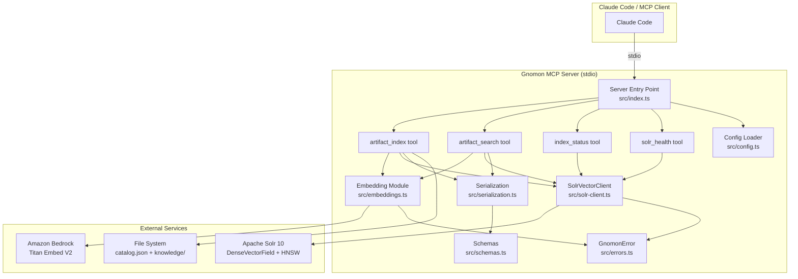
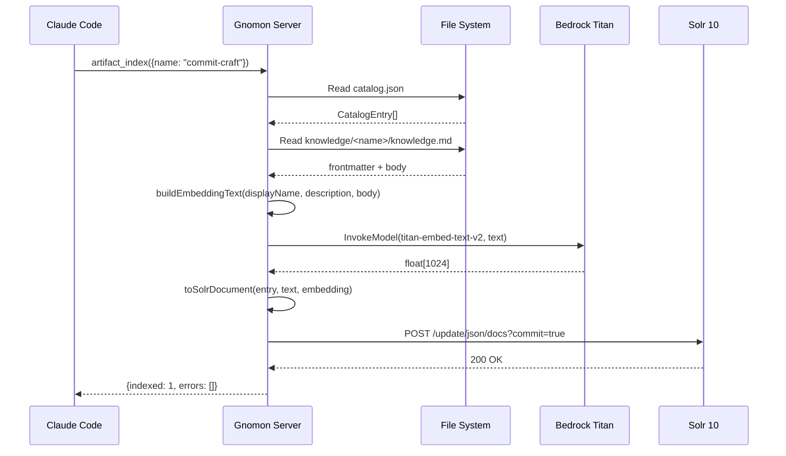
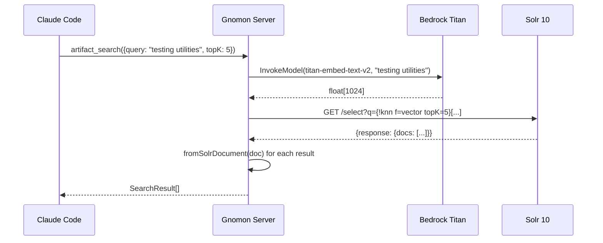

# Design Document: Gnomon — Solr-Backed Semantic Search MCP Server

## Overview

Gnomon (γνώμων — "one who knows/discerns") is a standalone MCP server that provides semantic search over the context-bazaar knowledge artifact catalog. It indexes artifact content into Apache Solr 10 as dense vector embeddings (via Amazon Bedrock Titan Embeddings V2, 1024 dimensions) and exposes kNN search through MCP tools.

Gnomon lives at `kanon/mcp-servers/gnomon/` alongside the existing `souk-compass` server. It follows the same structural patterns: Bun runtime, Zod v4 schemas, `@modelcontextprotocol/sdk` with stdio transport, and a CJS bundle for distribution. The key architectural difference is that Gnomon is intentionally minimal — focused exclusively on artifact-level semantic search without the multi-collection, codebase indexing, chunking, or memory features of souk-compass.

### Design Goals

1. **Simplicity**: Single-collection, whole-document indexing (no chunking)
2. **Consistency**: Follow existing patterns from souk-compass for Solr interaction and MCP tool registration
3. **Correctness**: Zod-validated data flows with explicit round-trip guarantees for serialization
4. **Graceful degradation**: Server starts without Solr; tool invocations report errors without crashing

## Architecture



### Data Flow: Indexing



### Data Flow: Search



## Components and Interfaces

### File Structure

```
kanon/mcp-servers/gnomon/
├── src/
│   ├── index.ts            # MCP server entry point
│   ├── config.ts           # Environment → GnomonConfig
│   ├── schemas.ts          # All Zod schemas + inferred types
│   ├── errors.ts           # GnomonError class + error codes
│   ├── solr-client.ts      # SolrVectorClient (HTTP → Solr)
│   ├── embeddings.ts       # embed() / batchEmbed() via Bedrock
│   ├── serialization.ts    # toSolrDocument / fromSolrDocument
│   └── __tests__/          # Unit + property tests
│       ├── schemas.test.ts
│       ├── serialization.test.ts
│       ├── serialization.property.test.ts
│       ├── config.test.ts
│       ├── config.property.test.ts
│       ├── solr-client.test.ts
│       ├── embeddings.test.ts
│       └── server.test.ts
├── solr/
│   ├── schema.xml          # Solr field definitions
│   └── README.md           # Setup instructions
├── docker-compose.yml      # Local Solr 10 dev instance
├── package.json
├── tsconfig.json
└── dist/
    └── mcp-server.cjs      # Compiled CJS bundle (gitignored)
```

### Component: `GnomonError` (`src/errors.ts`)

```typescript
export const ErrorCodes = {
  SOLR_CONNECTION: "SOLR_CONNECTION",
  SOLR_HTTP: "SOLR_HTTP",
  EMBED_FAILURE: "EMBED_FAILURE",
  EMBED_TRUNCATED: "EMBED_TRUNCATED",
  SERIALIZATION: "SERIALIZATION",
  CONFIG_INVALID: "CONFIG_INVALID",
  CATALOG_READ: "CATALOG_READ",
  ARTIFACT_READ: "ARTIFACT_READ",
} as const;

export type ErrorCode = (typeof ErrorCodes)[keyof typeof ErrorCodes];

export class GnomonError extends Error {
  readonly code: ErrorCode;
  readonly httpStatus?: number;
  readonly solrMessage?: string;

  constructor(
    message: string,
    code: ErrorCode,
    options?: { httpStatus?: number; solrMessage?: string; cause?: unknown }
  ) {
    super(message, { cause: options?.cause });
    this.name = "GnomonError";
    this.code = code;
    this.httpStatus = options?.httpStatus;
    this.solrMessage = options?.solrMessage;
  }
}
```

### Component: `SolrVectorClient` (`src/solr-client.ts`)

```typescript
export class SolrVectorClient {
  constructor(baseUrl: string, collection: string);

  /** Upsert a document with auto-commit (default) or deferred commit. */
  async upsert(
    docId: string,
    text: string,
    embedding: number[],
    metadata: Record<string, string | string[]>,
    options?: { commit?: boolean }
  ): Promise<void>;

  /** kNN vector search with optional Solr filter query (fq). */
  async search(
    queryEmbedding: number[],
    topK: number,
    filterQuery?: string
  ): Promise<SolrSearchResponse>;

  /** Delete a single document by ID. */
  async delete(docId: string): Promise<void>;

  /** Check Solr connectivity and collection existence. */
  async health(): Promise<boolean>;

  /** Explicit commit for batch operations. */
  async commit(): Promise<void>;

  /** Get total document count in the collection. */
  async count(): Promise<number>;
}

export interface SolrSearchResponse {
  response: {
    docs: Record<string, unknown>[];
    numFound: number;
  };
}
```

**Internal HTTP helper**: Uses the Fetch API. On connection failure, throws `GnomonError` with code `SOLR_CONNECTION`. On non-2xx responses, throws `GnomonError` with code `SOLR_HTTP` including HTTP status and Solr error body.

### Component: Embedding Module (`src/embeddings.ts`)

```typescript
import type { EmbedConfig } from "./schemas.js";

/**
 * Generate a single embedding vector from text.
 * Truncates input if it exceeds Titan V2's 8192-token limit.
 */
export async function embed(text: string, config: EmbedConfig): Promise<number[]>;

/**
 * Generate embeddings for multiple texts, reusing the Bedrock client.
 */
export async function batchEmbed(texts: string[], config: EmbedConfig): Promise<number[][]>;
```

**Implementation details**:
- Creates a `BedrockRuntimeClient` with the configured region
- Sends `InvokeModel` with `modelId: config.modelId` and body `{ inputText, dimensions }`
- Parses the response to extract `embedding` array
- Truncation strategy: approximate token count as `text.length / 4`, truncate to `8192 * 4 = 32768` characters if exceeded
- On Bedrock failure: wraps in `GnomonError` with code `EMBED_FAILURE` including AWS error type/message

### Component: Serialization (`src/serialization.ts`)

```typescript
import type { CatalogEntry } from "../../../src/schemas.js";
import type { SearchResult, SolrDocument } from "./schemas.js";

/** Build the text used for embedding generation. */
export function buildEmbeddingText(
  displayName: string,
  description: string,
  body: string
): string;
// Returns: `${displayName}: ${description}\n\n${body}`

/** Convert catalog entry + text + embedding → Solr document. */
export function toSolrDocument(
  entry: CatalogEntry,
  text: string,
  embedding: number[]
): SolrDocument;

/** Parse Solr response document → typed SearchResult. */
export function fromSolrDocument(doc: Record<string, unknown>): SearchResult;
```

**Round-trip guarantee**: For all valid `CatalogEntry` inputs with valid embeddings, `fromSolrDocument(toSolrDocument(entry, text, embedding))` preserves `artifactName`, `type`, `description`, `maturity`, and `collections`.

### Component: Configuration (`src/config.ts`)

```typescript
import type { GnomonConfig } from "./schemas.js";

/** Load and validate configuration from environment variables. */
export function loadConfig(): GnomonConfig;
```

**Environment variable mapping**:

| Env Var | Config Field | Default |
|---------|-------------|---------|
| `GNOMON_SOLR_URL` | `solrUrl` | `http://localhost:8983` |
| `GNOMON_SOLR_COLLECTION` | `solrCollection` | `context-bazaar` |
| `GNOMON_AWS_REGION` | `awsRegion` | `us-east-1` |
| `GNOMON_EMBED_MODEL` | `embedModel` | `amazon.titan-embed-text-v2:0` |
| `GNOMON_EMBED_DIMENSIONS` | `embedDimensions` | `1024` |

Removes `undefined` entries before Zod parsing so defaults apply. On validation failure, throws with clear error messages listing all invalid fields.

### Component: MCP Server Entry (`src/index.ts`)

```typescript
// Pseudo-structure
const server = new Server(
  { name: "gnomon", version: "0.1.0" },
  { capabilities: { tools: {} } }
);

// Register tools: artifact_index, artifact_search, index_status, solr_health
// Each tool handler:
// 1. Validates input with Zod
// 2. Executes business logic
// 3. On success: returns { content: [{type: "text", text: ...}] }
// 4. On error: returns { content: [{type: "text", text: ...}], isError: true }
//    (never crashes the process)

const transport = new StdioServerTransport();
await server.connect(transport);
```

## Data Models

### Zod Schemas (`src/schemas.ts`)

```typescript
import { z } from "zod";

// --- Configuration ---
export const GnomonConfigSchema = z.object({
  solrUrl: z.string().url().default("http://localhost:8983"),
  solrCollection: z.string().min(1).default("context-bazaar"),
  awsRegion: z.string().min(1).default("us-east-1"),
  embedModel: z.string().min(1).default("amazon.titan-embed-text-v2:0"),
  embedDimensions: z.number().int().positive().default(1024),
});
export type GnomonConfig = z.infer<typeof GnomonConfigSchema>;

// --- Embedding Config ---
export const EmbedConfigSchema = z.object({
  region: z.string().min(1),
  modelId: z.string().min(1),
  dimensions: z.number().int().positive().default(1024),
});
export type EmbedConfig = z.infer<typeof EmbedConfigSchema>;

// --- Solr Document (upsert payload) ---
export const SolrDocumentSchema = z.object({
  id: z.string().min(1),
  text: z.string(),
  vector: z.array(z.number()).min(1),
  artifact_name: z.string(),
  artifact_type: z.string(),
  collection_names: z.union([z.string(), z.array(z.string())]),
  keywords: z.union([z.string(), z.array(z.string())]),
  maturity: z.string(),
  author: z.string(),
  version: z.string(),
});
export type SolrDocument = z.infer<typeof SolrDocumentSchema>;

// --- Search Result (parsed from Solr response) ---
export const SearchResultSchema = z.object({
  artifactName: z.string(),
  displayName: z.string(),
  type: z.string(),
  score: z.number(),
  description: z.string(),
  maturity: z.string(),
  collections: z.array(z.string()),
});
export type SearchResult = z.infer<typeof SearchResultSchema>;

// --- Tool Input Schemas ---
export const ToolInputSchemas = {
  artifact_index: z.object({
    name: z.string().optional(),
    all: z.boolean().optional(),
  }),
  artifact_search: z.object({
    query: z.string().min(1),
    topK: z.number().int().positive().default(5),
    type: z.string().optional(),
    collection: z.string().optional(),
    maturity: z.string().optional(),
  }),
  index_status: z.object({}),
  solr_health: z.object({}),
} as const;

// Inferred input types
export type ArtifactIndexInput = z.input<typeof ToolInputSchemas.artifact_index>;
export type ArtifactSearchInput = z.input<typeof ToolInputSchemas.artifact_search>;
export type IndexStatusInput = z.input<typeof ToolInputSchemas.index_status>;
export type SolrHealthInput = z.input<typeof ToolInputSchemas.solr_health>;
```

### Solr Collection Schema (`solr/schema.xml`)

```xml
<?xml version="1.0" encoding="UTF-8"?>
<schema name="gnomon" version="1.0">
  <uniqueKey>id</uniqueKey>

  <field name="id" type="string" indexed="true" stored="true" required="true"/>
  <field name="text" type="text_general" indexed="true" stored="true"/>
  <field name="vector" type="knn_vector_1024" indexed="true" stored="true"/>
  <field name="artifact_name" type="string" indexed="true" stored="true"/>
  <field name="artifact_type" type="string" indexed="true" stored="true"/>
  <field name="collection_names" type="string" indexed="true" stored="true" multiValued="true"/>
  <field name="keywords" type="string" indexed="true" stored="true" multiValued="true"/>
  <field name="maturity" type="string" indexed="true" stored="true"/>
  <field name="author" type="string" indexed="true" stored="true"/>
  <field name="version" type="string" indexed="true" stored="true"/>

  <fieldType name="knn_vector_1024" class="solr.DenseVectorField"
    vectorDimension="1024"
    similarityFunction="cosine"
    knnAlgorithm="hnsw"
    hnswMaxConnections="16"
    hnswBeamWidth="100"/>
</schema>
```

### `.mcp.json` Entry

```json
{
  "gnomon": {
    "command": "node",
    "args": ["${CLAUDE_PLUGIN_ROOT}/kanon/mcp-servers/gnomon/dist/mcp-server.cjs"],
    "env": {
      "GNOMON_SOLR_URL": "http://localhost:8983",
      "GNOMON_SOLR_COLLECTION": "context-bazaar",
      "GNOMON_AWS_REGION": "us-east-1"
    }
  }
}
```

## Correctness Properties

*A property is a characteristic or behavior that should hold true across all valid executions of a system — essentially, a formal statement about what the system should do. Properties serve as the bridge between human-readable specifications and machine-verifiable correctness guarantees.*

### Property 1: Serialization Round-Trip

*For any* valid `CatalogEntry` with a non-empty description, valid embedding (1024-element number array), and non-empty body text, converting to a Solr document via `toSolrDocument` and then parsing back via `fromSolrDocument` SHALL produce a `SearchResult` where `artifactName` equals the entry's `name`, `type` equals the entry's `type`, `maturity` equals the entry's `maturity`, and `collections` equals the entry's `collections`.

**Validates: Requirements 10.3**

### Property 2: toSolrDocument Produces Schema-Valid Documents

*For any* valid `CatalogEntry` with a non-empty text string and a 1024-element embedding array, `toSolrDocument(entry, text, embedding)` SHALL produce an object that passes `SolrDocumentSchema.parse()` without throwing — meaning it contains all required fields (`id`, `text`, `vector`, `artifact_name`, `artifact_type`, `collection_names`, `keywords`, `maturity`, `author`, `version`).

**Validates: Requirements 1.10, 3.4, 10.1, 10.4**

### Property 3: fromSolrDocument Rejects Incomplete Documents

*For any* Solr response document that is missing one or more of the required fields (`id`, `artifact_name`, `artifact_type`, `maturity`), calling `fromSolrDocument` SHALL throw a `GnomonError` with code `SERIALIZATION`.

**Validates: Requirements 10.5**

### Property 4: Embedding Text Format

*For any* artifact with a `displayName`, `description`, and Markdown `body`, `buildEmbeddingText(displayName, description, body)` SHALL return a string that starts with `"{displayName}: {description}"`, contains `"\n\n"` as a separator, and ends with `{body}`.

**Validates: Requirements 3.5**

### Property 5: Filter Parameters in Solr Queries

*For any* combination of optional `type`, `collection`, and `maturity` filter values provided to the search tool, the constructed Solr filter query string SHALL contain an `artifact_type:"{value}"` clause when `type` is present, a `collection_names:"{value}"` clause when `collection` is present, and a `maturity:"{value}"` clause when `maturity` is present — and SHALL contain no filter clauses for parameters that are absent.

**Validates: Requirements 1.8, 4.4, 4.5, 4.6**

### Property 6: Configuration Resolution

*For any* subset of `GNOMON_*` environment variables that are set to valid values, and any subset that are unset, `loadConfig()` SHALL return a `GnomonConfig` where set variables produce their parsed value and unset variables produce the documented default. For any environment variable set to an invalid value (e.g., non-URL string for `GNOMON_SOLR_URL`, non-numeric for `GNOMON_EMBED_DIMENSIONS`), `loadConfig()` SHALL throw an error with a message identifying the invalid field.

**Validates: Requirements 6.1, 6.2, 6.3, 6.4, 6.5, 6.6, 6.7**

### Property 7: MCP Error Resilience

*For any* error thrown during MCP tool execution (whether `GnomonError`, network error, or unexpected `TypeError`), the tool handler SHALL return a response with `isError: true` and a text description — and the server process SHALL remain running and capable of handling subsequent tool invocations.

**Validates: Requirements 9.4, 9.6**

### Property 8: Input Truncation for Embeddings

*For any* input text string regardless of length (including strings exceeding 32,768 characters), calling `embed(text, config)` SHALL NOT throw due to input length — it SHALL either succeed with a valid embedding or throw only due to Bedrock service failures unrelated to input length.

**Validates: Requirements 2.7**

## Error Handling

### Error Propagation Strategy

Errors are categorized by origin and handled at appropriate boundaries:

1. **Solr errors** (`SOLR_CONNECTION`, `SOLR_HTTP`): Thrown by `SolrVectorClient`, caught by tool handlers. The tool returns `isError: true` with a descriptive message. The server continues.

2. **Bedrock errors** (`EMBED_FAILURE`): Thrown by `embed()`/`batchEmbed()`, caught by tool handlers. Includes the AWS error type and message for debugging.

3. **Serialization errors** (`SERIALIZATION`): Thrown by `fromSolrDocument` when Solr returns malformed data. Indicates a schema mismatch between Gnomon and the Solr collection.

4. **Configuration errors** (`CONFIG_INVALID`): Thrown at startup by `loadConfig()`. These are fatal — the server exits with a clear message.

5. **File I/O errors** (`CATALOG_READ`, `ARTIFACT_READ`): Thrown when `catalog.json` or `knowledge.md` cannot be read. Tool returns error; server continues.

### Tool-Level Error Handling Pattern

```typescript
async function handleTool(name: string, args: unknown): Promise<ToolResult> {
  try {
    // Validate input, execute logic, return success
  } catch (err) {
    if (err instanceof GnomonError) {
      return { content: [{ type: "text", text: `[${err.code}] ${err.message}` }], isError: true };
    }
    // Unexpected error — log to stderr, return generic message
    console.error(`[gnomon] Unexpected error in ${name}:`, err);
    return {
      content: [{ type: "text", text: `An unexpected error occurred in ${name}. Check server logs.` }],
      isError: true,
    };
  }
}
```

### Startup Behavior

- Configuration validation is **required** — invalid config is fatal
- Solr connectivity is **not required** — the server starts normally even if Solr is unreachable
- Tools report Solr connectivity errors at invocation time

## Testing Strategy

### Property-Based Tests (fast-check)

Each correctness property maps to a property-based test with minimum 100 iterations:

| Property | Test File | Generator Strategy |
|----------|-----------|-------------------|
| 1: Round-trip | `serialization.property.test.ts` | Generate random `CatalogEntry` with valid fields, random embeddings |
| 2: Schema validity | `serialization.property.test.ts` | Same generators as Property 1 |
| 3: Rejection | `serialization.property.test.ts` | Generate docs with random fields removed |
| 4: Text format | `serialization.property.test.ts` | Generate random strings for displayName, description, body |
| 5: Filter params | `solr-client.property.test.ts` | Generate random subsets of {type, collection, maturity} |
| 6: Config resolution | `config.property.test.ts` | Generate random env var subsets with valid/invalid values |
| 7: Error resilience | `server.property.test.ts` | Generate random error types thrown in tool handlers |
| 8: Truncation | `embeddings.property.test.ts` | Generate strings of varying lengths (0 to 100K chars) |

**Library**: `fast-check` (devDependency, consistent with project convention)
**Iterations**: 100 minimum per property
**Tagging**: Each test includes a comment: `// Feature: looking-glass-bazaar, Property N: <property text>`

### Unit Tests (example-based)

- `schemas.test.ts`: Schema accepts valid inputs, rejects invalid inputs (specific examples)
- `serialization.test.ts`: Specific catalog entries serialize/deserialize correctly
- `config.test.ts`: Specific env var combinations produce expected config
- `solr-client.test.ts`: Mock fetch for upsert, search, delete, health, commit (verify HTTP payloads)
- `embeddings.test.ts`: Mock Bedrock client for embed/batchEmbed (verify model invocation)
- `server.test.ts`: Tool registration, tool invocation with mocked dependencies

### Integration Tests

- Docker-based Solr 10 instance (via `docker-compose.yml`)
- End-to-end indexing and search with real Solr (but mocked Bedrock)
- Health check against running Solr
- Upsert → search → verify result flow

### Test Dependencies

```json
{
  "devDependencies": {
    "fast-check": "^4.7.0",
    "@types/bun": "^1.3.12",
    "typescript": "^6.0.3"
  }
}
```
