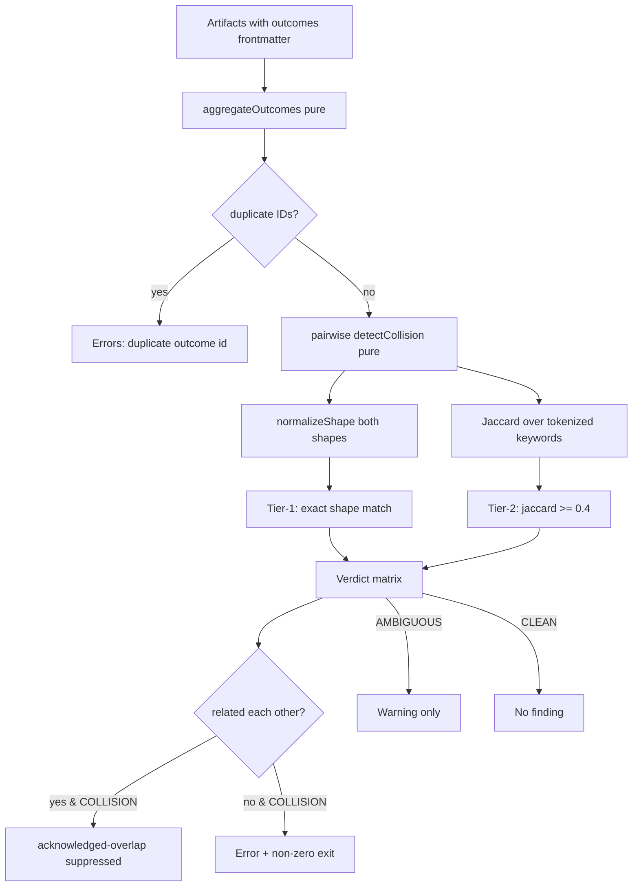
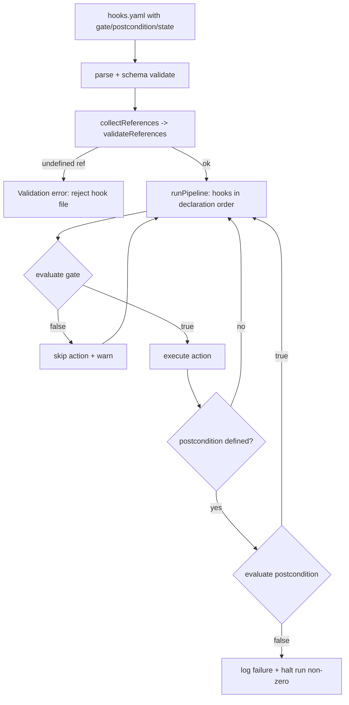

# Design Document

## Overview

This feature integrates five nWave-inspired capabilities into the Kanon ecosystem. They split into two natures:

- **Knowledge skills** (Requirements 1 and 2A) — prose decision frameworks authored as codeshop workflow steering files. These ship as Markdown content under `kanon/knowledge/codeshop/workflows/` and require no code beyond their authoring.
- **CLI / pipeline enhancements** (Requirements 2B–2H, 3, 4, 5) — schema extensions, new pure-function algorithm modules, and wiring into the existing `validate`, `guild sync`, `catalog`, `build`, and `eval` flows.

The design honors the established Kanon architecture: a `source → parse → adapt → write` pipeline, central Zod schemas in `src/schemas.ts`, pure-function adapters in `src/adapters/`, Nunjucks templates for output, and a strict separation between **pure logic** (deterministic, no I/O) and **I/O orchestration** (file reads, git, subprocess execution).

The most algorithmically substantial work is the **Outcomes Registry** (shape normalization + two-tier collision detection) and the **DES hook execution engine** (expression evaluation over a shared state context). Both are designed as pure functions so they can be exhaustively verified with property-based tests. Mutation testing, catalog metadata, and the knowledge skills are largely orchestration, schema, and content work respectively, and lean on example/snapshot tests.

### Design Principles

1. **Pure core, thin I/O shell.** Every deterministic algorithm (normalization, Jaccard similarity, verdict computation, expression evaluation, catalog sorting, mutation operators, history serialization) is a pure function. I/O (reading artifacts, running `bun test`, `git diff`, writing JSONL) lives in thin orchestration layers that call the pure core.
2. **Schema-first.** All new data shapes (outcomes, hook gate/postcondition/state, visibility/priority, mutation config) are defined as Zod schemas in `src/schemas.ts` (or `src/config.ts` for config), so parsing and validation are centralized and reused by validate, catalog, and guild sync.
3. **Backward compatibility.** Every new frontmatter and manifest field is optional with a sensible default. Existing artifacts validate and build unchanged.
4. **Reuse existing traversal.** Outcomes aggregation reuses the same artifact-collection logic already present in `catalog.ts` and `validate.ts` rather than introducing a new scanner.

## Architecture

### Module Map

```
kanon/
├── knowledge/codeshop/workflows/
│   ├── tune-rigor.md             # NEW — Req 1 (rigor profiles framework)
│   └── register-outcomes.md      # NEW — Req 2A (outcomes methodology)
├── src/
│   ├── schemas.ts                # EXTEND — Outcome, hook gate/postcondition/state,
│   │                             #          visibility/priority, catalog outcomes
│   ├── config.ts                 # EXTEND — mutationOperators in ForgeConfigSchema
│   ├── outcomes/                 # NEW — pure outcomes-registry core
│   │   ├── normalize.ts          #   shape normalization (pure)
│   │   ├── collision.ts          #   tokenize, Jaccard, verdict matrix, related downgrade (pure)
│   │   └── registry.ts           #   aggregation + pairwise detection + duplicate-id (pure)
│   ├── hooks/                    # NEW — pure DES hook-execution engine
│   │   ├── expression.ts         #   parse / collect refs / evaluate (pure)
│   │   └── pipeline.ts           #   ordered gate→action→postcondition run (pure)
│   ├── mutation/                 # NEW — mutation testing
│   │   ├── operators.ts          #   mutation operators (pure)
│   │   ├── delta.ts              #   changed-module selection (pure given file list)
│   │   ├── history.ts            #   JSONL serialize/parse (pure) + append (I/O)
│   │   └── runner.ts             #   orchestration: discover, mutate, run bun test (I/O)
│   ├── validate.ts               # EXTEND — cross-artifact outcomes collision; hook ref validation
│   ├── catalog.ts                # EXTEND — outcomes array, visibility filter, priority sort
│   ├── browse.ts                 # EXTEND — --all visibility filtering
│   ├── eval.ts                   # EXTEND — --mutation / --delta / --trend wiring
│   ├── adapters/kiro.ts          # EXTEND — gate → prompt preamble translation
│   └── guild/sync.ts             # EXTEND — outcomes collision gate before materialize
└── evals/
    └── mutation-history.jsonl    # NEW (generated) — Req 5 trend persistence
```

### Data Flow — Outcomes Collision Detection



The same pure `runRegistryCheck(outcomes)` function is the single source of truth, called from both `kanon validate` (cross-artifact) and `kanon guild sync` (manifest-resolved artifacts). Only the surrounding I/O and exit-code policy differ (`--force` on guild sync downgrades errors to warnings).

### Data Flow — DES Hook Execution



State writes from earlier hooks are threaded into the context visible to later hooks' gate and postcondition expressions.

## Components and Interfaces

### 1. Rigor Profiles Knowledge Skill (Req 1)

A single steering file `knowledge/codeshop/workflows/tune-rigor.md`, authored to match the existing codeshop workflow style (see `analyze-hotspots.md`). No code changes. Content structure:

- **Four profiles**: lean, standard, thorough, exhaustive.
- **Decision matrix** mapping four task dimensions to a recommended profile:
  - criticality: low / medium / high / critical
  - blast radius: single-file / module / system-wide
  - reversibility: trivial / moderate / difficult
  - audience: self / team / public
- **Per-profile practice tables** stating included practices (TDD depth, review passes, refactoring pass, mutation testing) and excluded practices (each omitted practice named with a one-sentence rationale).
- **Conflict-resolution rule**: when dimensions map to more than one candidate profile, select the higher rigor profile.
- **Worked examples** that reference at least one driving dimension value (e.g., "security-sensitive → thorough because criticality=critical").
- Language- and tool-agnostic prose, consistent with codeshop shared-concepts style.

This artifact is validated for quality via the existing eval framework (an `evals/tune-rigor.yaml` llm-rubric eval), not property tests.

### 2. Outcomes Registry (Req 2)

#### 2.1 Pure core — `src/outcomes/normalize.ts`

```typescript
/**
 * Canonicalize a type-shape string for comparison.
 * Pure. Deterministic. Idempotent.
 * Steps (Req 2D.1): trim, collapse whitespace, lowercase,
 * sort union members, Array<T> -> T[], strip tuple parameter names.
 * Does NOT (Req 2D.2): resolve aliases, erase generic params, structurally compare objects.
 */
export function normalizeShape(shape: string): string;
```

Normalization sub-steps applied in a fixed order:
1. Trim leading/trailing whitespace.
2. Collapse internal runs of whitespace to a single space.
3. Lowercase.
4. Normalize `array<T>` → `T[]` (applied before union sorting so members compare canonically).
5. Strip parameter names inside tuples: `(name: string, age: number)` → `(string, number)`.
6. Split top-level union on `|`, trim members, sort alphabetically, rejoin with ` | `.

> Union sorting operates on top-level union members only; nested generics are left structurally intact (a deliberate non-goal per Req 2D.2).

#### 2.2 Pure core — `src/outcomes/collision.ts`

```typescript
export type Verdict = "COLLISION" | "AMBIGUOUS" | "CLEAN";

/** Tokenize a keyword set: split on -, _, whitespace; drop tokens <= 2 chars; dedupe. (Req 2E.2) */
export function tokenizeKeywords(keywords: string[]): Set<string>;

/** Jaccard similarity |A∩B| / |A∪B|. Returns 0 when both sets empty. Range [0,1]. */
export function jaccardSimilarity(a: Set<string>, b: Set<string>): number;

/** Tier-1: exact match on normalized (inputShape, outputShape) tuple. (Req 2E.1) */
export function shapesMatch(a: Outcome, b: Outcome): boolean;

/** Tier-2: keyword Jaccard >= threshold (default 0.4). (Req 2E.2) */
export function keywordsMatch(a: Outcome, b: Outcome, threshold?: number): boolean;

/**
 * Compute verdict from the two tiers. (Req 2E.3)
 * both -> COLLISION, exactly one -> AMBIGUOUS, neither -> CLEAN.
 */
export function computeVerdict(a: Outcome, b: Outcome, threshold?: number): Verdict;

/** True when a and b each list the other in `related`. (Req 2E.4 / 2B.2) */
export function isAcknowledged(a: Outcome, b: Outcome): boolean;
```

#### 2.3 Pure core — `src/outcomes/registry.ts`

```typescript
export interface OutcomeRef { outcome: Outcome; artifactName: string; }

export interface CollisionFinding {
  kind: "collision" | "ambiguous" | "duplicate-id" | "acknowledged-overlap";
  a: OutcomeRef;
  b: OutcomeRef;
  inputShape?: string;   // normalized, for collision/ambiguous
  outputShape?: string;  // normalized
  jaccard?: number;
}

export interface RegistryReport {
  findings: CollisionFinding[];
  hasErrors: boolean;    // true if any collision (non-acknowledged) or duplicate-id
}

/** Flatten outcomes from a set of artifacts into refs. Pure. (Req 2F.1 / 2G.1) */
export function aggregateOutcomes(
  artifacts: Array<{ name: string; outcomes: Outcome[] }>,
): OutcomeRef[];

/**
 * Run duplicate-id detection + pairwise collision detection over all refs. Pure.
 * Acknowledged pairs (mutual `related`) are downgraded to acknowledged-overlap.
 */
export function runRegistryCheck(refs: OutcomeRef[], threshold?: number): RegistryReport;
```

`runRegistryCheck` is the single deterministic entry point used by both validate and guild sync. It performs duplicate-id detection first (globally unique IDs, Req 2F.4), then evaluates each unordered pair once.

#### 2.4 Validate integration — `src/validate.ts` (Req 2F)

A new cross-artifact pass in `validateAll` after dependency-cycle detection:
1. For each artifact, parse `frontmatter.outcomes` (already schema-validated during frontmatter parse, Req 2C.2).
2. Build `OutcomeRef[]` via `aggregateOutcomes`.
3. Call `runRegistryCheck`.
4. Map findings to `ValidationError` (COLLISION, duplicate-id) and `ValidationWarning` (AMBIGUOUS). Errors include both outcome IDs, both artifact names, matched shapes, and the Jaccard score (Req 2F.2). Acknowledged-overlap produces no finding. Errors set the synthetic result invalid, causing non-zero exit via existing `validateCommand` logic.

#### 2.5 Guild sync integration — `src/guild/sync.ts` (Req 2G)

After Step 7 (entries resolved) and before Step 8 (materialize), load each resolved artifact's `knowledge.md`, aggregate outcomes, and run `runRegistryCheck`:
- COLLISION (non-acknowledged) → push to `errors`, set `hasFatalError`, return before materialize (Req 2G.2).
- AMBIGUOUS → push to `warnings`, continue (Req 2G.4).
- A new `force?: boolean` option on `SyncOptions` (wired to a `--force` CLI flag): when set, collisions are pushed to `warnings` instead of `errors` and materialization proceeds (Req 2G.3).

#### 2.6 Catalog integration — `src/catalog.ts` (Req 2H)

`loadArtifactEntry` copies `frontmatter.outcomes` into the catalog entry as an `outcomes` array, projecting each to `{ id, kind, inputShape, outputShape, keywords }` (Req 2H.2). Empty/absent → `[]`.

#### 2.7 Methodology skill — `register-outcomes.md` (Req 2A)

Prose steering file documenting the registration pattern, the two-tier algorithm, the verdict matrix, and the resolution workflow (including how to acknowledge overlap via `related`). Uses generic type-shape notation only (primitives, arrays/lists, maps, tuples, unions, named records) — no language-specific syntax.

### 3. DES-Style Hook Execution (Req 3)

#### 3.1 Schema extension — `CanonicalHookSchema` (Req 3.1, 3.3, 3.5)

```typescript
export const HookStateValueSchema = z.union([z.string(), z.boolean()]);

export const CanonicalHookSchema = z.object({
  // ...existing fields...
  gate: z.string().optional(),          // Req 3.1
  postcondition: z.string().optional(), // Req 3.3
  state: z.record(z.string(), HookStateValueSchema).optional(), // Req 3.5
});
```

#### 3.2 Pure expression engine — `src/hooks/expression.ts`

A small boolean expression grammar over two reference kinds: **state keys** and **built-in predicates** (`tests_pass`, `files_exist`, `lint_clean`). Supported operators: `&&`, `||`, `!`, parentheses, and equality against string/boolean literals (`state.key == "value"`).

```typescript
export const BUILTIN_PREDICATES = ["tests_pass", "files_exist", "lint_clean"] as const;

export interface ParsedExpression { /* AST */ }

/** Parse an expression string into an AST. Throws on syntax error. Pure. */
export function parseExpression(expr: string): ParsedExpression;

/** All state keys and predicate names referenced by the expression. Pure. (Req 3.7) */
export function collectReferences(expr: ParsedExpression): { stateKeys: string[]; predicates: string[] };

/**
 * Validate that every referenced state key is declared in `declaredStateKeys`
 * and every predicate is in BUILTIN_PREDICATES. Returns undefined references. Pure. (Req 3.7)
 */
export function validateReferences(
  expr: ParsedExpression,
  declaredStateKeys: Set<string>,
): { undefinedStateKeys: string[]; undefinedPredicates: string[] };

/** Evaluate to boolean given resolved predicate values and the current state. Pure. (Req 3.1, 3.3) */
export function evaluateExpression(
  expr: ParsedExpression,
  predicateValues: Record<string, boolean>,
  state: Record<string, string | boolean>,
): boolean;
```

Predicate **resolution** (actually running tests, checking files, running the linter) is I/O and happens in the orchestration layer, which passes a resolved `predicateValues` map into the pure evaluator.

#### 3.3 Pure pipeline — `src/hooks/pipeline.ts` (Req 3.2, 3.4, 3.8, 3.9)

```typescript
export type HookStepOutcome =
  | { hook: string; status: "skipped"; failedGate: string }      // Req 3.2
  | { hook: string; status: "executed" }                          // gate passed, no postcond
  | { hook: string; status: "postcondition-passed" }
  | { hook: string; status: "halted"; postcondition: string; actual: boolean }; // Req 3.4

export interface PipelineResult {
  steps: HookStepOutcome[];
  finalState: Record<string, string | boolean>;
  halted: boolean;
}

/**
 * Run hooks in declaration order over a shared, mutable-by-copy state context. Pure.
 * For each hook: evaluate gate (Req 3.8 order); if false -> skip + warn (Req 3.2);
 * if true -> apply the hook's `state` writes, run action (modeled via callback result),
 * then evaluate postcondition (Req 3.4). State from earlier hooks is visible to later
 * hooks (Req 3.9). Halts on postcondition failure.
 */
export function runPipeline(
  hooks: CanonicalHook[],
  resolvePredicates: (hook: CanonicalHook, state: Record<string, string | boolean>) => Record<string, boolean>,
): PipelineResult;
```

The pipeline is pure: side-effecting actions and predicate resolution are injected via the `resolvePredicates` callback (and, in the real runner, an action executor), keeping ordering, gating, and state-threading logic fully testable without I/O.

#### 3.4 Reference validation in validate — `src/validate.ts` (Req 3.7)

When parsing `hooks.yaml`, for every `gate` and `postcondition` expression, parse and run `validateReferences` against the union of all declared `state` keys across the file. Any undefined state key or unknown predicate yields a `ValidationError` identifying the reference and the hook name/field.

#### 3.5 Kiro adapter translation — `src/adapters/kiro.ts` (Req 3.6)

`buildKiroHook` is extended: when a canonical hook has a `gate`, the gate is rendered as a natural-language precondition preamble prepended to the hook's prompt (for `ask_agent` actions) instructing the agent to verify each referenced predicate before proceeding. A pure helper:

```typescript
/** Render a gate expression as a natural-language precondition checklist. Pure. (Req 3.6) */
export function translateGateToPreamble(gate: string): string;
```

This keeps the adapter a pure function. Built-in predicates map to fixed phrasings (e.g., `tests_pass` → "Confirm the test suite passes"); state-key references map to "Confirm that <key> is <expected>".

### 4. Enhanced Catalog Metadata (Req 4)

#### 4.1 Schema extensions (Req 4.1, 4.2, 4.3, 4.10)

```typescript
export const VisibilitySchema = z.enum(["public", "private", "unlisted"]).default("public");
export const PrioritySchema = z.number().int().min(1).max(100).default(50);
```

Added to `FrontmatterSchema` and `CollectionSchema` as `visibility` and `priority`. The integer/range check (Req 4.10) is enforced by Zod; a non-integer or out-of-range value surfaces as a frontmatter validation error through the existing parse path.

#### 4.2 CatalogEntry extension (Req 4.4, 4.6)

`CatalogEntrySchema` gains `visibility: VisibilitySchema` and `priority: PrioritySchema`. `maturity` and `audience` are already present; the design ensures all four (`visibility`, `priority`, `maturity`, `audience`) appear in each entry's JSON.

#### 4.3 Catalog generation — visibility filter + sort (Req 4.5, 4.7)

```typescript
/** Total ordering: priority descending, then name ascending. Pure, stable. (Req 4.7) */
export function sortCatalogEntries(entries: CatalogEntry[]): CatalogEntry[];
```

`generateCatalog` (a) excludes entries with `visibility: private` entirely (Req 4.5), (b) retains `unlisted` entries with their `visibility` field set (Req 4.6), and (c) replaces the current `localeCompare`-by-name sort with `sortCatalogEntries`.

#### 4.4 Browse filtering — `src/browse.ts` (Req 4.8, 4.9)

`kanon catalog browse` gains an `--all` flag. Default listing hides `private` and `unlisted`. With `--all`, `unlisted` is shown but `private` remains hidden. Since `private` is already absent from `catalog.json`, the browse filter only needs to hide `unlisted` by default and reveal it under `--all`.

### 5. Mutation Testing (Req 5)

#### 5.1 Config extension — `src/config.ts` (Req 5.3)

```typescript
export const MutationOperatorSchema = z.enum([
  "statement-deletion",
  "conditional-boundary",
  "arithmetic-replacement",
  "string-literal",
  "return-value",
]);

// In ForgeConfigSchema:
eval: z.object({
  mutationOperators: z.array(MutationOperatorSchema).default([...ALL_OPERATORS]),
}).optional(),
```

#### 5.2 Adapter discovery — `src/mutation/runner.ts` (Req 5.2, 5.10)

Scan `src/adapters/` for `.ts` files exporting a `HarnessAdapter`-typed function, excluding `types.ts`, `index.ts`, `capabilities.ts`. If none found → exit code 1 with an error message (Req 5.10).

#### 5.3 Mutation operators — `src/mutation/operators.ts` (Req 5.3, pure)

```typescript
export interface Mutant {
  filePath: string;
  line: number;
  operator: MutationOperator;
  originalSnippet: string;
  mutatedSnippet: string;
  mutatedSource: string;   // full file content with the single mutation applied
}

/** Generate mutants for one source file. Pure. At most `cap` (default 50) per file. (Req 5.3) */
export function generateMutants(
  filePath: string,
  source: string,
  operators: MutationOperator[],
  cap?: number,
): Mutant[];
```

Each operator is a pure transformation that locates candidate sites and emits a mutant whose source differs from the original at exactly one site. Generation is deterministic (stable ordering) and capped at 50 per file.

#### 5.4 Test execution + kill rate — `src/mutation/runner.ts` (Req 5.4, 5.5)

For each mutant: write the mutated source to a temp location (or apply/restore), run `bun test` with a 30s timeout. Timeout → mutant marked **killed** (Req 5.4). A failing test → **killed**; all passing → **survived**.

```typescript
/** Pure. killRate = killed / total; 0 total -> 0. (Req 5.5) */
export function computeKillRate(killed: number, total: number): number;
```

Exit code 1 when `killRate < threshold` (default 0.80; `--threshold` is a decimal in [0.0, 1.0]).

#### 5.5 Delta strategy — `src/mutation/delta.ts` (Req 5.6, 5.7, pure)

```typescript
/**
 * Given the set of adapter files and the set of changed files (from git diff
 * since the last run's sha), return the subset to mutate. Pure. (Req 5.6)
 * If `lastRunSha` is null -> caller falls back to full run + warning (Req 5.7).
 */
export function selectDeltaTargets(adapterFiles: string[], changedFiles: string[]): string[];
```

The `git diff` invocation and reading the last sha from history are I/O in the runner; `selectDeltaTargets` is the pure intersection logic.

#### 5.6 History persistence — `src/mutation/history.ts` (Req 5.8)

```typescript
export interface MutationRunRecord {
  ts: string; sha: string; killRate: number;
  totalMutants: number; killed: number; survived: number;
  operators: string[];
}

/** Serialize one record to a single JSONL line. Pure. */
export function serializeRecord(r: MutationRunRecord): string;
/** Parse JSONL content into records. Pure. */
export function parseHistory(content: string): MutationRunRecord[];
```

Append (I/O) writes to `evals/mutation-history.jsonl`. `--trend` reads and renders the history (reusing the sparkline style already in `eval.ts`).

#### 5.7 Surviving-mutant report (Req 5.9)

For each survivor, the runner reports file path, line number, operator, and original vs mutated code with up to 3 lines of context above and below — derived purely from the `Mutant` plus the source.

#### 5.8 CLI wiring — `src/eval.ts` / `src/cli.ts`

`kanon eval --mutation [--delta] [--threshold <d>] [--trend]` routes into the mutation runner, mirroring the existing `evalCommand` option handling.

## Data Models

### Outcome (Req 2B)

```typescript
export const OutcomeKindSchema = z.enum(["specification", "operation", "invariant"]);

export const OutcomeSchema = z.object({
  id: z.string()
    .regex(/^out-[a-z0-9]+(-[a-z0-9]+)*$/, "Outcome id must match out-kebab-case")
    .max(64),                                       // Req 2B.1 / 2C.3
  kind: OutcomeKindSchema,                           // Req 2B.1
  inputShape: z.string().min(1),                     // type expression string
  outputShape: z.string().min(1),
  summary: z.string().max(120),                      // Req 2B.1
  keywords: z.array(z.string().max(24)).max(6).default([]), // Req 2B.1 (lowercase enforced/normalized)
  related: z.array(z.string()).default([]),          // Req 2B.2
});
export type Outcome = z.infer<typeof OutcomeSchema>;
```

`FrontmatterSchema` gains `outcomes: z.array(OutcomeSchema).default([])` (Req 2C.1), and `outcomes` is added to `KNOWN_FRONTMATTER_FIELDS` in `parser.ts`.

### Hook gate/postcondition/state (Req 3)

Extends `CanonicalHookSchema` with optional `gate: string`, `postcondition: string`, and `state: Record<string, string | boolean>` as shown in §3.1.

### Catalog metadata (Req 4)

`visibility: "public" | "private" | "unlisted"` (default `public`) and `priority: 1..100` (default `50`) on `FrontmatterSchema`, `CollectionSchema`, and `CatalogEntrySchema`.

### Mutation run record (Req 5.8)

`MutationRunRecord` as shown in §5.6, persisted one-per-line to `evals/mutation-history.jsonl`.
