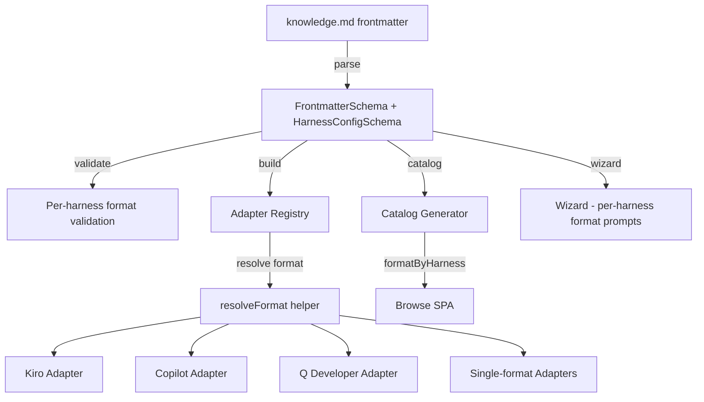

# Design Document: Per-Harness Artifact Type

## Overview

This feature replaces the single global `type` field (`skill | power | rule`) with per-harness output format configuration in the `harness-config` section. Today, no adapter reads the top-level `type` field to determine output — Kiro already uses `harness-config.kiro.power: true` independently. This design formalizes that pattern: each harness declares its own set of valid output formats, adapters read `format` from their harness-config section, and the wizard/catalog/browse SPA are updated to reflect per-harness formats.

The global `type` field is retained as optional with a default of `"skill"` for backward compatibility, but it becomes purely catalog metadata during a deprecation period.

## Architecture

The change touches five layers of the system:



Key architectural decisions:

1. **Format registry as a static map** — A single `HARNESS_FORMAT_REGISTRY` constant maps each harness name to its valid formats and default. This is the single source of truth for format validation, adapter resolution, wizard prompts, and catalog generation. Rationale: avoids scattering format knowledge across adapters and keeps validation centralized.

2. **`resolveFormat()` pure function** — A shared helper reads `harness-config.<harness>.format`, falls back to the registry default, and handles Kiro's `power: true` backward compatibility. Each adapter calls this instead of implementing its own resolution logic.

3. **Zod superRefine for cross-field validation** — Per-harness format validation uses `FrontmatterSchema.superRefine()` to check that each `harness-config.<harness>.format` value is in that harness's valid set. This keeps validation in the schema layer where it belongs.

4. **Additive catalog change** — `formatByHarness` is added alongside the existing `type` field. No breaking change to catalog consumers.

## Components and Interfaces

### 1. Format Registry (`src/format-registry.ts`)

New module exporting the format registry and the `resolveFormat` helper.

```typescript
import type { HarnessName } from "./schemas";

export interface HarnessFormatDef {
  formats: readonly string[];
  default: string;
}

export const HARNESS_FORMAT_REGISTRY: Record<HarnessName, HarnessFormatDef> = {
  kiro:          { formats: ["steering", "power"],        default: "steering" },
  cursor:        { formats: ["rule"],                     default: "rule" },
  copilot:       { formats: ["instructions", "agent"],    default: "instructions" },
  "claude-code": { formats: ["claude-md"],                default: "claude-md" },
  windsurf:      { formats: ["rule"],                     default: "rule" },
  cline:         { formats: ["rule"],                     default: "rule" },
  qdeveloper:    { formats: ["rule", "agent"],            default: "rule" },
};

export interface ResolveFormatResult {
  format: string;
  deprecationWarning?: string;
}

/**
 * Resolve the output format for a harness from its harness-config section.
 * Falls back to the registry default. Handles Kiro `power: true` backward compat.
 */
export function resolveFormat(
  harness: HarnessName,
  harnessConfig: Record<string, unknown> | undefined,
): ResolveFormatResult;
```

### 2. Schema Changes (`src/schemas.ts`)

- `FrontmatterSchema.type` becomes `.optional().default("skill")` (already optional with default — no change needed to the field itself, but adapters stop reading it).
- Add a `superRefine` pass on `FrontmatterSchema` that iterates `harness-config` keys, and for each key that has a `format` field, validates it against `HARNESS_FORMAT_REGISTRY[harness].formats`.
- `CatalogEntrySchema` gains `formatByHarness: z.record(HarnessNameSchema, z.string()).optional()`.

### 3. Adapter Changes

Each multi-format adapter (`kiro`, `copilot`, `qdeveloper`) calls `resolveFormat()` at the top and branches on the result. Single-format adapters (`cursor`, `claude-code`, `windsurf`, `cline`) call `resolveFormat()` for consistency but always get their single default.

**Kiro adapter migration**: Replace `const isPower = kiroConfig.power === true` with `const { format, deprecationWarning } = resolveFormat("kiro", kiroConfig)`. The `resolveFormat` function handles the `power: true` → `format: "power"` fallback and returns a deprecation warning string when the legacy flag is used.

### 4. Wizard Changes (`src/wizard.ts`)

- Remove the global artifact type `p.select` prompt.
- Add harness descriptions to the harness multi-select options (e.g., `"kiro — Steering files or powers for Kiro IDE"`).
- After harness selection, loop over selected harnesses that have `formats.length > 1` in the registry and prompt for format via `p.select`.
- Write non-default format selections into `harness-config.<harness>.format` in the generated frontmatter.

### 5. Catalog Changes (`src/catalog.ts`)

- Import `HARNESS_FORMAT_REGISTRY` and `resolveFormat`.
- For each artifact, build `formatByHarness` by calling `resolveFormat` for each harness in the artifact's `harnesses` array.
- Include `formatByHarness` in the catalog entry alongside the existing `type` field.

### 6. Browse SPA Changes (`src/browse.ts`)

- Card view: display format labels as `harness:format` pairs (e.g., `[kiro:power]`).
- Detail view: show the full `formatByHarness` mapping.
- Replace the type filter checkboxes with a format filter that collects all unique format values across all catalog entries and filters artifacts where at least one harness uses the selected format.

### 7. Validation Changes (`src/validate.ts`)

- During `forge validate`, check if an artifact has a top-level `type` field but no `format` in any harness-config section. If so, emit a deprecation warning.
- Format validation errors from the schema `superRefine` are already surfaced through the existing parse error path.

## Data Models

### HarnessFormatDef

| Field     | Type               | Description                                    |
|-----------|--------------------|------------------------------------------------|
| formats   | `readonly string[]` | Valid format values for this harness           |
| default   | `string`           | Default format when `format` is omitted        |

### Updated Frontmatter (harness-config section)

```yaml
harness-config:
  kiro:
    format: power          # new field — replaces power: true
  copilot:
    format: agent          # new field
  qdeveloper:
    format: agent          # new field
  cursor: {}               # single-format — format field optional
```

### Updated CatalogEntry

| Field           | Type                              | Description                                      |
|-----------------|-----------------------------------|--------------------------------------------------|
| formatByHarness | `Record<HarnessName, string>`     | Resolved output format per harness               |
| type            | `"skill" \| "power" \| "rule"`    | Retained for backward compatibility (deprecated) |

### ResolveFormatResult

| Field              | Type                | Description                                         |
|--------------------|---------------------|-----------------------------------------------------|
| format             | `string`            | Resolved format value                               |
| deprecationWarning | `string \| undefined` | Warning message if legacy config was used          |

