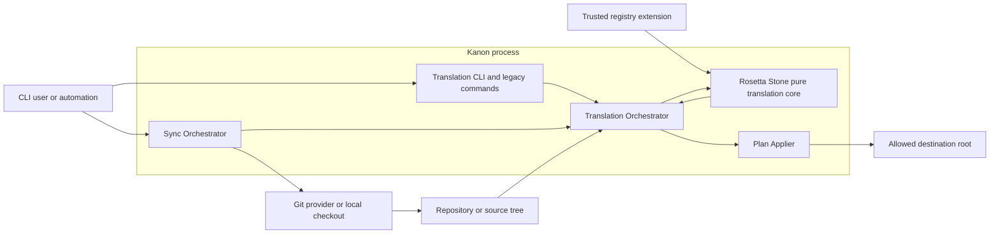
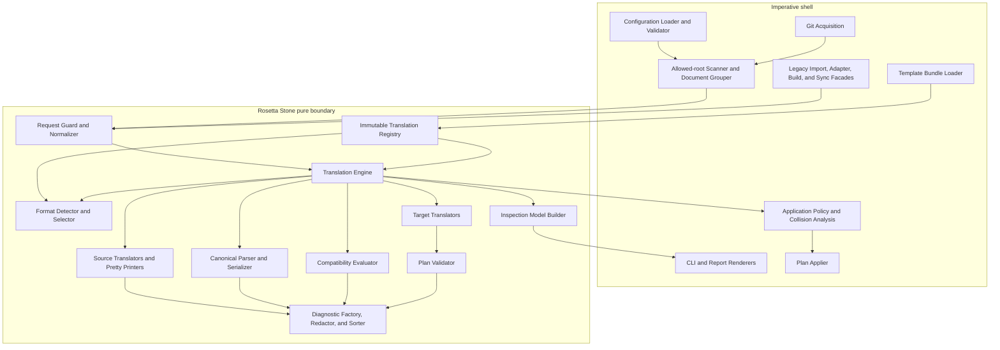
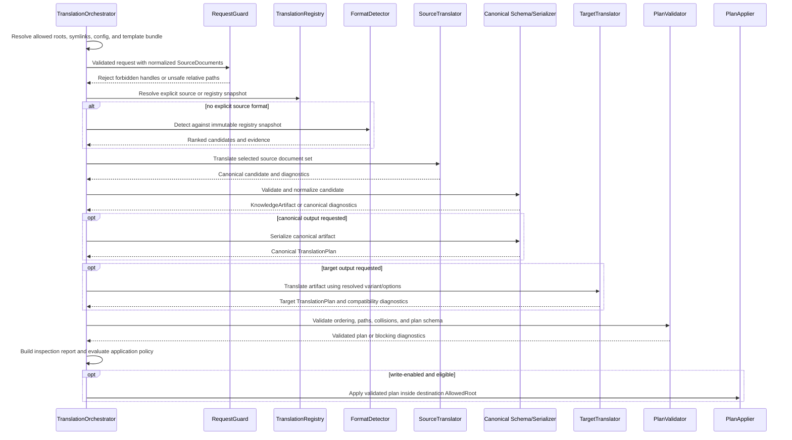

# Technical Design: Rosetta Stone

## Overview

Rosetta Stone introduces a first-class schema-translation subsystem for Kanon. It accepts normalized in-memory source documents, detects or validates a source format, translates them into a canonical `KnowledgeArtifact`, and translates canonical artifacts into deterministic harness-native output plans. It does not clone repositories, scan arbitrary filesystem trees, prompt users, inspect destination state, or write files. Those responsibilities remain in an imperative `TranslationOrchestrator` and `PlanApplier` around a pure translation core.

This design applies the **Kiro Spec Design contract** (anchors: C4 Diagrams and ADR): C4 views show the system at context and component level, and short ADR-style decision records capture each significant choice, its context, and its consequences.

### Goals

- Unify inbound upstream formats, harness-native importers, canonical parsing, and outbound adapters behind one typed registry and vocabulary.
- Make every format, variant, detection rule, compatibility decision, default, normalization, and degradation discoverable.
- Produce deterministic canonical values, diagnostics, inspection data, and translation plans from explicit inputs only.
- Preserve the current `kanon import`, build adapters, target variants, configuration, and sync-script behavior through compatibility facades while migration proceeds.
- Make unsafe paths, ambiguous detection, schema loss, compatibility loss, and sensitive-value handling visible before any write.
- Provide extension contracts and testable invariants without coupling format implementations to orchestration.

### Non-goals

- Rosetta Stone does not perform Git operations, network access, directory traversal, symbolic-link resolution, prompts, environment lookup, destination collision policy, or filesystem mutation.
- Rosetta Stone does not execute commands, hooks, templates, or instructions found in source content. It parses and renders them as data.
- The initial release does not replace artifact dependency composition, workspace project selection, shared MCP merging, or release publishing. Those remain preprocessing/orchestration concerns and supply the resulting canonical artifact explicitly.
- The initial release does not introduce arbitrary runtime plugin loading from untrusted packages. A `RegistryExtension` is a trusted in-process module registered by the host application.

### Research findings informing the design

Repository research identified the following constraints and migration seams:

- The current canonical loader combines filesystem reads with parsing in [`parser.ts`](../../../kanon/src/parser.ts). Rosetta Stone must split this into an impure document reader and a pure `CanonicalParser` over `SourceDocument[]`.
- The path-based import flow in [`import.ts`](../../../kanon/src/import.ts) performs detection, defaults, translation, collision checks, writes, and workflow copying together. Its three source formats become pure source translators while its scanning and application behavior moves behind a legacy facade.
- Harness-native importers in [`src/importers/`](../../../kanon/src/importers/) are registered per harness but each parser reads an absolute path. They become document-set translators; the existing scanning, confirmation, `--force`, and destination logic remains orchestration.
- Outbound adapters are already function-shaped, but receive a Nunjucks environment backed by `FileSystemLoader` from [`template-engine.ts`](../../../kanon/src/template-engine.ts). The host must preload immutable template sources before entering the pure boundary; translators render only from that in-memory bundle.
- Target variants and defaults are currently split between [`format-registry.ts`](../../../kanon/src/format-registry.ts), adapter logic, and `harness-config`. Format contracts become the authoritative source while compatibility facades preserve `HARNESS_FORMAT_REGISTRY` and `resolveFormat`.
- Compatibility is split between asset-type declarations in [`compatibility.ts`](../../../kanon/src/compatibility.ts) and capability declarations in [`adapters/capabilities.ts`](../../../kanon/src/adapters/capabilities.ts). Registration will seed complete per-format compatibility profiles from both tables before either legacy table becomes a generated view.
- Build orchestration in [`build.ts`](../../../kanon/src/build.ts) currently mixes canonical loading, composition, target selection, compatibility, translation, version embedding, and writes. Migration extracts translation and plan validation first; composition and writes remain outside the core.
- Current project configuration uses Zod in [`config.ts`](../../../kanon/src/config.ts), while `upstreams` in [`kanon.config.yaml`](../../../kanon/kanon.config.yaml) is not in `ForgeConfigSchema`. Acquisition and translation profiles must be added as typed schemas before sync scripts delegate to Rosetta Stone.
- [`sync-upstream.sh`](../../../kanon/scripts/sync-upstream.sh) and [`sync-kiro-powers.sh`](../../../kanon/scripts/sync-kiro-powers.sh) already expose pull-only, import-only, and dry-run modes. Their Git steps remain unchanged initially; only config validation and import invocation are redirected.
- The repository already uses Zod 4 and fast-check with 100-run properties, as declared in [`package.json`](../../../kanon/package.json) and demonstrated by existing `*.property.test.ts` suites. The design uses those libraries rather than introducing custom validators or generators.

### Design principles

1. **Functional core, imperative shell:** all format selection and translation are pure; all environmental interaction is outside.
2. **Parse, do not validate by convention:** all public values cross a Zod boundary, including registry extensions, requests, canonical candidates, plans, diagnostics, profiles, and machine output.
3. **One authoritative registry:** legacy registries become projections or facades, not independent sources of truth.
4. **Plans before effects:** translators return relative output files; an orchestrator validates policy and environment before a plan applier writes anything.
5. **Loss is data:** defaults, normalization, preservation, omission, and degradation produce structured diagnostics.
6. **Determinism is contractual:** ordering, normalization, serialization, defaults, and diagnostics are specified rather than inherited from platform behavior.

## Architecture

### C4 context view



Rosetta Stone sees only validated values: source documents, canonical artifacts, format identifiers, options, canonical schema versions, and caller context. It never receives repository handles, absolute paths, filesystem services, prompts, clocks, random sources, environment objects, or writers. This boundary addresses Requirements 1, 11, 12, and 13.

### C4 component view



The dependency rule is one-way: impure code may depend on pure contracts; pure modules may not import `node:fs`, `node:child_process`, network clients, `process`, prompt libraries, or filesystem-backed template loaders. A static architecture test enforces this import boundary.

### End-to-end translation flow



A single-artifact `TranslationRequest` is the atomic translation unit. Batch import and build commands segment a scan into deterministic artifact document sets, invoke one request per artifact, and combine plans only after cross-request collision analysis. This preserves precise diagnostics and prevents one malformed artifact from changing another artifact's translation result.

### Boundary rules

| Concern | Pure Rosetta Stone | Translation orchestration |
|---|---|---|
| Source acquisition | Accepts `SourceDocument[]` | Git, network, checkout, scan, read, symlink resolution |
| Detection | Scores registered declarative rules | Chooses scan root and groups files |
| Parsing | Parses in-memory bytes/text | Determines encoding only when contract permits it |
| Templates | Renders immutable in-memory template bundle | Loads and validates template files before registry construction |
| Destination | Emits normalized relative paths | Adds destination prefix, inspects filesystem, applies collision policy |
| Configuration | Validates typed profile values relevant to translation | Loads YAML, resolves CLI precedence and credential references |
| Security | Lexical path checks, content-as-data, structured redaction | Realpath checks, allowed roots, permissions, atomic writes |
| Time/identity | No operation IDs or timestamps | May add run metadata only outside deterministic result fields |

Before translator dispatch, `RequestGuard` recursively rejects functions, symbols, class instances, accessors, streams, and reserved environmental keys (`filesystem`, `git`, `network`, `process`, `env`, `clock`, `random`, `prompt`, `writer`). Caller context is JSON-compatible and deep-frozen. This gives Requirement 1.4 a runtime guard in addition to TypeScript and import-lint enforcement.

### Registry composition and built-in formats

The host creates a `TranslationRegistryBuilder`, registers built-ins and trusted extensions transactionally, then freezes an immutable `TranslationRegistrySnapshot`. Every successful registration builds its query record before adding resolver indexes, and the completed snapshot is atomically published; a format can never be selectable while absent from typed queries.

Initial built-in contracts are:

| Format identifier | Direction | Harness | Variants/default | Legacy source coverage |
|---|---|---|---|---|
| `kanon-canonical` | bidirectional | none | none | canonical artifact directories |
| `kiro` | bidirectional | `kiro` | `steering`, `power` / `steering` | `.kiro/steering`, `.kiro/skills`, hooks, MCP files |
| `claude-code` | bidirectional | `claude-code` | `claude-md` / `claude-md` | `CLAUDE.md`, settings |
| `codex` | bidirectional | `codex` | `agents-md`, `skill` / `agents-md` | `AGENTS.md`, skills, TOML MCP config |
| `copilot` | bidirectional | `copilot` | `instructions`, `agent` / `instructions` | Copilot instruction files |
| `cursor` | bidirectional | `cursor` | `rule` / `rule` | Cursor rule files |
| `windsurf` | bidirectional | `windsurf` | `rule` / `rule` | Windsurf rule files |
| `cline` | bidirectional | `cline` | `rule` / `rule` | Cline rule files |
| `qdeveloper` | bidirectional | `qdeveloper` | `rule`, `agent` / `rule` | Amazon Q rule files |
| `kiro-power` | source | `kiro` | none | path-based `POWER.md` plus `steering/` |
| `kiro-skill` | source | `kiro` | none | path-based `SKILL.md` plus `references/` |
| `superpowers` | source | none | none | Superpowers `SKILL.md` plus companion Markdown |

`auto` remains accepted by the legacy import facade and is represented in registry query output as a deprecated **selection alias**, not as a representation contract. It resolves to “no explicit format; run detection.” Selection aliases occupy a separate namespace from format aliases, so every format alias still resolves to exactly one `FormatContract`. Machine output reports `auto` with replacement syntax (“omit `--format` or use `kanon rosetta detect`”) and the planned removal policy. This preserves legacy behavior without pretending that automatic selection has a schema or pretty-printer.

### Detection and selection algorithm

Each source-capable contract declares a deterministic set of detection rules. Built-in rule kinds are `path-glob`, `basename`, `extension`, `content-marker`, `frontmatter-key`, `json-pointer`, and `yaml-key`. Rules contain an integer weight, a `required` flag, a stable evidence label, and optional bounded parsing limits. Extensions may add pure detector code only when they also publish equivalent rule metadata for inspection.

Detection proceeds as follows:

1. Validate and normalize every document path, reject duplicates, then sort paths by Unicode code-point order.
2. Enumerate source-capable, detectable contracts by `FormatIdentifier` code-point order.
3. Evaluate each contract's rules in declared rule-ID order over the sorted documents.
4. Compute `confidence = matchedPositiveWeight / totalPositiveWeight`, rounded to six decimal places. A missing required rule marks the candidate non-qualifying even if its numeric score crosses the threshold.
5. Return every evaluated candidate with matched, missing-required, and conflicting evidence. Sort by confidence descending and `FormatIdentifier` ascending.
6. Qualify candidates against their own registered thresholds. Select the unique highest qualifying score; report no-match when none qualify and ambiguity when the highest score is tied.
7. For explicit selection, skip scoring as a selector but still evaluate required and conflicting rules and validate direction. Invalid evidence blocks dispatch.

No score depends on document array order, map insertion order, locale, filesystem metadata, or current registry mutation. Results include the registry snapshot version used for evaluation.

### Deterministic normalization and serialization

Determinism is defined by contract rather than by incidental library behavior:

- Paths use `/`, Unicode NFC, no empty or `.` segments, no `..`, no absolute/root/drive/UNC prefix, and no NUL. Duplicate normalized paths are errors.
- Identifier comparison uses Unicode code-point order, never `localeCompare`.
- Source document order is ignored after unique-path validation.
- New generated text uses UTF-8, LF line endings, and exactly one trailing newline unless a format contract explicitly declares another grammar.
- JSON uses recursively sorted object keys and two-space indentation. YAML uses a contract-owned key-order table followed by code-point ordering, disables aliases, and uses stable line width and quoting options.
- Canonical arrays preserve semantic order where order is meaningful (`hooks`, workflow content); set-like arrays use format-declared normalization (for example, sorted unique aliases). Normalizations are reported.
- Output files and plan operations sort by normalized relative path, then operation kind. Diagnostics sort by severity (`error`, `warning`, `info`), phase order, path, location, code, and format identifier.
- Templates are identified by a content digest in the immutable registry snapshot. The digest is explicit request/contract context, so changing templates changes the effective translation input.
- Strict mode promotes all compatibility diagnostics after compatibility evaluation and before final diagnostic sorting; it does not silently change translator branches.

### Inline architecture decisions

#### ADR-RS-001: Use a functional core with an imperative orchestration shell

**Context:** Existing import, parser, build, and sync paths mix translation with filesystem and Git operations.

**Decision:** Rosetta Stone accepts and returns validated in-memory values only. Scanning, acquisition, prompting, collision policy, and application live in separate orchestration modules.

**Consequences:** Pure behavior becomes reproducible and property-testable; orchestration must explicitly build document sets and apply plans.

#### ADR-RS-002: Make one immutable registry the source of truth

**Context:** Importers, adapters, target variants, and capabilities currently use independent registries.

**Decision:** Register one versioned `FormatContract` plus required implementations per format, then expose legacy maps as generated projections.

**Consequences:** Registration is stricter and catches drift early; legacy APIs remain available during migration but cannot introduce new independent declarations.

#### ADR-RS-003: Use plan-based output and two-stage path validation

**Context:** Translators must be pure, while lexical safety and filesystem containment require different information.

**Decision:** Core plan validation rejects unsafe relative paths and normalized collisions. The orchestrator separately resolves symlinks and destination parents against caller-approved roots immediately before application.

**Consequences:** Dry-run can show exact output without writing; safe application still requires environment-aware checks.

#### ADR-RS-004: Preload templates into immutable bundles

**Context:** Existing adapters are pure except for a filesystem-backed Nunjucks loader.

**Decision:** The host loads templates, resolves inheritance, validates names, and registers a frozen in-memory loader with a content digest before translation.

**Consequences:** Target translators remain deterministic. A missing or invalid template fails registry/bootstrap or request validation rather than causing a mid-write failure.

#### ADR-RS-005: Model compatibility per target format and variant

**Context:** Existing asset compatibility and capability matrices can disagree and variants may preserve different capabilities.

**Decision:** Each effective target variant has a complete `CompatibilityProfile` over the canonical capability enum. Built-ins are initially generated from the current declarations and then snapshot-tested.

**Consequences:** Every loss has a declared action and diagnostic. Adding a canonical capability intentionally breaks incomplete registrations until profiles are updated.

#### ADR-RS-006: Keep application policy outside translation

**Context:** Some errors always block output, while selected non-schema diagnostics may be accepted by a caller.

**Decision:** Rosetta Stone classifies and scopes diagnostics and marks plans `eligible`, `policy-required`, or `withheld`; only the orchestrator evaluates caller policy and filesystem preconditions.

**Consequences:** The same translation result supports CLI, automation, and dry-run without embedding interactive or environment-specific decisions.

## Components and Interfaces

### Module layout and dependency direction

The implementation should use the following structure while retaining central schemas in `src/schemas.ts`:

```text
kanon/src/
├── schemas.ts                         # Zod schemas and inferred public types
├── rosetta/
│   ├── contracts.ts                   # interfaces re-exported from schema types
│   ├── registry.ts                    # builder, immutable snapshot, projections
│   ├── detector.ts                    # rule evaluation and selection
│   ├── request-guard.ts               # purity, normalization, option validation
│   ├── diagnostics.ts                 # construction, redaction, ordering
│   ├── compatibility.ts               # effective profile and strict promotion
│   ├── canonical.ts                   # pure parser and serializer
│   ├── engine.ts                      # inbound, outbound, transcode coordination
│   ├── plan.ts                        # plan construction and lexical validation
│   ├── inspection.ts                  # deterministic report model
│   ├── builtins/
│   │   ├── sources/                   # Kiro, skills, Superpowers, native formats
│   │   └── targets/                   # facades over current adapter logic
│   └── index.ts                       # library exports
├── translation-orchestrator.ts        # filesystem scan/read, grouping, policy
├── translation-plan-applier.ts        # allowed-root write boundary
├── rosetta-cli.ts                     # Commander handlers and renderers
├── config.ts                          # profile schemas integrated in load path
├── import.ts                          # legacy path-import facade
├── importers/                         # legacy native-import facade
├── adapters/                          # legacy target facade/projections
└── format-registry.ts                 # legacy projection from registry
```

Pure modules under `src/rosetta/` may import Zod schemas, pure parser libraries, and in-memory Nunjucks rendering, but not impure platform modules. `translation-orchestrator.ts`, CLI handlers, config file loading, sync scripts, and the plan applier are explicitly outside the boundary.

### Translation registry

```ts
interface TranslationRegistryBuilder {
  register(extension: RegistryExtension): RegistrationResult;
  freeze(): TranslationRegistrySnapshot;
}

interface TranslationRegistrySnapshot {
  readonly version: string;
  listContracts(query?: RegistryQuery): readonly FormatContract[];
  resolve(identifierOrAlias: string, direction: RequestedDirection): FormatResolution;
  getSourceTranslator(id: FormatIdentifier): SourceTranslator | undefined;
  getPrettyPrinter(id: FormatIdentifier): PrettyPrinter | undefined;
  getTargetTranslator(id: FormatIdentifier): TargetTranslator | undefined;
}

type RegistrationResult =
  | { ok: true; contract: FormatContract }
  | { ok: false; diagnostics: TranslationDiagnostic[] }
  | { ok: false; registryFailure: RegistryFailure };
```

Registration validates the contract version, canonical range, identifier and aliases, variants/defaults, detection metadata, options schema, normalization rules, security policy, complete compatibility profiles, and implementation presence implied by direction. It constructs all duplicate diagnostics before mutating builder state. If diagnostic construction itself fails, the builder returns a minimal `RegistryFailure` containing no untrusted values. Failed registration leaves the previous builder snapshot unchanged.

Registry queries return copies or deeply frozen records ordered by identifier. Lifecycle behavior is enforced at resolution: `experimental` adds info, `deprecated` adds warning and replacement, and `retired` is queryable but not selectable unless a migration-only override is explicitly supplied.

### Request guard and translation engine

```ts
type TranslationRequest =
  | InboundTranslationRequest
  | OutboundTranslationRequest
  | TranscodeTranslationRequest;

interface RosettaStone {
  detect(request: DetectionRequest): DetectionResult;
  translate(request: TranslationRequest): TranslationResult;
  inspect(request: TranslationRequest): InspectionReport;
}
```

`RequestGuard` validates the discriminated request with a strict Zod schema, rejects forbidden context, normalizes paths and set-like options, resolves format aliases and target variants, applies precedence, and records every default. It returns an immutable `ResolvedTranslationRequest`; translators never receive raw CLI/config values.

The engine runs phase boundaries in this order: request, registry contract, source structure, source parse, canonical validation, compatibility, target translation, and plan validation. Each phase returns diagnostics instead of printing or throwing expected validation failures. Unexpected implementation exceptions are converted at the engine boundary into redacted `RS_TRANSLATOR_INTERNAL` diagnostics; no stack or source content enters machine output.

Inbound requests can request a canonical plan. Outbound requests require a validated canonical artifact. Transcode requests perform inbound canonicalization followed by target translation without writing an intermediate canonical directory. If canonical validation or source-data-loss errors occur, the canonical plan is withheld. Other error codes may leave a plan `policy-required`, but only an external `ApplicationPolicy` can authorize application.

### Source translator and pretty-printer

```ts
interface SourceTranslatorContext {
  readonly format: EffectiveFormatContract;
  readonly canonicalSchemaVersion: string;
  readonly options: Readonly<Record<string, JsonValue>>;
  readonly callerContext: Readonly<Record<string, JsonValue>>;
}

type SourceTranslator = (
  documents: readonly SourceDocument[],
  context: SourceTranslatorContext,
) => SourceTranslationOutput;

interface SourceTranslationOutput {
  candidate?: KnowledgeArtifactCandidate;
  diagnostics: readonly TranslationDiagnostic[];
  consumedPaths: readonly NormalizedRelativePath[];
  preservedPaths: readonly NormalizedRelativePath[];
}

type PrettyPrinter = (
  artifact: KnowledgeArtifact,
  context: SourceTranslatorContext,
) => SourcePrintOutput;
```

A source translator must account for every input document and mapped field. `consumedPaths` and `preservedPaths`, plus field-level mapping records in diagnostics, allow the engine to detect undeclared loss. Unmapped values go to `extraFields` using a namespaced key such as `source.<format-id>.<source-path>` when the contract declares that channel; otherwise they produce loss diagnostics. Strict mode promotes any loss outside a declared lossless channel.

Each source-capable built-in has a corresponding pretty-printer even when it is not a selectable target format. Pretty-printers exist for round-trip verification and migration inspection; direction still controls whether users may request that representation as an outbound target.

Source translators never infer from absolute directory names. When a name is conventionally derived from a directory, the orchestrator supplies a normalized logical `artifactNameHint` in caller context, and the default is diagnosed with its contract rule.

### Canonical parser and serializer

`CanonicalParser` implements the source side of `kanon-canonical`. It requires `knowledge.md`; accepts optional `hooks.yaml`, `mcp-servers.yaml`, `workflows/**`, and `body.<harness>.md`; validates each grammar; then validates the assembled artifact through `KnowledgeArtifactSchema`.

Key canonical rules are:

- The parser splits known frontmatter keys from unknown keys using the schema-owned key set, not a manually maintained list. Unknown values are stored in `extraFields` and removed from the normalized `frontmatter` object to avoid duplicate ownership.
- `sourcePath` is a normalized logical source identifier, never an absolute filesystem path.
- Workflows are sorted by normalized filename; nested relative paths are allowed, but traversal and duplicate normalized names are not.
- Body overrides validate harness identifiers through `HarnessNameSchema`; invalid override names are diagnostics rather than silently ignored.
- Optional empty YAML files parse as empty arrays. Contract defaults are reported when files or values are omitted.

`CanonicalSerializer` validates before rendering and creates a plan rooted at the artifact directory. It merges `extraFields` into frontmatter without overriding canonical fields; an attempted collision is an error. Its default emits `knowledge.md`, `hooks.yaml`, and `mcp-servers.yaml` to preserve current import output, plus sorted workflows and body overrides. The effective option `emitEmptyAuxiliaryFiles: false` may omit empty auxiliary files and therefore changes plan bytes while preserving canonical equivalence.

### Compatibility evaluator

The evaluator computes an effective profile from the target contract and resolved variant, then examines only capabilities used by the artifact. A profile entry is one of:

```ts
type CompatibilityEntry =
  | { support: "full" }
  | {
      support: "partial" | "none";
      degradation: "inline" | "comment" | "omit";
      semanticChange: string;
      remediation: string;
    };
```

The canonical capability enum covers `frontmatter`, `body`, `hooks`, `mcp-servers`, `workflows`, `body-overrides`, `extra-fields`, `path-scoping`, `toggleable-rules`, `file-match-inclusion`, `system-prompt-merging`, and every `AssetTypeSchema` value. Registration requires an entry for every capability. Variant overrides must also resolve to a complete profile.

For each used `partial` or `none` capability, the evaluator emits one diagnostic per affected canonical field group and records the number of affected values. Missing diagnostic details are represented as `unavailableDetails: string[]`, never silently omitted. Strict mode promotes all compatibility diagnostics for the request in one pass. Translators then execute only the declared degradation action; they may not invent a different omission path.

Initially, profile fixtures are generated from `ASSET_HARNESS_COMPATIBILITY` and `CAPABILITY_MATRIX`. Regression tests assert effective outcomes against current adapters. After migration, the legacy constants are generated from contracts so there is one authority.

### Target translator and template bundle

```ts
interface TargetTranslatorContext {
  readonly format: EffectiveFormatContract;
  readonly variant: string;
  readonly canonicalSchemaVersion: string;
  readonly options: Readonly<Record<string, JsonValue>>;
  readonly callerContext: Readonly<Record<string, JsonValue>>;
  readonly templates: ImmutableTemplateBundle;
  readonly compatibility: EffectiveCompatibilityProfile;
}

type TargetTranslator = (
  artifact: KnowledgeArtifact,
  context: TargetTranslatorContext,
) => TargetTranslationOutput;

interface TargetTranslationOutput {
  plan: TranslationPlan;
  diagnostics: readonly TranslationDiagnostic[];
  degradations: readonly DegradationRecord[];
}
```

Variant resolution order is explicit request, translation profile, canonical `harness-config`, then contract default. Legacy `harness-config.kiro.power: true` maps to variant `power` only when `format` is absent and emits the existing deprecation guidance. An explicit request always wins.

Before invoking a target translator, the engine resolves the per-harness body override and passes an immutable artifact copy. Target translators return files only; version embedding becomes a declared target option/normalization step so it is included in deterministic plan bytes. Existing adapters are wrapped first, with adapter warnings/errors mapped to structured diagnostics. Adapter-specific output ordering is discarded and reconstructed by plan normalization.

The template loader runs outside Rosetta Stone, loads all referenced `.njk` sources, validates inheritance/includes, and creates an in-memory Nunjucks loader. The registry snapshot stores a template bundle digest and referenced template names. Rendering cannot fall back to disk.

### Plan validator and plan applier

The pure `PlanValidator`:

- validates the plan Zod schema;
- normalizes and validates each relative path;
- rejects duplicate normalized output paths;
- verifies one write operation references each output file exactly once;
- validates content kind and executable flags;
- sorts files and operations deterministically; and
- removes operations affected by blocking output diagnostics.

The impure `PlanApplier` accepts only a validated plan, a destination `AllowedRoot`, and an explicit collision policy (`error`, `skip`, or `replace`). It resolves the root and nearest existing parent for each destination, rejects symlinks or resolved paths outside the root, rechecks collisions immediately before writing, writes temporary files inside the allowed root, applies executable mode only when requested, and atomically renames each file. For multi-file artifact replacement it stages the complete artifact under the destination root before swapping, preventing partially written artifacts. It never follows instructions contained in file content.

Dry-run executes all orchestration through collision analysis but does not call the applier. Write-enabled execution builds the same report and plan before application; operation IDs, timestamps, and write outcomes are attached to a separate `ApplicationReport` so they do not contaminate deterministic translation output.

### Diagnostics and redaction

All expected failures use `TranslationDiagnostic` rather than strings. Codes are stable upper-snake identifiers prefixed `RS_`, grouped by phase, and documented for machine consumers. Diagnostic factories accept structured fields, not interpolated source payloads. Messages and remediation are produced from trusted templates.

Sensitive handling has three layers:

1. Contract security policy declares literal-secret handling (`reject`, `preserve`, or `reference-only`) and approved reference syntax such as `${ENV_VAR}`.
2. Parsing records sensitive locations and fingerprints but never diagnostic values. Redaction replaces values before a diagnostic object is created.
3. Inspection includes output content only when a format-specific structured redactor returns a completeness proof covering all registered sensitive locations. Otherwise complete content is omitted. When content is omitted, content-derived field names and locations are omitted as required.

If diagnostic redaction cannot prove safe output, the engine returns a minimal `RS_REDACTION_UNSAFE` error and suppresses all potentially derived diagnostics and plans.

### Inspection and machine output

`InspectionReport` is a deterministic data model built from the same resolved request and result used for application. It contains selected formats/variant, detector candidates/evidence, contract and canonical versions, canonical summaries, resolved options and their source, defaults, normalizations, compatibility/degradation counts, diagnostics, plan paths, collision policy/outcomes, and content-preview status.

The CLI has separate human and JSON renderers. JSON validates through a versioned `InspectionReportEnvelopeSchema`, uses stable field names and deterministic ordering, and never contains ANSI sequences. Human output may use color but consumes the same model.

### Configuration, CLI, and orchestration integration

`ForgeConfigSchema` gains optional `acquisitions` and `translations` records. Legacy `upstreams` remains accepted during migration and is normalized into one profile of each type.

```yaml
acquisitions:
  kiro-powers:
    repo: https://github.com/kirodotdev/powers.git
    branch: main
    remote: kiro-powers
    checkoutPrefix: kanon/upstream/kiro-powers

translations:
  kiro-powers:
    source:
      format: kiro-power
      subpath: .
    canonical:
      destination: knowledge/kiro-official
      collections: [kiro-official]
    strict: false
    options: {}
```

Credential values are not valid profile fields. Profiles may contain approved credential references, resolved only by acquisition code. Validation happens before any acquisition begins and reports field-addressed diagnostics.

The new Commander namespace is:

```text
kanon rosetta formats [--json]
kanon rosetta detect <path> [--format <id>] [--json]
kanon rosetta inspect <path> [--from <id>] [--to <id>] [--variant <name>] [--strict] [--json]
kanon rosetta translate <path> [--from <id>] [--to <id>] [--variant <name>] [--dry-run] [--strict] [--json]
```

CLI precedence is command argument, named translation profile, canonical `harness-config` where applicable, contract default. Absent profile option maps are `{}`. Every effective value records its origin in inspection.

### Compatibility facades and staged migration

#### Legacy path import facade

`src/import.ts` retains `ImportFormat`, `ImportOptions`, `ImportResult`, and `importCommand`. It scans and groups paths exactly as today, builds `SourceDocument` sets, delegates to `kiro-power`, `kiro-skill`, or `superpowers`, requests a canonical serializer plan, performs existing collision behavior, and applies the plan. `--all`, collections, knowledge directory, and dry-run remain orchestration options.

#### Harness-native importer facade

`src/importers/index.ts` retains native path mappings, explicit harness filtering, confirmation, force, destination, and dry-run behavior. Parser exports adapt a single file into a one-artifact document set and map the result back to `ImportedFile` during the deprecation period. Multi-file formats use deterministic grouping rules from the relevant contract.

#### Adapter and target-format facade

`adapterRegistry` remains keyed by harness. Each adapter entry calls the corresponding target translator with an in-memory template bundle and maps plans/diagnostics back to `AdapterResult`. `HARNESS_FORMAT_REGISTRY` and `resolveFormat` become projections over built-in contracts, preserving names, variants, defaults, and Kiro deprecation behavior.

#### Build facade

`build.ts` keeps artifact scanning, dependency composition, shared MCP merge, workspace filtering/overrides, dist cleanup, threshold summaries, and writes. It delegates canonical parse and target translation to Rosetta Stone. Once plan application is stable, direct writes move to `PlanApplier` without changing build CLI output.

#### Sync facade

The shell scripts initially keep Git commands but replace untyped inline YAML extraction with a Kanon config-validation/list command. On successful acquisition they call a named translation profile. Pull-only never calls translation; import-only never calls Git; dry-run calls inspection without application. Per-profile summaries keep acquisition and translation status separate.

#### Migration stages

1. **Characterize:** freeze regression fixtures for every importer, adapter variant, config mapping, and sync mode.
2. **Introduce core:** add schemas, registry, detector, diagnostics, canonical parser/serializer, and plan validation without changing default commands.
3. **Migrate inbound:** route path and harness-native imports through source translators and canonical plans behind facades.
4. **Migrate outbound:** wrap adapters as target translators, preload templates, and generate legacy registries from contracts.
5. **Expose Rosetta CLI/config:** add commands and typed profiles; update sync scripts to validate before acquisition and delegate by profile.
6. **Switch defaults:** make build/import use the orchestrator by default, retaining an emergency legacy flag for one documented release window.
7. **Retire facades:** remove legacy internals only after fixture equivalence, deprecation policy, and migration documentation gates pass.

Rollback at stages 2–5 is routing-only because legacy public interfaces remain. No migration stage changes canonical files or acquired repositories without an inspected plan.

### Curation-preserving reconciliation

This section addresses Requirement 18. The problem it solves is specific to *re-synchronization*: distilled artifacts under `knowledge/<upstream>/` are curated after import (categories, trust, keywords, collections, sometimes body), so the second and subsequent syncs must carry upstream improvements forward *without* discarding curation. The pre-Rosetta project handled this with skip-or-`--force` plus four hand-maintained drift-comparison scripts (`compare-kiro-powers.sh`, `compare-kiro-powers-full.sh`, `diff-kiro-body.sh`, `diff-kiro-steering.sh`) whose artifact maps and absolute paths had already drifted from reality (e.g. `figma` distilled but absent from every map). Reconciliation replaces both.

Reconciliation is a **pure core** in `src/rosetta/reconcile.ts` plus an **orchestration** step in the sync shell. It introduces no Git, digest-of-file, or IO into the Pure_Translation_Boundary: the core consumes three already-translated `KnowledgeArtifact` values (Base, Ours, Theirs) and a `FieldOwnershipPolicy`, and returns a merged `KnowledgeArtifact` plus ordered `ReconciliationDiagnostic`s. Because inbound translation is order-independent and repeatable (Property 9), Theirs and Base are reproducible from their upstream revisions, so the merge is deterministic (Requirement 18.13).

**Provenance.** A `ProvenanceRecord` (see Data Models) is written into canonical frontmatter by the import path at distillation time and is machine-owned thereafter. Its `baseDigest` is the deterministic digest of the normalized Theirs_Artifact for the recorded revision (Requirement 18.2) — the common-ancestor fingerprint that upgrades a lossy two-way diff into a true three-way merge. Artifacts authored from scratch carry no `ProvenanceRecord` and are excluded from reconciliation (Requirement 18.17).

**Base reconstruction.** Because upstreams are vendored via `git subtree --squash` (ADR-0048), historical trees exist but are awkward to check out. The Sync_Orchestrator therefore writes the normalized Base_Artifact content to a git-ignored `upstream/.kanon-base/<upstream>/<name>@<digest>` cache at import time. On re-sync it reconstructs Base_Artifact from this cache; if the cache entry is missing it degrades to a two-way merge (Ours vs Theirs) and marks affected fields with a distinct reduced-confidence diagnostic (Requirement 18.11) rather than overwriting. If `baseDigest` fails self-verification against Ours (hand-edited provenance), the same reduced-confidence path applies with a warning (Requirement 18.16).

**Field-level merge.** The `FieldOwnershipPolicy` (per upstream, in config) classifies each canonical field into one of four classes, and the merge applies the corresponding rule field-by-field. `hooks` is curation-owned in the default policy: maintainers routinely tune hooks locally, so upstream hook changes must never overwrite them — an upstream that wants a hook change surfaces it as a `new`/`orphaned` signal for manual adoption rather than a fast-forward. When one field conflicts, every other (non-conflicting) field of the same artifact is still applied; the artifact is classified `conflict` and human resolution is confined to the flagged fields (Requirement 18.18):

| Class | Merge rule | Outcome when both sides changed |
|---|---|---|
| `curation-owned` (`categories`, `trust`, `collections`, `audience`, `priority`, `visibility`, `hooks`, …) | always keep Ours | never a conflict; Ours wins (Req 18.6) |
| `upstream-owned` (body, `workflows`, `mcpServers`) | fast-forward to Theirs when Base == Ours | `conflict`, keep Ours, field-addressed diagnostic (Req 18.4–18.5) |
| `merge-by-union` (`keywords`, `enhances`, `depends`) | union(Ours, Theirs) − removed(Base→Theirs), deterministic order | union, no conflict (Req 18.7) |
| `machine-owned` (`provenance`, `version`) | recomputed from the merged result | n/a (Req 18.8) |

**Reconciliation report.** The orchestrator aggregates per-artifact `ReconciliationOutcome`s (`clean`, `fast-forward`, `merged`, `conflict`, `orphaned`, `new`) into a deterministic `ReconciliationReport`, renderable as human text or versioned JSON ordered by outcome, upstream, then artifact name (Requirement 18.15). The map of which artifacts to reconcile is derived from `ProvenanceRecord`s, not a hardcoded list, so it cannot silently miss a newly distilled artifact and it surfaces orphans (Requirement 18.9–18.10). This report is the mechanical replacement for the retired drift scripts.

**Boundary.** Reconciliation adds one collision policy — `reconcile` — to the PlanApplier's existing `error | skip | replace`. Selecting `reconcile` runs the pure merge, then produces a normal canonical serialization plan for the merged artifact, which flows through the same plan validation, path checks, and application as any other write. Conflicts are reported but do not block application of the non-conflicting fields; the maintainer resolves flagged fields afterward. No content instruction from any artifact is executed (Requirement 13.7–13.8 continue to hold).

#### ADR-RS-007: Preserve curation via recorded-base three-way merge, not overlays

**Decision:** Re-sync reconciles Base/Ours/Theirs canonical artifacts field-by-field under a declared ownership policy, using a machine-managed `ProvenanceRecord.baseDigest` as the common ancestor. Curation stays expressed as normal edits to `knowledge.md`.

**Alternatives:** (a) skip-or-`--force` plus manual drift scripts — the status quo, already unmaintainable and source-specific; (b) a curation *overlay* file regenerated over a raw import each sync — clean in theory but forces curation to be authored as a diff and breaks every tool that treats `knowledge.md` as source of truth.

**Consequences:** Re-sync becomes the low-toil default and curation is preserved by construction; drift detection is complete and self-maintaining because it is driven by provenance. Costs: a one-time provenance backfill for existing artifacts, a base-artifact cache, and a machine-managed frontmatter block authors must not edit (validated by digest self-check).

## Data Models

All public schemas are defined in `src/schemas.ts` with Zod 4 and exported with `z.infer`/`z.input` TypeScript types. Rosetta modules may compose but not redefine public shapes. Schemas use `.strict()` unless an explicit extension map exists.

### Primitive and version schemas

```ts
const FormatIdentifierSchema = z.string().regex(/^[a-z0-9]+(?:-[a-z0-9]+)*$/);
const NormalizedRelativePathSchema = z.string().superRefine(validateRelativePath);
const ContractVersionSchema = z.literal("1.0");
const CanonicalSchemaVersionSchema = z.string().regex(SEMVER_PATTERN);
const LifecycleStatusSchema = z.enum(["experimental", "active", "deprecated", "retired"]);
const DirectionSchema = z.enum(["source", "target", "bidirectional"]);
const SeveritySchema = z.enum(["info", "warning", "error"]);
const JsonValueSchema: z.ZodType<JsonValue> = z.lazy(() =>
  z.union([z.null(), z.boolean(), z.number().finite(), z.string(),
    z.array(JsonValueSchema), z.record(z.string(), JsonValueSchema)]),
);
```

The initial contract version is `1.0`; canonical schema compatibility uses a validated SemVer range object `{minInclusive, maxExclusive}` rather than evaluating free-form range expressions during translation.

### Source documents

```ts
const SourceDocumentSchema = z.object({
  path: NormalizedRelativePathSchema,
  content: z.union([z.string(), z.instanceof(Uint8Array)]),
  mediaType: z.string().optional(),
  executable: z.boolean().default(false),
}).strict();
```

A document path is logical and relative to the supplied source root. Filesystem identity, inode, absolute path, symlink target, modification time, and Git metadata are deliberately absent. Binary content is accepted at the transport boundary, but a text-only contract must reject it with a source diagnostic. A document set schema enforces unique normalized paths and configured aggregate/per-document byte limits.

### Format contract

```ts
const FormatContractSchema = z.object({
  id: FormatIdentifierSchema,
  contractVersion: ContractVersionSchema,
  direction: DirectionSchema,
  harness: HarnessNameSchema.nullable(),
  aliases: z.array(FormatIdentifierSchema),
  lifecycle: LifecycleMetadataSchema,
  canonicalVersions: CanonicalVersionRangeSchema,
  schemaReference: SchemaReferenceSchema,
  pathConventions: z.array(PathConventionSchema),
  detection: DetectionContractSchema,
  variants: z.record(FormatIdentifierSchema, VariantContractSchema).default({}),
  defaultVariant: FormatIdentifierSchema.optional(),
  optionDefinitions: z.record(z.string(), FormatOptionDefinitionSchema).default({}),
  defaults: z.record(z.string(), JsonValueSchema).default({}),
  normalizationRules: z.array(NormalizationRuleSchema),
  compatibility: CompatibilityProfileSchema,
  security: FormatSecurityPolicySchema,
}).strict();
```

Runtime `RegistryExtensionSchema` pairs this serializable metadata with Zod option schemas and implementation functions. Functions are not included in registry queries or machine output. A target variant may override paths, defaults, options, compatibility, and normalization; the registry resolves these into a complete frozen `EffectiveFormatContract` before translation.

Lifecycle metadata includes introduced version, optional deprecation/replacement, and optional retirement version. Alias metadata is versioned separately so machine consumers can track changes.

### Detection models

```ts
interface DetectionEvidence {
  ruleId: string;
  kind: DetectionRuleKind;
  outcome: "matched" | "missing-required" | "conflicting" | "not-matched";
  paths: NormalizedRelativePath[];
  marker?: string;
  metadataLocation?: SourceLocation;
}

interface DetectionCandidate {
  formatId: FormatIdentifier;
  confidence: number;
  threshold: number;
  qualifies: boolean;
  evidence: DetectionEvidence[];
}
```

Evidence markers come from trusted contract labels, not raw source values. Detection results include `registryVersion` and the ordered evaluated identifier list.

### Translation request and resolved options

```ts
interface FormatSelection {
  formatId?: FormatIdentifier;
  variant?: FormatIdentifier;
  options: Record<string, JsonValue>;
}

interface InboundTranslationRequest {
  mode: "inbound";
  sourceDocuments: SourceDocument[];
  source: FormatSelection;
  canonical: CanonicalOutputOptions;
  canonicalSchemaVersion: string;
  strict: boolean;
  callerContext: Record<string, JsonValue>;
}

interface OutboundTranslationRequest {
  mode: "outbound";
  artifact: KnowledgeArtifact;
  target: FormatSelection & { formatId: FormatIdentifier };
  canonicalSchemaVersion: string;
  strict: boolean;
  callerContext: Record<string, JsonValue>;
}

interface TranscodeTranslationRequest {
  mode: "transcode";
  sourceDocuments: SourceDocument[];
  source: FormatSelection;
  target: FormatSelection & { formatId: FormatIdentifier };
  canonicalSchemaVersion: string;
  strict: boolean;
  callerContext: Record<string, JsonValue>;
}
```

Resolved options are represented as `{value, origin}` where origin is `cli`, `profile`, `canonical`, or `contract-default`. Only options whose resolved values alter paths or bytes are `EffectiveTranslationOption`s for determinism comparison. Orchestration-only values such as allowed roots, collision policy, prompting, and dry-run are not translator options.

### Canonical candidate and equivalence

`KnowledgeArtifactCandidate` is `z.input<typeof KnowledgeArtifactSchema>` plus explicit source-mapping metadata used only until canonical validation. A successful result contains `z.output<typeof KnowledgeArtifactSchema>`.

Canonical equivalence is implemented by a pure `normalizeCanonicalForComparison(artifact, contract)` function that:

- removes logical `sourcePath` when the contract declares it non-semantic;
- applies only declared defaults;
- normalizes line endings and trailing newline policy;
- sorts only fields declared set-like;
- sorts object keys recursively; and
- preserves workflow order/content when the contract declares order semantic.

No diagnostic, operation ID, timestamp, destination root, or registry object identity participates in equivalence.

### Translation diagnostics

```ts
const TranslationDiagnosticSchema = z.object({
  code: z.string().regex(/^RS_[A-Z0-9_]+$/),
  severity: SeveritySchema,
  phase: TranslationPhaseSchema,
  formatId: FormatIdentifierSchema.optional(),
  message: z.string().min(1),
  remediation: z.string().min(1),
  source: SourceDiagnosticLocationSchema.optional(),
  canonical: CanonicalDiagnosticLocationSchema.optional(),
  degradation: DegradationDetailSchema.optional(),
  unavailableDetails: z.array(z.string()).default([]),
  blocking: z.boolean(),
}).strict();
```

`TranslationPhaseSchema` orders `request`, `registry`, `detection`, `source-validation`, `source-translation`, `canonical-validation`, `compatibility`, `target-translation`, `plan-validation`, and `redaction`. Source locations contain normalized path plus optional field, line, column, or syntax offset. Canonical locations contain artifact name and field path.

Blocking is derived from diagnostic code metadata, not translator preference. Core blocking categories include request/contract invalidity, unsafe path, canonical schema failure, error-level source loss, plan collision, and unsafe redaction.

### Compatibility and degradation models

`CanonicalCapabilitySchema` is a closed enum. `CompatibilityProfileSchema` is a complete `z.record(CanonicalCapabilitySchema, CompatibilityEntrySchema)`. Zod refinement requires a degradation action for `partial` and `none` and forbids one for `full`.

```ts
interface DegradationRecord {
  capability: CanonicalCapability;
  canonicalPaths: string[];
  action: "inline" | "comment" | "omit";
  affectedValueCount: number;
  expectedSemanticChange?: string;
}
```

Inspection aggregates records by capability and action while retaining field-level diagnostics.

### Translation plans and output files

```ts
const OutputFileSchema = z.object({
  relativePath: NormalizedRelativePathSchema,
  content: z.union([z.string(), z.instanceof(Uint8Array)]),
  executable: z.boolean().default(false),
  mediaType: z.string().optional(),
}).strict();

const PlanOperationSchema = z.object({
  kind: z.literal("write-file"),
  relativePath: NormalizedRelativePathSchema,
  outputFileIndex: z.number().int().nonnegative(),
}).strict();

const TranslationPlanSchema = z.object({
  schemaVersion: z.literal("1.0"),
  formatId: FormatIdentifierSchema,
  variant: FormatIdentifierSchema.optional(),
  canonicalSchemaVersion: CanonicalSchemaVersionSchema,
  outputFiles: z.array(OutputFileSchema),
  operations: z.array(PlanOperationSchema),
  applicationState: z.enum(["eligible", "policy-required", "withheld"]),
  policyDiagnosticCodes: z.array(z.string()),
}).strict();
```

The plan validator enforces a bijection between files and write operations. Destination roots and overwrite decisions are absent. Binary content is base64-encoded only in versioned machine envelopes, never changed in the in-memory plan.

### Translation result

```ts
interface TranslationResult {
  schemaVersion: "1.0";
  status: "success" | "partial" | "failure";
  registryVersion: string;
  sourceFormat?: ResolvedFormatSummary;
  targetFormat?: ResolvedFormatSummary;
  canonical?: KnowledgeArtifact;
  plan?: TranslationPlan;
  diagnostics: TranslationDiagnostic[];
  defaults: AppliedDefault[];
  normalizations: AppliedNormalization[];
  degradations: DegradationRecord[];
}
```

`success` has no errors, `partial` has a canonical value or inspectable plan but requires policy, and `failure` has blocking errors or no valid output. Affected output operations are absent on blocking plan diagnostics. Inbound canonical schema or source-loss errors always suppress the writable canonical plan.

### Profiles and reports

`AcquisitionProfileSchema` owns `repo`, `branch`, `remote`, `checkoutPrefix`, and credential reference metadata. `TranslationProfileSchema` owns source format/subpath, target format/variant, canonical destination, collections, strictness, canonical schema version, and format options. Cross-refinement resolves identifiers and option schemas against a supplied registry snapshot.

`InspectionReportEnvelopeSchema` and `DiagnosticsEnvelopeSchema` have independent machine schema versions. Report summaries include counts and paths, not complete canonical content by default. `ApplicationReport` is separate and may contain orchestration timestamps and operation IDs.

### Provenance and reconciliation models

`ProvenanceRecordSchema` is an optional, machine-managed block on `FrontmatterSchema` (and added to `KNOWN_FRONTMATTER_FIELDS` in `parser.ts`): `{ upstream: string, sourcePath: string, sourceFormat: FormatIdentifier, sourceRevision: string, contract: string, baseDigest: string, importedAt: string }`. It is absent for hand-authored artifacts. `baseDigest` is `sha256` over the deterministically serialized Theirs_Artifact, reusing the Canonical_Serializer ordering so the digest is stable across machines (Requirement 18.2).

`FieldOwnershipPolicySchema` maps each reconcilable canonical field or Canonical_Capability to `curation-owned | upstream-owned | merge-by-union | machine-owned`. It has a documented default policy and is overridable per upstream in config; the Configuration_Validator rejects a policy referencing an unknown field or leaving a reconcilable capability unclassified (Requirement 18.14).

`ReconciliationRequestSchema` carries `{ base?: KnowledgeArtifact, ours: KnowledgeArtifact, theirs: KnowledgeArtifact, policy: FieldOwnershipPolicy }` — `base` optional to express the reduced-confidence two-way path. `ReconciliationDiagnosticSchema` extends the shared diagnostic shape with `{ field, fieldClass, outcome, baseValuePresent, confidence }`. `ReconciliationResultSchema` is `{ artifact: KnowledgeArtifact, outcome: ReconciliationOutcome, diagnostics: ReconciliationDiagnostic[] }`, and `ReconciliationReportSchema` aggregates results with stable ordering (outcome, upstream, name) and a `machineSchemaVersion`, independent of `InspectionReportEnvelopeSchema`.

## Correctness Properties

*A property is a characteristic or behavior that should hold true across all valid executions of a system-essentially, a formal statement about what the system should do. Properties serve as the bridge between human-readable specifications and machine-verifiable correctness guarantees.*

### Property reflection

The acceptance-criteria prework identified overlapping invariants. The following properties intentionally consolidate them:

- Registry uniqueness, required metadata, translator completeness, and transactional visibility are one atomic-registration invariant rather than separate state properties.
- Detection order and repeatability are one deterministic-ranking property; no-match, unique selection, tie handling, and explicit precedence are one selection-totality property.
- Canonical round-trip subsumes field-preservation checks except unknown-frontmatter ownership, which is stated explicitly in the same property.
- Repeated target translation and canonical-equivalent input behavior are one extensional-determinism property.
- Path normalization and normalized collision rejection are one safety invariant.
- Diagnostic schema, source/canonical locations, ordering, and operation withholding are combined where one generated result can verify the complete diagnostic contract.
- Test-suite and documentation inventory criteria are not restated as properties of runtime translation unless they expose a generative projection invariant.

Each remaining property provides validation not implied by another property.

### Property 1: Registry registration is atomic, unique, complete, and query-consistent

For any registry state and any sequence of candidate extensions, a registration is committed if and only if its contract is schema-valid, version-compatible, identifier/aliases are unique, compatibility profile is complete, defaults are valid, and all direction-required implementations are present; every committed contract is both queryable and selectable in the resulting snapshot, and every rejected registration leaves the prior snapshot unchanged.

**Validates: Requirements 2.1, 2.2, 2.3, 2.4, 2.5, 2.7, 15.1, 15.3, 15.4, 15.5**

### Property 2: Registry metadata history is stable across snapshots

For any valid sequence of contract snapshot updates, changing an alias or lifecycle status preserves the prior version metadata and exposes the new metadata in deterministic machine-readable order without changing unrelated contracts.

**Validates: Requirements 15.7**

### Property 3: Format resolution and dispatch are direction-safe

For any registered format contract and requested direction, resolution and translator dispatch succeed if and only if the contract direction includes the requested capability, and a source or target request is dispatched only to the implementation associated with the resolved registry contract.

**Validates: Requirements 1.1, 1.5, 1.6**

### Property 4: Requests are closed, validated values before dispatch

For any candidate translation request, the engine invokes no detector or translator unless the request passes its strict Zod schema, contains only JSON-compatible caller context, contains no forbidden environmental handle or reserved key, and resolves to a result that validates as canonical data or a translation plan with ordered diagnostics.

**Validates: Requirements 1.2, 1.4, 8.1**

### Property 5: Detection ranking and evidence are deterministic

For any registry snapshot and any source-document set, every permutation and repeated evaluation of that set produces identical evidence and candidates ordered by descending confidence and then format identifier, with each matched rule represented by its registered path, marker, or metadata-signature evidence.

**Validates: Requirements 3.1, 3.2, 3.8, 16.5**

### Property 6: Detection selection is total and explicit selection has precedence

For any evaluated candidate set, selection returns the unique highest qualifying format when one exists, returns a no-match diagnostic containing all evaluated identifiers/evidence when none exists, and returns an ambiguity diagnostic containing all tied highest identifiers when the highest score is tied; for any explicit source selection, that format takes precedence over scoring but is accepted only when its identifier, direction, required rules, and conflict rules validate.

**Validates: Requirements 3.3, 3.4, 3.5, 3.6, 3.7**

### Property 7: Inbound translation has complete source accounting

For any valid document set for a source contract, every declared mappable field and file appears in its corresponding canonical field, every unmapped value is either preserved in the contract's lossless `extraFields` channel or has a location-addressed loss diagnostic, and every inserted default has an info diagnostic naming the default and contract rule.

**Validates: Requirements 4.1, 4.2, 4.3, 4.4**

### Property 8: Inbound validation gates plans by diagnostic class

For any source translation output, canonical schema issues are mapped to canonical field paths; canonical-schema or error-level source-loss diagnostics withhold a writable canonical plan; other error diagnostics retain only unaffected operations in a `policy-required` plan; and any blocking diagnostic makes the result unsuccessful and excludes all affected operations.

**Validates: Requirements 4.6, 4.7, 4.8, 8.1, 8.7**

### Property 9: Inbound translation is order-independent and repeatable

For any valid source-document set, all permutations and repeated translations under the same registry snapshot, canonical version, options, and caller context produce canonically equivalent artifacts and identical ordered diagnostics.

**Validates: Requirements 4.9, 12.4, 16.3**

### Property 10: Canonical serialization and parsing preserve canonical meaning

For any valid `KnowledgeArtifact`, serializing it to a canonical plan and parsing the resulting document set produces a canonically equivalent artifact, including unknown frontmatter values owned by `extraFields`; and mutating any required canonical file grammar or schema field causes a location-addressed validation failure rather than a successful artifact.

**Validates: Requirements 5.1, 5.3, 5.5, 16.1**

### Property 11: Every source parser and pretty-printer round-trips

For any registered source translator and any valid generated source-document set for that contract, translating, pretty-printing, and translating again produces a canonically equivalent `KnowledgeArtifact` under only that contract's declared normalization rules.

**Validates: Requirements 5.4, 16.2**

### Property 12: Canonical serialization is byte-deterministic and totally ordered

For any valid canonical artifact, repeated serialization and all semantically irrelevant map insertion orders produce byte-identical plans whose files, YAML keys, operations, and diagnostics follow the documented deterministic total orders.

**Validates: Requirements 5.2, 5.6**

### Property 13: Variant and option resolution follows one precedence order

For any target contract and combination of explicit, profile, canonical `harness-config`, and contract-default values, each resolved value is the highest-precedence defined valid value, omitted variants resolve to the registered default, unknown identifiers/variants report sorted valid choices, absent option maps behave as empty maps, and the inspection report records each value and origin; the compatibility facade resolves every valid legacy `harness-config` to the same variant.

**Validates: Requirements 6.2, 6.4, 10.3, 10.5, 10.8, 14.6**

### Property 14: Target plans conform to the effective format contract

For any valid canonical artifact and target request, the target translator returns a schema-valid ordered plan and diagnostics; every used canonical capability is either represented according to full support or processed by its declared degradation action; and every output has a normalized relative path, deterministic content, deterministic order, and explicit executable state.

**Validates: Requirements 6.1, 6.5, 6.6**

### Property 15: Outbound translation is extensional and deterministic

For any two canonically equivalent artifacts with the same effective contract, variant, canonical version, template digest, options, and caller context, target translation returns byte-identical plans and identical ordered diagnostics, including across repeated invocations.

**Validates: Requirements 6.7, 12.5, 16.3**

### Property 16: Effective option changes are observable in output

For any valid target request and any option declared effective by its format contract, changing only that option to a distinct valid value produces a non-byte-identical plan whose changed paths or content match the option's declared effect.

**Validates: Requirements 6.8**

### Property 17: Compatibility profiles are complete and internally valid

For any candidate target contract or variant, registration succeeds only when every canonical capability has exactly one support classification and every `partial` or `none` classification declares a degradation action while every `full` classification does not require one.

**Validates: Requirements 7.1, 7.2, 15.5, 16.6**

### Property 18: Degradation diagnostics and counts exactly describe affected values

For any artifact and effective compatibility profile, each used `partial` capability produces a warning with every available field, target, action, and semantic change (and explicitly lists unavailable details), each used `none` capability identifies the omitted field, target, and remediation, and inspection counts equal the affected canonical values grouped by capability and action.

**Validates: Requirements 7.3, 7.4, 7.5, 7.8**

### Property 19: Strict mode promotes compatibility and undeclared loss uniformly

For any translation request, enabling strict mode promotes every compatibility diagnostic in that request to error without changing noncompatibility diagnostic content, and every unmapped source value outside a declared lossless channel becomes a location-addressed error while values inside a lossless channel remain preserved.

**Validates: Requirements 7.6, 7.7**

### Property 20: Diagnostics are structured, located, ordered, and plan-safe

For any emitted diagnostic set, every diagnostic has the required stable fields; source issues include normalized source locations when available; canonical issues include artifact and field paths; all diagnostics follow the severity/phase/path/location/code/format total order; and blocking diagnostics make the result fail and remove affected output operations.

**Validates: Requirements 8.2, 8.3, 8.4, 8.5, 8.7**

### Property 21: Dry-run and write-enabled analysis are pre-application equivalent

For any resolved request and identical modeled filesystem preconditions, dry-run and write-enabled orchestration produce equivalent inspection reports and translation plans before application, and every report field for formats, evidence, versions, canonical summaries, defaults, normalizations, compatibility, diagnostics, and planned paths is a faithful projection of the resolved request and result.

**Validates: Requirements 9.2, 9.3**

### Property 22: Inspection redaction fails closed and is content-noninterfering

For any output content containing generated sensitive values, content is included only when a registered redactor proves complete removal while retaining permitted field/location metadata; otherwise complete content and all content-derived field/location metadata are absent, and varying the excluded sensitive content does not change the remaining inspection report.

**Validates: Requirements 9.6, 9.7, 9.8, 13.10, 13.11**

### Property 23: Profile validation separates concerns and halts invalid work

For any acquisition and translation profile values, only fields owned by the respective strict schema are accepted; source/target identifiers, options, canonical versions, and variants must resolve against the registry; credential-like literals are rejected while approved references are accepted; and any invalid profile yields field-addressed diagnostics before acquisition or translation is invoked.

**Validates: Requirements 10.4, 10.5, 10.6, 10.7, 13.12**

### Property 24: Multi-profile orchestration isolates status and translation ignores acquisition strategy

For any batch of acquisition profiles and per-profile acquisition/translation outcomes, each summary status depends only on that profile's outcomes; and any two successful acquisitions that produce identical source documents and translation profiles produce identical Rosetta Stone results regardless of provider, branch strategy, or subtree usage.

**Validates: Requirements 11.7, 11.8**

### Property 25: Translation depends only on explicit context

For any valid inbound or outbound request, changing host filesystem state, current directory, environment variables, current time, random state, network state, or Git state while holding the request and registry snapshot fixed does not change the result; changing an explicitly declared effective context value affects output only according to its contract declaration.

**Validates: Requirements 12.6, 12.7**

### Property 26: Path normalization is safe and collision-free

For any generated source or output path, acceptance implies one normalized relative path within the logical root; absolute, drive, UNC, NUL, traversal, and normalization-escape variants are rejected with path diagnostics; and any two individually valid paths that normalize to the same destination cause the complete colliding plan to be rejected.

**Validates: Requirements 13.1, 13.2, 13.5, 13.6, 16.4**

### Property 27: Sensitive-value policy never leaks diagnostic or report payloads

For any generated credential-like value and format security policy, the value is preserved, rejected, or accepted only as a reference exactly as declared, while no human or machine diagnostic/inspection serialization contains the raw value; if safe diagnostic construction cannot be guaranteed, only the minimal redaction failure is returned and translation is aborted.

**Validates: Requirements 13.9, 13.10, 13.11**

### Property 28: Schema and registry documentation projections are complete

For any profile schema and immutable registry snapshot, generated documentation metadata contains every profile field/default/precedence/security rule and every registered identifier, alias, direction, variant, detection rule, canonical range, compatibility entry, lifecycle record, normalization, and degradation without entries not present in the source schema or snapshot.

**Validates: Requirements 17.3, 17.4, 17.7**

### Property 29: Three-way reconciliation preserves curation and is deterministic

For any Base, Ours, Theirs, and FieldOwnershipPolicy, the merged artifact keeps every curation-owned field equal to Ours; applies Theirs to an upstream-owned field only when Base equals Ours; reports a `conflict` and keeps Ours when an upstream-owned field diverges on both sides while still applying every non-conflicting field of the same artifact; produces the declared deterministic union for merge-by-union fields; and yields Canonically_Equivalent results with identical ordered diagnostics on repeated evaluation. No execution produces Curation_Loss without an explicit override.

**Validates: Requirements 18.4, 18.5, 18.6, 18.7, 18.12, 18.13, 18.18**

### Property 30: Provenance digests and reconciliation outcomes are total and stable

For any upstream revision, translating it yields a Base_Digest identical to any other translation of the same revision and options; equal recorded and recomputed digests classify `clean`; a missing base cache or failed digest self-verification yields the reduced-confidence two-way path with a distinct diagnostic rather than an overwrite; provenance without an upstream counterpart classifies `orphaned` and an upstream artifact without provenance counterpart classifies `new`; and every reconciled artifact receives exactly one ReconciliationOutcome.

**Validates: Requirements 18.1, 18.2, 18.3, 18.8, 18.9, 18.10, 18.11, 18.16**

## Error Handling

### Error model

Expected failures are values, not exceptions. Each phase returns diagnostics and optional data; the engine combines them, applies blocking metadata and strict promotion, sorts once, and derives `TranslationResult.status`. Translators must not print or call `process.exit`.

| Diagnostic family | Typical codes | Default severity | Effect |
|---|---|---:|---|
| Request/purity | `RS_REQUEST_INVALID`, `RS_IMPURE_CONTEXT` | error | Abort before registry/detector/translator dispatch |
| Registry | `RS_CONTRACT_INVALID`, `RS_REGISTRY_CONFLICT`, `RS_CONTRACT_VERSION_UNSUPPORTED` | error | Reject registration atomically |
| Resolution/detection | `RS_FORMAT_UNKNOWN`, `RS_DIRECTION_UNSUPPORTED`, `RS_DETECTION_NO_MATCH`, `RS_DETECTION_AMBIGUOUS`, `RS_FORMAT_RULE_MISSING` | error | No source/target dispatch |
| Source parsing/loss | `RS_SOURCE_GRAMMAR_INVALID`, `RS_SOURCE_FIELD_INVALID`, `RS_SOURCE_DATA_LOSS`, `RS_SOURCE_DEFAULT_APPLIED` | error/info by code | Loss/schema errors withhold canonical plan; defaults continue |
| Canonical | `RS_CANONICAL_SCHEMA_INVALID`, `RS_CANONICAL_EXTRA_COLLISION` | error | Withhold canonical and target plans |
| Compatibility | `RS_COMPAT_PARTIAL`, `RS_COMPAT_NONE` | warning, error in strict mode | Continue with declared degradation unless strict |
| Target | `RS_TARGET_OPTION_INVALID`, `RS_TARGET_RENDER_FAILED` | error | Exclude affected target operations |
| Plan/path | `RS_PATH_UNSAFE`, `RS_PLAN_COLLISION`, `RS_PLAN_INVALID` | error | Reject affected or complete plan |
| Security/redaction | `RS_SENSITIVE_VALUE_REJECTED`, `RS_REDACTION_UNSAFE` | error | Suppress unsafe diagnostics/content; abort on unsafe redaction |
| Internal | `RS_TRANSLATOR_INTERNAL`, `RS_INTERNAL_INVARIANT` | error | Redacted failure; no affected output |
| Deprecation | `RS_DEPRECATED_ALIAS`, `RS_DEPRECATED_OPTION` | warning | Continue and provide replacement/removal policy |

### Failure containment

- **Registration:** validates into temporary indexes and commits only after all checks pass. A failed extension cannot shadow or partially add identifiers. `RegistryFailure` is the only fallback when diagnostics cannot be safely constructed.
- **Detection:** no-match and ambiguity are ordinary error results with evidence; no heuristic fallback silently selects a translator.
- **Parsing:** grammar errors retain safe source locations. Raw lines, source values, parser stacks, and exception objects are not copied to diagnostics.
- **Canonical validation:** all Zod issues are accumulated and mapped; the engine does not continue to target translation with an invalid artifact.
- **Target translation:** a translator failure excludes that target's operations. Batch orchestration may continue other artifacts/targets and reports independent statuses.
- **Plan validation:** any collision between operations in one atomic artifact plan rejects that complete plan. No “last file wins” behavior is allowed.
- **Application:** filesystem errors belong to `ApplicationReport`, not `TranslationDiagnostic`. Staged writes are cleaned up best-effort; the original destination remains unchanged until atomic replacement.
- **Unexpected exceptions:** the engine catches only at implementation boundaries, maps to a stable internal code, redacts the message through a trusted allowlist, and omits stacks from user/machine output. Programmer invariant failures remain observable in test/debug instrumentation outside serialized reports.

### Application-policy rules

`ApplicationPolicy` can authorize only diagnostic codes whose catalog metadata marks them policy-overridable. It cannot override invalid requests, wrong direction, canonical schema errors, error-level source loss, unsafe paths, normalized collisions, failed sensitive-value handling, or unsafe redaction. The policy evaluation result records authorized codes in `ApplicationReport`; it does not mutate the deterministic translation result.

CLI exit status is nonzero for failed translation, rejected application, acquisition failure, or application failure. A partial/`policy-required` result is nonzero unless an explicit policy authorizes it. Human renderers provide remediation; JSON consumers receive the same codes and status without terminal formatting.

## Testing Strategy

Rosetta Stone uses Bun test, Zod 4, and fast-check 4.x. Tests are split by the pure/impure boundary so broad generated coverage remains fast and external behavior uses focused fixtures.

### Property-based tests

Each correctness property above is implemented by exactly one fast-check property test with at least 100 runs. Tests use repository-standard shrinking and do not catch/rewrite fast-check failures, preserving the minimized counterexample.

Every property test includes this exact comment form:

```ts
/**
 * Feature: rosetta-stone, Property 10: Canonical serialization and parsing preserve canonical meaning
 */
```

Shared arbitraries live in `src/__tests__/rosetta-arbitraries.ts` and generate:

- valid and selectively invalid `KnowledgeArtifact` values using existing test helpers for required frontmatter;
- unique and colliding format contracts, aliases, variants, versions, profiles, and registry extensions;
- source documents for every built-in source contract and source pretty-printer;
- canonical directories with optional hooks, MCP servers, workflows, body overrides, and unknown frontmatter;
- diagnostic sets and degradation records with randomized insertion order;
- explicit/profile/canonical/default option layers;
- portable path cases including POSIX absolute paths, Windows drives/UNC paths, traversal, mixed separators, Unicode normalization, duplicate normalized paths, and NUL;
- sensitive canary values and approved credential-reference forms; and
- in-memory filesystem preconditions for dry-run equivalence and status isolation.

Generators bound document size and nesting to keep 100+ runs inexpensive. Parser fuzzing uses strings/bytes, not filesystem calls. Per-format round-trip tests derive their source contract list from the frozen built-in registry so adding a source translator without a tagged property case fails the suite inventory.

### Unit and edge-case tests

Example-based tests cover behavior that does not gain value from broad generation:

- registration diagnostic-factory failure returns `RegistryFailure`;
- malformed YAML, JSON, TOML, and frontmatter preserve source locations;
- built-in format listing includes required fields and legacy inventory;
- all current harness defaults equal `HARNESS_FORMAT_REGISTRY`;
- legacy `harness-config.kiro.power: true` guidance and explicit-format precedence;
- human and JSON report rendering, schema versions, color suppression, and stable codes;
- malicious command/template/instruction content remains inert data;
- deprecated aliases/options include exact replacement and removal policy; and
- translator exceptions become redacted internal diagnostics.

### Fixture regression tests

A manifest maps every legacy interface to at least one golden fixture:

- path import: `kiro-power`, `kiro-skill`, and `superpowers`;
- harness-native import: Kiro, Claude Code, Codex, Copilot, Cursor, Windsurf, Cline, and Amazon Q Developer;
- target variants: Kiro steering/power, Claude Code `claude-md`, Codex `agents-md`/skill, Copilot instructions/agent, Cursor rule, Windsurf rule, Cline rule, and Q Developer rule/agent; and
- sync configuration: current `kiro-powers` and `superpowers` upstream entries.

Inbound fixtures compare canonical-normalized artifacts and diagnostics. Outbound fixtures compare normalized relative paths, exact bytes, executable flags, and diagnostics. The fixture manifest is compared with both legacy and Rosetta registry inventories so missing coverage fails explicitly.

### Integration tests

Focused integration tests use temporary local directories and no network:

- CLI command registration, direction validation, human output, JSON output, dry-run, strict mode, option precedence, and legacy command compatibility;
- source allowed-root scanning with in-root and escaping symbolic links;
- destination parent resolution, collision policies, staging, executable modes, and atomic application;
- dry-run proves the applier was not invoked while running all preceding phases;
- config loading validates `acquisitions`, `translations`, and legacy `upstreams` before command invocation;
- sync modes use a temporary local Git repository or mocked Git command runner for pull-only, import-only, dry-run, acquisition failure, and multi-profile status; and
- template bundle loading verifies includes/inheritance are fully in memory before target translation.

### Architecture and security tests

- An import-boundary test scans `src/rosetta/**` and fails on `node:fs`, `node:child_process`, network clients, `process`, prompt libraries, or filesystem-backed template loaders.
- Frozen-input tests ensure translators do not mutate requests, artifacts, contracts, template bundles, or source documents.
- Execution spies prove embedded source/canonical strings do not reach command, dynamic template compilation, or network APIs.
- Canary-secret tests serialize every diagnostic/report form and assert the canary is absent.
- Registry synchronization tests compare built-in contracts with legacy adapter, importer, format, asset-compatibility, and capability inventories during migration.

### Validation commands

From `kanon/` during implementation:

```bash
bun test src/__tests__/rosetta-*.test.ts
bun test
bun x tsc --noEmit
bun run lint
```

Property suites use one-shot `bun test`; no watch mode or development server is required.

## Requirements Traceability

| Requirement | Primary design coverage |
|---|---|
| 1. Unified Translation Model | Pure boundary, engine request modes, direction-safe registry, result/plan models, Properties 3–4 |
| 2. Typed Translation Registry | Transactional builder/snapshot, built-in inventory, registry schemas, Properties 1–2 |
| 3. Detection and Selection | Weighted rule algorithm, evidence model, explicit validation, Properties 5–6 |
| 4. Inbound Translation | Source translator accounting, extra-field channels, canonical gating, Properties 7–9 |
| 5. Canonical Round Trips | Canonical parser/serializer and normalization, Properties 10–12 |
| 6. Outbound Translation | Variant resolution, target API, plan validator, Properties 13–16 |
| 7. Compatibility/Degradation | Complete effective profiles, strict promotion, degradation records, Properties 17–19 |
| 8. Validation/Diagnostics | Phase boundaries, stable diagnostic schema/order, error taxonomy, Properties 4, 8, 20 |
| 9. Dry-run/Inspection | Shared pre-application path, inspection model/renderers, fail-closed preview, Properties 21–22 |
| 10. CLI/Configuration | Commander namespace, profile schemas, precedence/origins, Properties 13, 23 |
| 11. Sync/Acquisition | Imperative sync shell, profile handoff, mode/status separation, Property 24 and integration tests |
| 12. Deterministic Pure Boundaries | Dependency rule, explicit context, ordering, Properties 9, 12, 15, 25 |
| 13. Security/Paths | Two-stage path checks, inert content, sensitive policy/redaction, Properties 22, 26–27 |
| 14. Migration/Compatibility | Four compatibility facades, fixture matrix, seven migration stages, Property 13 and regression tests |
| 15. Extensibility | Trusted extensions, registration checks, generic CLI routing, Properties 1–2, 17 |
| 16. Verification | 100-run fast-check properties, fixtures, CLI/security/integration suites, counterexample preservation |
| 17. Documentation | Research links, inline C4/ADRs, registry/schema projections, migration and security guidance, Property 28 |
| 18. Curation-Preserving Re-Sync | Provenance/base-digest models, pure three-way reconcile core, field-ownership policy, reconcile collision policy + report in sync shell, ADR-RS-007, Properties 29–30 |

## Design Review Notes

The design is ready for review. If review identifies a mismatch in format identity, variant semantics, canonical ownership of unknown fields, compatibility classifications, or migration behavior, return to requirements clarification before creating implementation tasks. No tasks or implementation changes are included in this phase.
