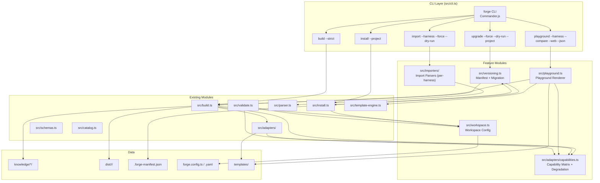
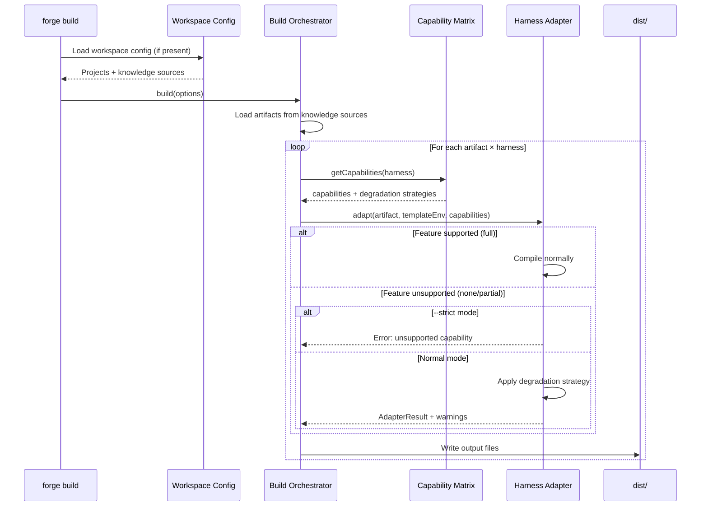
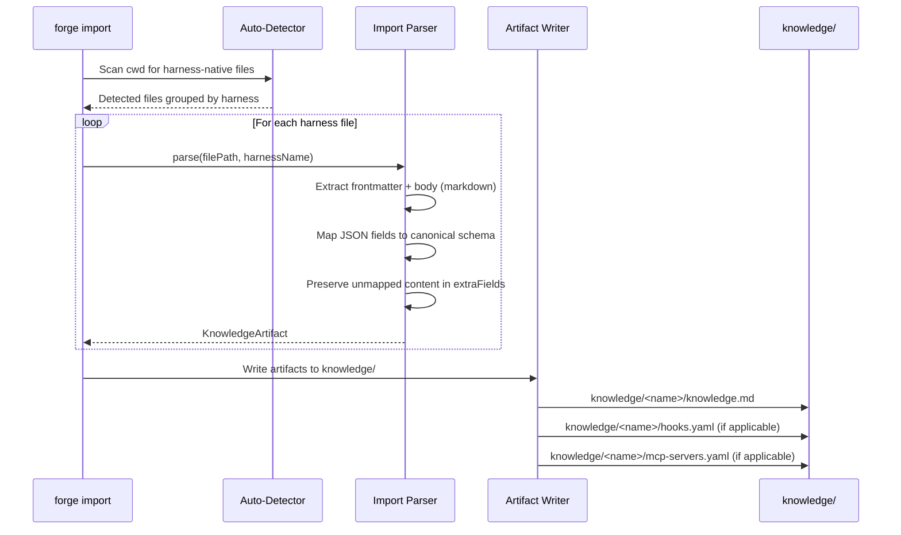
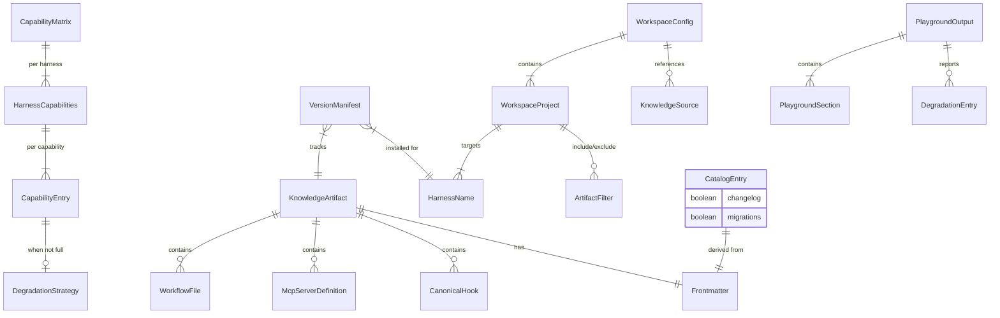

# Design Document: Skill Forge 10-Star Features

## Overview

This design extends Skill Forge with five major capabilities that transform it from a one-way compiler into a full-lifecycle knowledge management platform. The features are:

1. **Harness Capability Matrix + Graceful Degradation** — A machine-readable matrix declaring what each harness supports, with configurable strategies (`inline`, `comment`, `omit`) for handling unsupported features during compilation.
2. **Bidirectional Sync / `forge import`** — A new `import` command that reads harness-native files (`.cursorrules`, `CLAUDE.md`, `.kiro/steering/*.md`, etc.) and reverse-engineers them into canonical Knowledge Artifacts.
3. **Artifact Versioning + Migration** — Semantic versioning in frontmatter, version manifests alongside installed files, a `forge upgrade` command, and optional migration scripts for breaking changes.
4. **Multi-Repo / Monorepo Workspace Support** — A `forge.config.ts`/`forge.config.yaml` workspace configuration file that maps artifacts to projects, enabling per-package harness configuration in monorepos.
5. **Interactive Playground / Preview** — A `forge playground` command that renders a human-readable preview of the "AI experience" for a given artifact-harness combination, with terminal, comparison, and web modes.

### Key Design Decisions

- **Capability matrix as a typed constant** — The matrix is a TypeScript `Record<HarnessName, ...>` validated by Zod, co-located with the adapter registry in `src/adapters/`. This keeps capability data close to the adapters that use it and enables compile-time type checking.
- **Degradation in the adapter layer** — Each adapter receives the capability matrix and applies degradation strategies itself, rather than a centralized pre-processing step. This keeps adapter-specific knowledge (e.g., how to inline hooks as prose for Cursor) encapsulated.
- **Import parsers as a mirror of adapters** — Each harness gets an import parser module under `src/importers/` that reverses the adapter's transformation. This symmetry makes round-trip testing natural.
- **Workspace config as optional overlay** — When no `forge.config.ts`/`forge.config.yaml` exists, all commands fall back to existing single-directory behavior. The workspace layer is purely additive.
- **Playground reuses eval-context templates** — The playground renderer uses the same `templates/eval-contexts/` Nunjucks templates that the eval system uses to simulate harness system prompt wrapping, ensuring consistency.
- **Version manifests as sidecar JSON** — `.forge-manifest.json` files are written alongside installed artifacts rather than in a central database. This keeps version tracking local and git-friendly.

## Architecture



### Data Flow: Build with Degradation



### Data Flow: Import Round-Trip



## Components and Interfaces

### 1. Capability Matrix (`src/adapters/capabilities.ts`)

The central data structure declaring what each harness supports and how to handle unsupported features.

```typescript
// src/adapters/capabilities.ts

import { z } from "zod";
import type { HarnessName } from "../schemas";

export const HARNESS_CAPABILITIES = [
  "hooks", "mcp", "path_scoping", "workflows",
  "toggleable_rules", "agents", "file_match_inclusion",
  "system_prompt_merging",
] as const;

export type HarnessCapabilityName = (typeof HARNESS_CAPABILITIES)[number];

export const SupportLevelSchema = z.enum(["full", "partial", "none"]);
export type SupportLevel = z.infer<typeof SupportLevelSchema>;

export const DegradationStrategySchema = z.enum(["inline", "comment", "omit"]);
export type DegradationStrategy = z.infer<typeof DegradationStrategySchema>;

export const CapabilityEntrySchema = z.object({
  support: SupportLevelSchema,
  degradation: DegradationStrategySchema.optional(),
}).refine(
  (entry) => entry.support === "full" || entry.degradation !== undefined,
  { message: "Degradation strategy required when support is not 'full'" },
);
export type CapabilityEntry = z.infer<typeof CapabilityEntrySchema>;

export const HarnessCapabilitiesSchema = z.record(
  z.enum(HARNESS_CAPABILITIES),
  CapabilityEntrySchema,
);

export const CapabilityMatrixSchema = z.record(
  z.string(), // validated against HarnessName at runtime
  HarnessCapabilitiesSchema,
);
export type CapabilityMatrix = Record<HarnessName, Record<HarnessCapabilityName, CapabilityEntry>>;

/** The capability matrix constant — source of truth */
export const CAPABILITY_MATRIX: CapabilityMatrix = {
  kiro: {
    hooks: { support: "full" },
    mcp: { support: "full" },
    path_scoping: { support: "full" },
    workflows: { support: "full" },
    toggleable_rules: { support: "full" },
    agents: { support: "partial", degradation: "inline" },
    file_match_inclusion: { support: "full" },
    system_prompt_merging: { support: "full" },
  },
  "claude-code": {
    hooks: { support: "partial", degradation: "inline" },
    mcp: { support: "full" },
    path_scoping: { support: "none", degradation: "comment" },
    workflows: { support: "none", degradation: "inline" },
    toggleable_rules: { support: "none", degradation: "omit" },
    agents: { support: "none", degradation: "omit" },
    file_match_inclusion: { support: "none", degradation: "omit" },
    system_prompt_merging: { support: "full" },
  },
  // ... remaining harnesses follow the same pattern
  copilot: {
    hooks: { support: "none", degradation: "inline" },
    mcp: { support: "none", degradation: "comment" },
    path_scoping: { support: "full" },
    workflows: { support: "none", degradation: "inline" },
    toggleable_rules: { support: "none", degradation: "omit" },
    agents: { support: "full" },
    file_match_inclusion: { support: "full" },
    system_prompt_merging: { support: "none", degradation: "inline" },
  },
  cursor: {
    hooks: { support: "none", degradation: "inline" },
    mcp: { support: "full" },
    path_scoping: { support: "full" },
    workflows: { support: "none", degradation: "inline" },
    toggleable_rules: { support: "full" },
    agents: { support: "none", degradation: "omit" },
    file_match_inclusion: { support: "full" },
    system_prompt_merging: { support: "none", degradation: "inline" },
  },
  windsurf: {
    hooks: { support: "none", degradation: "inline" },
    mcp: { support: "full" },
    path_scoping: { support: "full" },
    workflows: { support: "full" },
    toggleable_rules: { support: "none", degradation: "omit" },
    agents: { support: "none", degradation: "omit" },
    file_match_inclusion: { support: "full" },
    system_prompt_merging: { support: "none", degradation: "inline" },
  },
  cline: {
    hooks: { support: "partial", degradation: "inline" },
    mcp: { support: "full" },
    path_scoping: { support: "none", degradation: "comment" },
    workflows: { support: "none", degradation: "inline" },
    toggleable_rules: { support: "none", degradation: "omit" },
    agents: { support: "none", degradation: "omit" },
    file_match_inclusion: { support: "none", degradation: "omit" },
    system_prompt_merging: { support: "none", degradation: "inline" },
  },
  qdeveloper: {
    hooks: { support: "none", degradation: "inline" },
    mcp: { support: "full" },
    path_scoping: { support: "full" },
    workflows: { support: "none", degradation: "inline" },
    toggleable_rules: { support: "none", degradation: "omit" },
    agents: { support: "full" },
    file_match_inclusion: { support: "full" },
    system_prompt_merging: { support: "none", degradation: "inline" },
  },
};

/** Query capabilities for a harness */
export function getCapabilities(harness: HarnessName): Record<HarnessCapabilityName, CapabilityEntry> {
  return CAPABILITY_MATRIX[harness];
}

/** Check if a specific capability is supported */
export function isSupported(harness: HarnessName, capability: HarnessCapabilityName): boolean {
  return CAPABILITY_MATRIX[harness][capability].support === "full";
}

/** Get degradation strategy for a capability, or undefined if fully supported */
export function getDegradation(
  harness: HarnessName,
  capability: HarnessCapabilityName,
): DegradationStrategy | undefined {
  const entry = CAPABILITY_MATRIX[harness][capability];
  return entry.support === "full" ? undefined : entry.degradation;
}

/** Validate matrix is in sync with adapter registry */
export function validateMatrixSync(
  matrixHarnesses: string[],
  registryHarnesses: string[],
): { missing: string[]; extra: string[] } {
  const matrixSet = new Set(matrixHarnesses);
  const registrySet = new Set(registryHarnesses);
  return {
    missing: registryHarnesses.filter((h) => !matrixSet.has(h)),
    extra: matrixHarnesses.filter((h) => !registrySet.has(h)),
  };
}
```

### 2. Degradation Engine (integrated into adapters)

Each adapter is enhanced to accept the capability matrix and apply degradation. A shared utility handles the common patterns.

```typescript
// src/adapters/degradation.ts

import type { KnowledgeArtifact, CanonicalHook } from "../schemas";
import type { AdapterWarning } from "./types";
import type { DegradationStrategy, HarnessCapabilityName } from "./capabilities";

export interface DegradationResult {
  /** Text to append to the steering body (for inline strategy) */
  inlineText: string;
  /** Comment text to insert (for comment strategy) */
  commentText: string;
  /** Warnings generated */
  warnings: AdapterWarning[];
}

/** Render hooks as prose for inline degradation */
export function degradeHooksInline(
  hooks: CanonicalHook[],
  artifactName: string,
  harnessName: string,
): DegradationResult {
  const warnings: AdapterWarning[] = [];
  if (hooks.length === 0) return { inlineText: "", commentText: "", warnings };

  const lines = [
    "",
    "---",
    "<!-- forge:degraded hooks (inline) -->",
    "## Automated Behaviors",
    "",
    "The following behaviors should be applied manually since this harness does not support hooks natively:",
    "",
  ];

  for (const hook of hooks) {
    const trigger = hook.event.replace(/_/g, " ");
    const action = hook.action.type === "ask_agent"
      ? hook.action.prompt
      : `Run: \`${hook.action.command}\``;
    lines.push(`- **When** ${trigger}: ${action}`);
  }

  warnings.push({
    artifactName,
    harnessName,
    message: `hooks: degraded via inline strategy (${hooks.length} hook(s) rendered as prose)`,
  });

  return { inlineText: lines.join("\n"), commentText: "", warnings };
}

/** Apply a degradation strategy for a given capability */
export function applyDegradation(
  strategy: DegradationStrategy,
  capability: HarnessCapabilityName,
  artifact: KnowledgeArtifact,
  harnessName: string,
): DegradationResult {
  const warnings: AdapterWarning[] = [];

  switch (strategy) {
    case "inline":
      if (capability === "hooks") {
        return degradeHooksInline(artifact.hooks, artifact.name, harnessName);
      }
      // Generic inline for other capabilities
      warnings.push({
        artifactName: artifact.name,
        harnessName,
        message: `${capability}: degraded via inline strategy`,
      });
      return { inlineText: `\n<!-- forge:degraded ${capability} (inline) -->\n`, commentText: "", warnings };

    case "comment":
      const comment = `<!-- forge:unsupported ${capability} — this harness does not support ${capability} -->`;
      warnings.push({
        artifactName: artifact.name,
        harnessName,
        message: `${capability}: degraded via comment strategy`,
      });
      return { inlineText: "", commentText: comment, warnings };

    case "omit":
      warnings.push({
        artifactName: artifact.name,
        harnessName,
        message: `${capability}: omitted (not supported by ${harnessName})`,
      });
      return { inlineText: "", commentText: "", warnings };
  }
}
```

### 3. Adapter Interface Extension

The `HarnessAdapter` type is extended to receive capabilities context:

```typescript
// src/adapters/types.ts — extended

import type { CapabilityEntry, HarnessCapabilityName } from "./capabilities";

export interface AdapterContext {
  capabilities: Record<HarnessCapabilityName, CapabilityEntry>;
  strict: boolean;
}

// Updated adapter signature (backward compatible — context is optional)
export type HarnessAdapter = (
  artifact: KnowledgeArtifact,
  templateEnv: nunjucks.Environment,
  context?: AdapterContext,
) => AdapterResult;
```

### 4. Import Parsers (`src/importers/`)

A per-harness import parser module that reverses the adapter transformation.

```typescript
// src/importers/types.ts

import type { KnowledgeArtifact } from "../schemas";

export interface ImportedFile {
  sourcePath: string;
  harnessName: string;
}

export interface ImportResult {
  artifact: Partial<KnowledgeArtifact>;
  warnings: string[];
  unmappedContent: Record<string, unknown>;
}

export type ImportParser = (filePath: string) => Promise<ImportResult>;

// src/importers/index.ts
export const importerRegistry: Record<HarnessName, {
  /** Glob patterns for files this harness uses */
  nativePaths: string[];
  /** Parse a single native file into a partial artifact */
  parse: ImportParser;
}>;
```

Per-harness import path mappings:

| Harness | Native Paths |
|---------|-------------|
| kiro | `.kiro/steering/*.md`, `.kiro/hooks/*.kiro.hook` |
| claude-code | `CLAUDE.md`, `.claude/settings.json`, `.claude/mcp.json` |
| copilot | `.github/copilot-instructions.md`, `.github/instructions/*.instructions.md` |
| cursor | `.cursor/rules/*.md`, `.cursorrules` |
| windsurf | `.windsurfrules`, `.windsurf/rules/*.md` |
| cline | `.clinerules/*.md` |
| qdeveloper | `.q/rules/*.md`, `.amazonq/rules/*.md` |

### 5. Versioning Module (`src/versioning.ts`)

Handles version manifests, upgrade detection, and migration execution.

```typescript
// src/versioning.ts

import { z } from "zod";

export const VersionManifestSchema = z.object({
  artifactName: z.string(),
  version: z.string().regex(/^\d+\.\d+\.\d+$/),
  harnessName: z.string(),
  sourcePath: z.string(),
  installedAt: z.string().datetime(),
  files: z.array(z.string()),
});
export type VersionManifest = z.infer<typeof VersionManifestSchema>;

export function serializeManifest(manifest: VersionManifest): string {
  return JSON.stringify(manifest, null, 2);
}

export function parseManifest(json: string): VersionManifest {
  return VersionManifestSchema.parse(JSON.parse(json));
}

export interface MigrationScript {
  fromVersion: string;
  toVersion: string;
  migrate: (files: Map<string, string>, manifest: VersionManifest) => Map<string, string>;
}

/** Discover and order migration scripts for a version range */
export function resolveMigrationChain(
  availableMigrations: MigrationScript[],
  fromVersion: string,
  toVersion: string,
): MigrationScript[];

/** Compare semver strings */
export function compareVersions(a: string, b: string): number;

/** Scan directory for .forge-manifest.json files */
export async function discoverManifests(rootDir: string): Promise<VersionManifest[]>;

/** Execute upgrade for a single artifact */
export async function upgradeArtifact(
  manifest: VersionManifest,
  latestVersion: string,
  migrations: MigrationScript[],
  options: { force?: boolean; dryRun?: boolean },
): Promise<{ updated: boolean; newManifest?: VersionManifest }>;
```

### 6. Workspace Module (`src/workspace.ts`)

Loads and validates workspace configuration, provides project-aware build/install context.

```typescript
// src/workspace.ts

import { z } from "zod";
import { HarnessNameSchema } from "./schemas";

export const WorkspaceProjectSchema = z.object({
  name: z.string().min(1),
  root: z.string().min(1),
  harnesses: z.array(HarnessNameSchema).min(1),
  artifacts: z.object({
    include: z.array(z.string()).optional(),
    exclude: z.array(z.string()).optional(),
  }).optional(),
  overrides: z.record(z.string(), z.record(z.string(), z.unknown())).optional(),
});
export type WorkspaceProject = z.infer<typeof WorkspaceProjectSchema>;

export const WorkspaceConfigSchema = z.object({
  knowledgeSources: z.array(z.string()).min(1),
  sharedMcpServers: z.string().optional(),
  defaults: z.object({
    harnesses: z.array(HarnessNameSchema).optional(),
    buildOptions: z.record(z.string(), z.unknown()).optional(),
  }).optional(),
  projects: z.array(WorkspaceProjectSchema).min(1),
});
export type WorkspaceConfig = z.infer<typeof WorkspaceConfigSchema>;

/** Load workspace config from forge.config.ts or forge.config.yaml */
export async function loadWorkspaceConfig(
  rootDir: string,
): Promise<{ config: WorkspaceConfig; source: string } | null>;

/** Validate workspace config against filesystem and knowledge sources */
export async function validateWorkspaceConfig(
  config: WorkspaceConfig,
  rootDir: string,
  knownArtifacts: Set<string>,
): Promise<ValidationError[]>;

/** Merge knowledge sources, detecting conflicts */
export async function mergeKnowledgeSources(
  sources: string[],
  rootDir: string,
): Promise<{ artifacts: Map<string, string>; conflicts: Array<{ name: string; sources: string[] }> }>;

/** Serialize workspace config to YAML */
export function serializeWorkspaceConfig(config: WorkspaceConfig): string;

/** Parse workspace config from YAML string */
export function parseWorkspaceConfigYaml(yamlStr: string): WorkspaceConfig;
```

### 7. Playground Module (`src/playground.ts`)

Compiles and renders artifact previews for terminal, comparison, and web modes.

```typescript
// src/playground.ts

import type { HarnessName, KnowledgeArtifact } from "./schemas";
import type { CapabilityEntry, HarnessCapabilityName } from "./adapters/capabilities";

export interface PlaygroundSection {
  title: string;
  content: string;
  type: "system-prompt" | "steering" | "hooks" | "mcp-servers" | "degradation-report";
}

export interface PlaygroundOutput {
  artifactName: string;
  harnessName: string;
  sections: PlaygroundSection[];
  degradations: Array<{
    capability: string;
    strategy: string;
    detail: string;
  }>;
  fileCount: number;
  hooksTranslated: number;
  hooksDegraded: number;
  mcpServers: string[];
}

/** Render a single artifact-harness preview */
export function renderPlayground(
  artifact: KnowledgeArtifact,
  harness: HarnessName,
  options: { noColor?: boolean; json?: boolean },
): PlaygroundOutput;

/** Format PlaygroundOutput as terminal text */
export function formatTerminalOutput(
  output: PlaygroundOutput,
  options: { noColor?: boolean },
): string;

/** Format PlaygroundOutput as JSON */
export function formatJsonOutput(output: PlaygroundOutput): string;

/** Render side-by-side comparison */
export function renderComparison(
  artifact: KnowledgeArtifact,
  harnesses: HarnessName[],
): string;

/** Generate HTML for web preview */
export function generatePlaygroundHtml(
  outputs: PlaygroundOutput[],
  availableHarnesses: HarnessName[],
): string;

/** Start web preview server */
export async function startPlaygroundServer(
  artifactName: string,
  port: number,
): Promise<void>;
```

### 8. CLI Registration (`src/cli.ts` modifications)

New commands and flags added to the existing Commander.js program:

```typescript
// New commands
program
  .command("import")
  .description("Import harness-native files into canonical Knowledge Artifacts")
  .option("--harness <name>", "Import from a specific harness only")
  .option("--force", "Overwrite existing artifacts without confirmation")
  .option("--dry-run", "Show what would be imported without writing files")
  .action(importCommand);

program
  .command("upgrade")
  .description("Upgrade installed artifacts to the latest version")
  .option("--force", "Skip confirmation prompts")
  .option("--dry-run", "Show upgrade plan without modifying files")
  .option("--project <name>", "Upgrade only for a specific workspace project")
  .action(upgradeCommand);

program
  .command("playground <artifact>")
  .description("Preview how an artifact appears to the AI assistant")
  .option("--harness <name>", "Preview for a specific harness")
  .option("--compare", "Compare across all target harnesses")
  .option("--web", "Open web-based preview")
  .option("--json", "Output as structured JSON")
  .option("--no-color", "Disable color output for deterministic diffs")
  .action(playgroundCommand);

// Extended existing commands
// build: add --strict
// install: add --project <name>
```


## Data Models

### New Zod Schemas (`src/schemas.ts` extensions)

```typescript
// --- Capability Matrix schemas (also in src/adapters/capabilities.ts) ---

export const SupportLevelSchema = z.enum(["full", "partial", "none"]);
export const DegradationStrategySchema = z.enum(["inline", "comment", "omit"]);

export const CapabilityEntrySchema = z.object({
  support: SupportLevelSchema,
  degradation: DegradationStrategySchema.optional(),
});

// --- Version Manifest ---

export const VersionManifestSchema = z.object({
  artifactName: z.string().min(1),
  version: z.string().regex(/^\d+\.\d+\.\d+$/),
  harnessName: z.string().min(1),
  sourcePath: z.string().min(1),
  installedAt: z.string().datetime(),
  files: z.array(z.string()),
});

// --- Workspace Config ---

export const WorkspaceProjectSchema = z.object({
  name: z.string().min(1),
  root: z.string().min(1),
  harnesses: z.array(HarnessNameSchema).min(1),
  artifacts: z.object({
    include: z.array(z.string()).optional(),
    exclude: z.array(z.string()).optional(),
  }).optional(),
  overrides: z.record(z.string(), z.record(z.string(), z.unknown())).optional(),
});

export const WorkspaceConfigSchema = z.object({
  knowledgeSources: z.array(z.string()).min(1),
  sharedMcpServers: z.string().optional(),
  defaults: z.object({
    harnesses: z.array(HarnessNameSchema).optional(),
    buildOptions: z.record(z.string(), z.unknown()).optional(),
  }).optional(),
  projects: z.array(WorkspaceProjectSchema).min(1),
});

// --- Playground Output ---

export const PlaygroundSectionSchema = z.object({
  title: z.string(),
  content: z.string(),
  type: z.enum(["system-prompt", "steering", "hooks", "mcp-servers", "degradation-report"]),
});

export const PlaygroundOutputSchema = z.object({
  artifactName: z.string(),
  harnessName: z.string(),
  sections: z.array(PlaygroundSectionSchema),
  degradations: z.array(z.object({
    capability: z.string(),
    strategy: z.string(),
    detail: z.string(),
  })),
  fileCount: z.number(),
  hooksTranslated: z.number(),
  hooksDegraded: z.number(),
  mcpServers: z.array(z.string()),
});

// --- Extended existing schemas ---

// FrontmatterSchema: add optional `migrations` boolean
// CatalogEntrySchema: add `changelog` and `migrations` booleans
```

### Schema Relationships



### File System Layout (after all features)

```
project-root/
├── forge.config.ts              # Workspace config (optional)
├── knowledge/
│   └── my-skill/
│       ├── knowledge.md          # Canonical artifact
│       ├── hooks.yaml
│       ├── mcp-servers.yaml
│       ├── workflows/
│       ├── migrations/           # NEW: version migration scripts
│       │   └── 1.0.0-to-2.0.0.ts
│       ├── CHANGELOG.md          # NEW: per-artifact changelog
│       └── evals/
├── dist/
│   └── <harness>/
│       └── <artifact>/
│           └── ...               # Compiled output (now with version comments)
├── packages/                     # Monorepo projects
│   ├── api/
│   │   ├── .kiro/steering/       # Installed via workspace-aware install
│   │   └── .forge-manifest.json  # NEW: version manifest
│   └── web/
│       ├── .cursor/rules/
│       └── .forge-manifest.json
└── catalog.json                  # Extended with changelog/migrations fields
```

## Correctness Properties

*A property is a characteristic or behavior that should hold true across all valid executions of a system — essentially, a formal statement about what the system should do. Properties serve as the bridge between human-readable specifications and machine-verifiable correctness guarantees.*

### Property 1: Capability matrix completeness

*For any* harness name in `SUPPORTED_HARNESSES`, the `CAPABILITY_MATRIX` shall contain an entry for that harness, and that entry shall contain a `CapabilityEntry` for each of the 8 defined `HARNESS_CAPABILITIES`, with each entry's `support` field being one of `"full"`, `"partial"`, or `"none"`.

**Validates: Requirements 1.1, 1.2, 1.4**

### Property 2: Matrix-registry synchronization

*For any* set of harness names, the set of keys in `CAPABILITY_MATRIX` shall be exactly equal to the set of keys in `adapterRegistry` — no missing entries, no extra entries.

**Validates: Requirements 1.6**

### Property 3: Degradation strategy presence

*For any* harness and capability in the `CAPABILITY_MATRIX` where `support` is `"none"` or `"partial"`, the entry shall have a defined `degradation` strategy (one of `"inline"`, `"comment"`, `"omit"`).

**Validates: Requirements 2.1**

### Property 4: Degradation produces correct output and warnings

*For any* Knowledge Artifact using a capability that a target harness does not fully support, the adapter shall produce an `AdapterResult` containing at least one warning identifying the artifact name, harness name, unsupported capability, and degradation strategy applied.

**Validates: Requirements 2.3, 2.5**

### Property 5: Inline degradation appends delimited section

*For any* Knowledge Artifact with hooks compiled for a harness where hooks have `"inline"` degradation, the compiled steering file body shall contain a delimited section (marked with `<!-- forge:degraded hooks (inline) -->`) rendering each hook's trigger and action as prose.

**Validates: Requirements 2.4**

### Property 6: Strict mode fails on degradation

*For any* Knowledge Artifact requiring degradation for a target harness, building with `strict: true` shall produce an error (non-empty `errors` array in `BuildResult`) rather than applying any degradation strategy.

**Validates: Requirements 2.6**

### Property 7: Build idempotency

*For any* set of Knowledge Artifacts and build options, running the `build()` function twice without modifying source files shall produce byte-identical output files in the dist directory.

**Validates: Requirements 3.1, 3.2**

### Property 8: Import parser — markdown frontmatter and body extraction

*For any* valid markdown string containing YAML frontmatter and a body, the import parser shall separate the frontmatter fields into the artifact's `frontmatter` object and the remaining content into the `body` string, preserving both without data loss.

**Validates: Requirements 6.1**

### Property 9: Import parser — JSON field mapping

*For any* valid JSON hook definition conforming to a harness-native schema, the import parser shall produce a `CanonicalHook` with correctly mapped `event` and `action` fields.

**Validates: Requirements 6.2**

### Property 10: Import parser — unmapped content preservation

*For any* harness-native file containing fields not present in the canonical schema, the import parser shall preserve those fields in the artifact's `extraFields` record and emit a warning identifying the unmapped content.

**Validates: Requirements 6.5**

### Property 11: Markdown import-build round-trip

*For any* valid harness-native markdown file, importing it via the import parser then building for the same harness shall produce output whose markdown body content is semantically equivalent to the original file's body content.

**Validates: Requirements 7.1**

### Property 12: Hook import-build round-trip

*For any* valid Kiro `.kiro.hook` JSON file, importing it via the import parser then building for Kiro shall produce a `.kiro.hook` JSON file with equivalent `when` and `then` fields.

**Validates: Requirements 6.3, 7.2**

### Property 13: MCP config import-build round-trip

*For any* valid MCP server JSON configuration, importing it then building for the same harness shall produce an MCP JSON file with equivalent server entries (name, command, args, env).

**Validates: Requirements 7.3**

### Property 14: Version embedding in compiled output

*For any* Knowledge Artifact with a `version` field in its frontmatter, the compiled output for every target harness shall contain the version string embedded as a comment (`<!-- forge:version X.Y.Z -->` in markdown) or metadata field (`"_forgeVersion": "X.Y.Z"` in JSON).

**Validates: Requirements 9.2**

### Property 15: Version manifest serialization round-trip

*For any* valid `VersionManifest` object, serializing it to JSON via `serializeManifest()` then parsing it back via `parseManifest()` shall produce an object deeply equal to the original.

**Validates: Requirements 10.1**

### Property 16: Migration script sequential execution

*For any* sequence of migration scripts covering a version range from `A` to `B`, the `resolveMigrationChain()` function shall return them ordered by ascending source version, and `upgradeArtifact()` shall execute them in that order.

**Validates: Requirements 12.3**

### Property 17: Upgrade idempotency

*For any* installed artifact whose version matches the latest source version, running `upgradeArtifact()` shall produce no file changes and return `{ updated: false }`.

**Validates: Requirements 14.1, 14.2**

### Property 18: Workspace config validation catches invalid fields

*For any* `WorkspaceConfig` containing a `WorkspaceProject` with a non-existent `root` path, or an artifact name not present in any knowledge source, or an unrecognized harness name, `validateWorkspaceConfig()` shall return at least one `ValidationError` identifying the invalid field.

**Validates: Requirements 15.4, 18.2, 18.3, 18.4**

### Property 19: Knowledge source merging — unique names

*For any* set of knowledge source directories where all artifact names are unique across sources, `mergeKnowledgeSources()` shall return a map containing every artifact from every source with no conflicts.

**Validates: Requirements 16.2**

### Property 20: Knowledge source conflict detection

*For any* two knowledge source directories that both contain an artifact with the same name, `mergeKnowledgeSources()` shall return a non-empty `conflicts` array identifying the artifact name and both source paths.

**Validates: Requirements 16.3**

### Property 21: Override merging precedence

*For any* artifact `harness-config` and workspace project `overrides` with overlapping keys, the merged configuration shall contain the project override values for overlapping keys and all non-overlapping keys from both sources.

**Validates: Requirements 16.4**

### Property 22: Workspace config YAML round-trip

*For any* valid `WorkspaceConfig` object, serializing it to YAML via `serializeWorkspaceConfig()` then parsing it back via `parseWorkspaceConfigYaml()` shall produce an object deeply equal to the original.

**Validates: Requirements 19.1**

### Property 23: Playground section completeness

*For any* Knowledge Artifact with hooks and MCP servers, the `PlaygroundOutput` produced by `renderPlayground()` shall contain sections of type `"system-prompt"`, `"steering"`, `"hooks"`, and `"mcp-servers"`.

**Validates: Requirements 20.2**

### Property 24: Playground degradation report

*For any* artifact-harness combination where at least one capability requires degradation, the `PlaygroundOutput` shall contain a section of type `"degradation-report"` listing each degraded capability and the strategy applied.

**Validates: Requirements 21.1**

### Property 25: Playground comparison summary completeness

*For any* artifact compiled for multiple harnesses via `renderComparison()`, the output shall include for each harness: the file count, the number of hooks translated vs. degraded, the MCP servers configured, and any degradation strategies applied.

**Validates: Requirements 22.2**

### Property 26: Playground output determinism

*For any* valid artifact-harness combination, calling `renderPlayground()` twice with the same inputs and `{ noColor: true }` shall produce identical `PlaygroundOutput` objects.

**Validates: Requirements 24.1**

### Property 27: Playground JSON output validity

*For any* valid artifact-harness combination, `formatJsonOutput(renderPlayground(...))` shall produce a string that is valid JSON and parses to an object conforming to `PlaygroundOutputSchema`.

**Validates: Requirements 24.3**

### Property 28: New Zod schema round-trips

*For any* valid instance of `VersionManifestSchema`, `WorkspaceConfigSchema`, `WorkspaceProjectSchema`, `CapabilityEntrySchema`, or `PlaygroundOutputSchema`, parsing the instance then serializing to JSON then parsing again shall produce an object deeply equal to the original.

**Validates: Requirements 26.4**


## Error Handling

### Error Categories

| Category | Source | Handling |
|----------|--------|----------|
| **Parse errors** | Import parser encounters malformed harness-native files | Return `ParseError` with field path and message; skip file, continue with others |
| **Degradation errors** | `--strict` mode encounters unsupported capability | Return `BuildError` with artifact name, harness, and capability; fail the build |
| **Validation errors** | Capability matrix out of sync, workspace config invalid | Return `ValidationError[]` with field paths; non-zero exit code |
| **Migration errors** | Migration script throws during upgrade | Abort upgrade for that artifact; leave installed files unchanged; log error to stderr |
| **Conflict errors** | Duplicate artifact names across knowledge sources | Return error identifying both sources and the conflicting name; fail the build |
| **Not-found errors** | Playground references non-existent artifact or harness | Return error listing available options from catalog |
| **Version errors** | Manifest has invalid semver, missing migration script | Warn and fall back to clean reinstall |

### Error Message Format

All new commands follow the existing convention:
- Diagnostic output (warnings, progress) → `stderr`
- Machine-readable output (JSON, preview text) → `stdout`
- Non-zero exit code on any error
- Every error message includes an actionable suggestion:

```
Error: Artifact "my-skill" not built for harness "cursor".
  → Run `forge build --harness cursor` first, or use `forge playground --harness kiro` instead.

Error: Workspace project "api" not found in forge.config.ts.
  → Available projects: api-server, web-client, shared-lib

Error: No harness-native files detected in current directory.
  → Checked: .kiro/, .cursor/, .claude/, .github/, .windsurf/, .clinerules/, .q/, .amazonq/
  → Run `forge new <name>` to create a new artifact from scratch.

Error: Migration script missing for version gap 1.0.0 → 3.0.0.
  → Expected: knowledge/my-skill/migrations/1.0.0-to-2.0.0.ts
  → Falling back to clean reinstall. Custom modifications may be lost.
```

### Graceful Degradation of Errors

- Import: If one file fails to parse, continue importing others; report failures in summary
- Build: If one artifact fails for one harness, continue with other artifacts/harnesses; report in summary
- Upgrade: If one artifact's migration fails, skip it and continue with others; report in summary
- Validate: Collect all errors across all artifacts and workspace config; report all at once

## Testing Strategy

### Dual Testing Approach

This feature set uses both unit tests and property-based tests for comprehensive coverage:

- **Unit tests** (example-based): Verify specific scenarios, edge cases, integration points, and error conditions
- **Property-based tests** (via `fast-check`): Verify universal properties that must hold across all valid inputs

The project already has `fast-check` as a dev dependency. All property tests will use `fast-check` with a minimum of 100 iterations per property.

### Property-Based Test Plan

Each correctness property maps to a property-based test. Tests are tagged with the format:
`Feature: skill-forge-10-star-features, Property N: <title>`

| Property | Test File | Generator Strategy |
|----------|-----------|-------------------|
| 1: Matrix completeness | `tests/capabilities.test.ts` | Iterate over `SUPPORTED_HARNESSES` constant |
| 2: Matrix-registry sync | `tests/capabilities.test.ts` | Compare key sets of matrix and registry |
| 3: Degradation strategy presence | `tests/capabilities.test.ts` | Filter matrix entries where support ≠ "full" |
| 4: Degradation output + warnings | `tests/degradation.test.ts` | Generate random `KnowledgeArtifact` with hooks/MCP, random harness with degradation |
| 5: Inline degradation section | `tests/degradation.test.ts` | Generate random hooks, apply inline degradation, check output contains markers |
| 6: Strict mode failure | `tests/degradation.test.ts` | Generate random artifact requiring degradation, build with strict=true |
| 7: Build idempotency | `tests/build.test.ts` | Generate random artifacts, build twice, compare output byte-for-byte |
| 8: Markdown extraction | `tests/importers.test.ts` | Generate random YAML frontmatter + markdown body strings |
| 9: JSON field mapping | `tests/importers.test.ts` | Generate random valid hook JSON objects |
| 10: Unmapped content | `tests/importers.test.ts` | Generate random objects with known + unknown fields |
| 11: Markdown round-trip | `tests/import-roundtrip.test.ts` | Generate random markdown with frontmatter, import then build |
| 12: Hook round-trip | `tests/import-roundtrip.test.ts` | Generate random `CanonicalHook`, export to Kiro JSON, import back |
| 13: MCP round-trip | `tests/import-roundtrip.test.ts` | Generate random `McpServerDefinition`, export then import |
| 14: Version embedding | `tests/versioning.test.ts` | Generate random semver strings, build artifacts, check output |
| 15: Manifest round-trip | `tests/versioning.test.ts` | Generate random `VersionManifest` objects, serialize/deserialize |
| 16: Migration ordering | `tests/versioning.test.ts` | Generate random version sequences, verify chain ordering |
| 17: Upgrade idempotency | `tests/versioning.test.ts` | Generate manifest at latest version, verify no-op |
| 18: Workspace validation | `tests/workspace.test.ts` | Generate configs with invalid fields, verify errors |
| 19: Knowledge source merging | `tests/workspace.test.ts` | Generate unique artifact name sets, verify union |
| 20: Conflict detection | `tests/workspace.test.ts` | Generate overlapping artifact names, verify conflict |
| 21: Override precedence | `tests/workspace.test.ts` | Generate two config objects with overlapping keys, verify merge |
| 22: Workspace YAML round-trip | `tests/workspace.test.ts` | Generate random `WorkspaceConfig`, serialize/parse |
| 23: Playground sections | `tests/playground.test.ts` | Generate artifacts with hooks + MCP, verify section types |
| 24: Playground degradation report | `tests/playground.test.ts` | Generate artifact-harness pairs requiring degradation |
| 25: Comparison summary | `tests/playground.test.ts` | Generate artifact, render for multiple harnesses |
| 26: Playground determinism | `tests/playground.test.ts` | Generate artifact-harness pair, render twice, compare |
| 27: Playground JSON validity | `tests/playground.test.ts` | Generate artifact-harness pair, render as JSON, parse |
| 28: Schema round-trips | `tests/schemas.test.ts` | Generate random instances of each new schema |

### Unit Test Plan

| Area | Test File | Key Scenarios |
|------|-----------|---------------|
| CLI registration | `tests/cli.test.ts` | All new commands appear in help, correct options registered |
| Import auto-detection | `tests/importers.test.ts` | Detects files from multiple harnesses, handles empty directory |
| Import --force/--dry-run | `tests/importers.test.ts` | Force overwrites, dry-run writes nothing |
| Claude Code settings import | `tests/importers.test.ts` | Maps command entries to agent_stop hooks |
| Upgrade with changelog | `tests/versioning.test.ts` | Displays changelog entries between versions |
| Upgrade --force/--dry-run | `tests/versioning.test.ts` | Force skips prompts, dry-run modifies nothing |
| Missing migration fallback | `tests/versioning.test.ts` | Falls back to clean reinstall with warning |
| Migration script error | `tests/versioning.test.ts` | Aborts upgrade, leaves files unchanged |
| Workspace .ts vs .yaml precedence | `tests/workspace.test.ts` | Prefers .ts when both exist, emits warning |
| Workspace-aware install | `tests/workspace.test.ts` | Installs into correct project directories |
| Playground non-existent artifact | `tests/playground.test.ts` | Error lists available artifacts |
| Playground web preview | `tests/playground.test.ts` | HTML contains no external CDN references |
| Error message quality | `tests/errors.test.ts` | All error messages include actionable suggestions |

### Test Configuration

```typescript
// Example property test structure
import { describe, test, expect } from "bun:test";
import * as fc from "fast-check";

describe("Feature: skill-forge-10-star-features", () => {
  test("Property 15: Version manifest serialization round-trip", () => {
    fc.assert(
      fc.property(
        fc.record({
          artifactName: fc.string({ minLength: 1 }),
          version: fc.tuple(fc.nat(99), fc.nat(99), fc.nat(99))
            .map(([a, b, c]) => `${a}.${b}.${c}`),
          harnessName: fc.constantFrom(...SUPPORTED_HARNESSES),
          sourcePath: fc.string({ minLength: 1 }),
          installedAt: fc.date().map((d) => d.toISOString()),
          files: fc.array(fc.string({ minLength: 1 })),
        }),
        (manifest) => {
          const serialized = serializeManifest(manifest);
          const deserialized = parseManifest(serialized);
          expect(deserialized).toEqual(manifest);
        },
      ),
      { numRuns: 100 },
    );
  });
});
```
