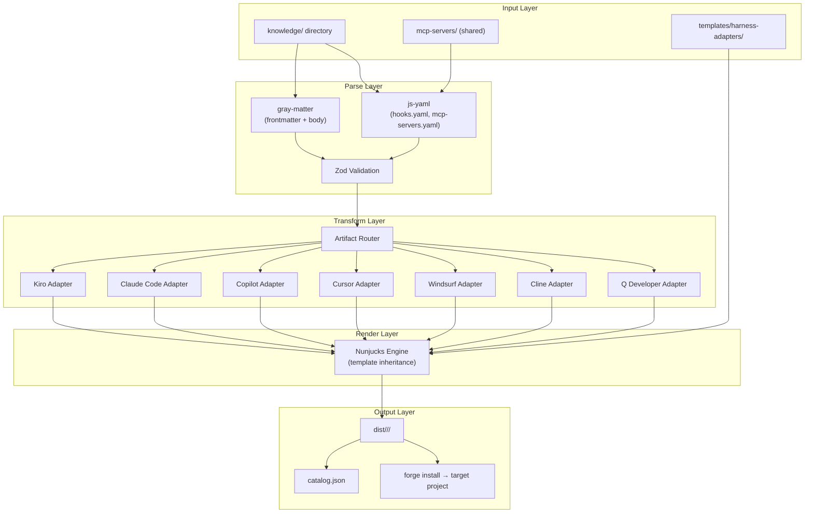
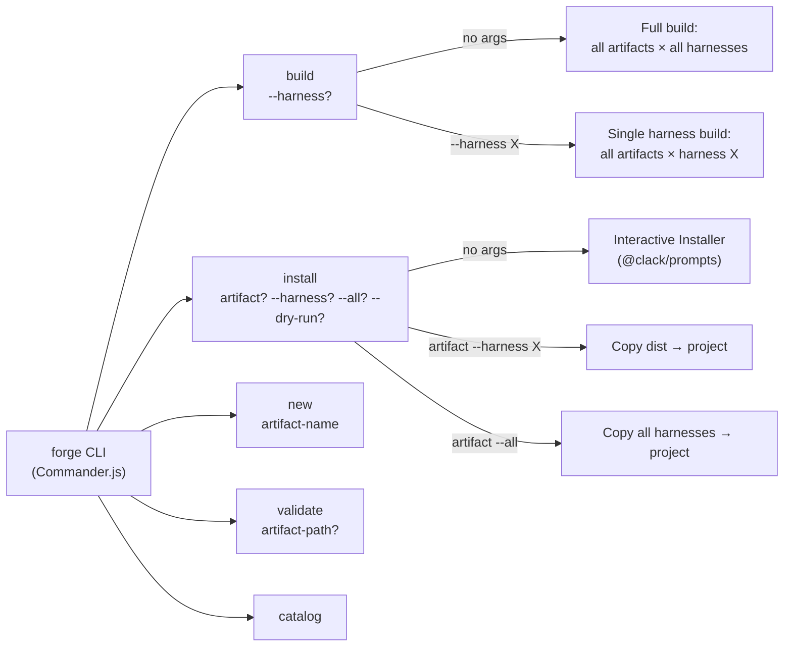
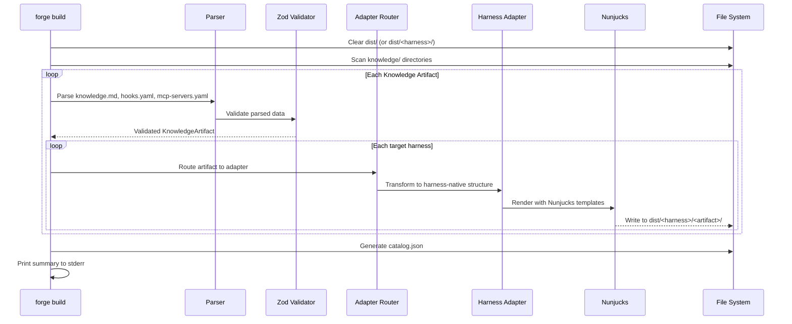
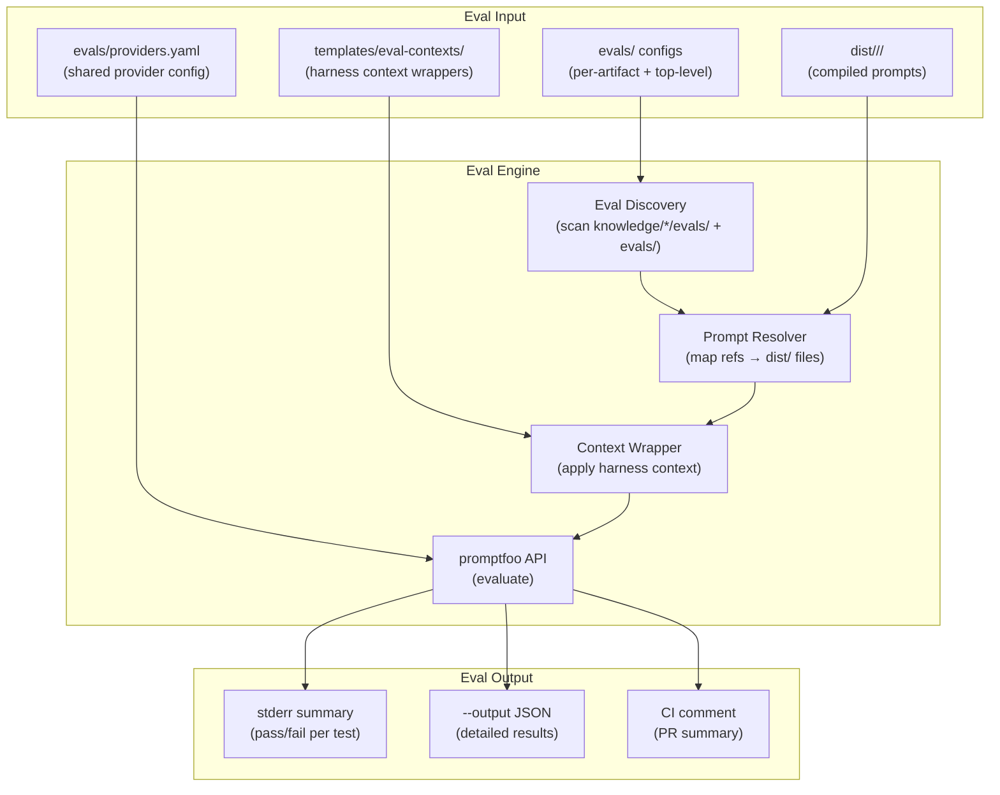
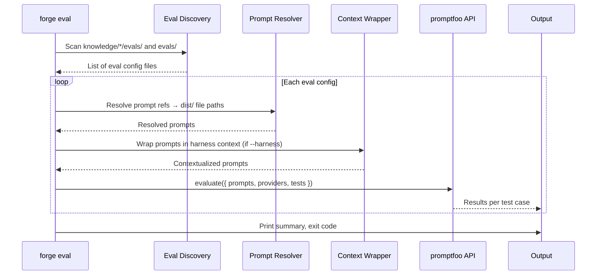

# Design Document: Skill Forge Monorepo

## Overview

Skill Forge is a TypeScript CLI tool running on Bun that implements a "write once, compile everywhere" pipeline for AI coding assistant knowledge artifacts. Authors maintain canonical content in Markdown + YAML under a `knowledge/` directory, and the `forge` CLI compiles that content into seven harness-native formats under `dist/` using a template-driven adapter architecture.

The system is structured around four core pipelines:

1. **Parse** — Read `knowledge.md` (gray-matter), `hooks.yaml` (js-yaml), and `mcp-servers.yaml` (js-yaml), validate with Zod schemas, and produce typed in-memory representations.
2. **Transform** — Route each parsed artifact through per-harness adapter modules that map canonical structures to harness-native structures (event name mapping, file layout, inclusion modes).
3. **Render** — Feed transformed data into Nunjucks templates with inheritance (`base.md.njk` → harness-specific overrides) to produce final output files.
4. **Emit** — Write rendered files to `dist/<harness>/<artifact>/`, generate `catalog.json`, and support `forge install` to copy into target projects.

Commander.js provides the CLI framework with subcommands: `build`, `install`, `new`, `validate`, and `catalog`. The interactive installer (`forge install` with no args) uses `@clack/prompts` for a guided wizard experience.

### Key Design Decisions

- **Nunjucks over Handlebars**: Nunjucks provides template inheritance (`` / ``), which allows harness templates to share a common base while overriding specific blocks. This avoids duplicating boilerplate across seven harness templates.
- **Zod for validation**: All parsed YAML/frontmatter passes through Zod schemas before entering the adapter pipeline. This gives us runtime type safety, clear error messages with paths, and TypeScript type inference from schemas.
- **Adapter as pure function**: Each harness adapter is a pure function `(artifact: KnowledgeArtifact, templates: NunjucksEnv) → HarnessOutput[]`. No side effects — the CLI orchestrator handles all file I/O. This makes adapters independently testable.
- **gray-matter for frontmatter**: gray-matter handles the `---` delimited YAML frontmatter extraction from Markdown files, returning both parsed data and the body content. It handles edge cases like empty frontmatter blocks.

## Architecture



### CLI Command Flow



### Data Flow: Build Pipeline



## Components and Interfaces

### 1. CLI Entry Point (`src/cli.ts`)

Registers Commander.js commands and wires them to core modules.

```typescript
// src/cli.ts
import { Command } from "commander";

const program = new Command()
  .name("forge")
  .description("Skill Forge — write knowledge once, compile to every harness")
  .version("0.1.0");

program.command("build")
  .description("Compile knowledge artifacts to harness-native formats")
  .option("--harness <name>", "Build for a single harness only")
  .action(buildCommand);

program.command("install [artifact]")
  .description("Install compiled artifacts into the current project")
  .option("--harness <name>", "Install for a specific harness")
  .option("--all", "Install for all harnesses")
  .option("--force", "Overwrite without confirmation")
  .option("--dry-run", "Show what would be installed without writing files")
  .option("--source <path>", "Path to skill-forge repository")
  .option("--from-release <tag>", "Download from GitHub release")
  .action(installCommand);

program.command("new <artifact-name>")
  .description("Scaffold a new knowledge artifact")
  .action(newCommand);

program.command("validate [artifact-path]")
  .description("Validate knowledge artifacts")
  .action(validateCommand);

program.command("catalog")
  .description("Generate catalog.json")
  .action(catalogCommand);
```

### 2. Harness Adapter Interface

All seven adapters implement a common interface. Adapters are pure functions — no file I/O.

```typescript
// src/adapters/types.ts

/** A single file to be written by the build orchestrator */
export interface OutputFile {
  /** Relative path within dist/<harness>/<artifact>/ */
  relativePath: string;
  /** File content as a string */
  content: string;
  /** Whether to set executable permission (for Cline hook scripts) */
  executable?: boolean;
}

/** Warnings emitted by an adapter (e.g., unsupported hook events) */
export interface AdapterWarning {
  artifactName: string;
  harnessName: string;
  message: string;
}

/** Result of running a harness adapter on a single artifact */
export interface AdapterResult {
  files: OutputFile[];
  warnings: AdapterWarning[];
}

/** The adapter function signature — pure, no side effects */
export type HarnessAdapter = (
  artifact: KnowledgeArtifact,
  templateEnv: nunjucks.Environment,
) => AdapterResult;
```

### 3. Adapter Registry

Maps harness names to their adapter functions.

```typescript
// src/adapters/index.ts
import type { HarnessAdapter } from "./types";

export const SUPPORTED_HARNESSES = [
  "kiro", "claude-code", "copilot", "cursor",
  "windsurf", "cline", "qdeveloper",
] as const;

export type HarnessName = (typeof SUPPORTED_HARNESSES)[number];

export const adapterRegistry: Record<HarnessName, HarnessAdapter> = {
  kiro: kiroAdapter,
  "claude-code": claudeCodeAdapter,
  copilot: copilotAdapter,
  cursor: cursorAdapter,
  windsurf: windsurfAdapter,
  cline: clineAdapter,
  qdeveloper: qdeveloperAdapter,
};
```

### 4. Event and Inclusion Mode Mapping

Each adapter maps canonical events and inclusion modes to harness-native equivalents.

```typescript
// Canonical → Kiro event mapping
const KIRO_EVENT_MAP: Partial<Record<CanonicalEvent, string>> = {
  file_edited: "fileEdited",
  file_created: "fileCreated",
  file_deleted: "fileDeleted",
  agent_stop: "agentStop",
  prompt_submit: "promptSubmit",
  pre_tool_use: "preToolUse",
  post_tool_use: "postToolUse",
  pre_task: "preTaskExecution",
  post_task: "postTaskExecution",
  user_triggered: "userTriggered",
};

// Canonical → Cursor inclusion mapping
const CURSOR_INCLUSION_MAP: Record<CanonicalInclusion, string> = {
  always: "always",
  fileMatch: "auto",
  manual: "agent-requested",
};
```

### 5. Build Orchestrator (`src/build.ts`)

Coordinates parsing, validation, adapter routing, rendering, and file emission.

```typescript
// src/build.ts
export interface BuildOptions {
  knowledgeDir: string;
  distDir: string;
  templatesDir: string;
  mcpServersDir: string;
  harness?: HarnessName; // undefined = all harnesses
}

export interface BuildResult {
  artifactsCompiled: number;
  filesWritten: number;
  warnings: AdapterWarning[];
  errors: BuildError[];
}

export async function build(options: BuildOptions): Promise<BuildResult>;
```

### 6. Validator (`src/validate.ts`)

Validates artifacts against Zod schemas and returns structured results.

```typescript
// src/validate.ts
export interface ValidationResult {
  artifactName: string;
  valid: boolean;
  errors: ValidationError[];
}

export interface ValidationError {
  field: string;
  message: string;
  filePath: string;
  line?: number;
}

export async function validateArtifact(
  artifactPath: string,
): Promise<ValidationResult>;

export async function validateAll(
  knowledgeDir: string,
): Promise<ValidationResult[]>;
```

### 7. Catalog Generator (`src/catalog.ts`)

Produces `catalog.json` from parsed artifacts.

```typescript
// src/catalog.ts
export interface CatalogEntry {
  name: string;
  displayName: string;
  description: string;
  keywords: string[];
  author: string;
  version: string;
  harnesses: HarnessName[];
  type: "skill" | "power" | "rule";
  path: string;
}

export async function generateCatalog(
  knowledgeDir: string,
): Promise<CatalogEntry[]>;

export function serializeCatalog(entries: CatalogEntry[]): string;
```

### 8. Interactive Installer (`src/install.ts`)

Handles both direct CLI install and the interactive wizard.

```typescript
// src/install.ts
export interface InstallOptions {
  artifactName?: string;
  harness?: HarnessName;
  all?: boolean;
  force?: boolean;
  dryRun?: boolean;
  source?: string;
  fromRelease?: string;
}

export interface InstallPlan {
  files: Array<{
    source: string;
    destination: string;
    overwrite: boolean;
  }>;
  harnesses: HarnessName[];
  artifacts: string[];
}

export async function install(options: InstallOptions): Promise<void>;
export async function runInteractiveInstaller(
  catalog: CatalogEntry[],
  distDir: string,
): Promise<void>;
```

### 9. Template System

Nunjucks templates use inheritance. Each harness has a directory under `templates/harness-adapters/`.

```
templates/harness-adapters/
├── _base/
│   └── base.md.njk          # Shared base template
├── kiro/
│   ├── power.md.njk         # 
│   ├── steering.md.njk
│   ├── hook.json.njk
│   └── mcp.json.njk
├── claude-code/
│   ├── claude.md.njk
│   ├── settings.json.njk
│   └── mcp.json.njk
├── copilot/
│   ├── instructions.md.njk
│   ├── scoped.md.njk
│   └── agents.md.njk
├── cursor/
│   ├── rule.md.njk
│   └── mcp.json.njk
├── windsurf/
│   ├── rule.md.njk
│   ├── workflow.md.njk
│   └── mcp.json.njk
├── cline/
│   ├── rule.md.njk
│   ├── hook.sh.njk
│   └── mcp.json.njk
└── qdeveloper/
    ├── rule.md.njk
    ├── agent.md.njk
    └── mcp.json.njk
```

The base template provides a common structure:

```nunjucks
{# templates/harness-adapters/_base/base.md.njk #}


{# Generated by Skill Forge from knowledge/{{ artifact.name }} — do not edit #}


{{ artifact.body }}




## {{ workflow.name }}

{{ workflow.content }}



```

## Data Models

All data models are defined as Zod schemas, providing both runtime validation and TypeScript type inference.

### Canonical Event and Action Types

```typescript
// src/schemas.ts
import { z } from "zod";

export const CanonicalEventSchema = z.enum([
  "file_edited", "file_created", "file_deleted",
  "agent_stop", "prompt_submit",
  "pre_tool_use", "post_tool_use",
  "pre_task", "post_task",
  "user_triggered",
]);
export type CanonicalEvent = z.infer<typeof CanonicalEventSchema>;

export const CanonicalActionSchema = z.discriminatedUnion("type", [
  z.object({
    type: z.literal("ask_agent"),
    prompt: z.string().min(1),
  }),
  z.object({
    type: z.literal("run_command"),
    command: z.string().min(1),
  }),
]);
export type CanonicalAction = z.infer<typeof CanonicalActionSchema>;
```

### Canonical Hook Schema

```typescript
export const CanonicalHookSchema = z.object({
  name: z.string().min(1),
  description: z.string().optional(),
  event: CanonicalEventSchema,
  condition: z.object({
    file_patterns: z.array(z.string()).optional(),
    tool_types: z.array(z.string()).optional(),
  }).optional(),
  action: CanonicalActionSchema,
});
export type CanonicalHook = z.infer<typeof CanonicalHookSchema>;

export const HooksFileSchema = z.array(CanonicalHookSchema);
```

### MCP Server Definition Schema

```typescript
export const McpServerDefinitionSchema = z.object({
  name: z.string().min(1),
  command: z.string().min(1),
  args: z.array(z.string()).default([]),
  env: z.record(z.string(), z.string()).default({}),
});
export type McpServerDefinition = z.infer<typeof McpServerDefinitionSchema>;

export const McpServersFileSchema = z.array(McpServerDefinitionSchema);
```

### Knowledge Artifact Frontmatter Schema

```typescript
export const HarnessNameSchema = z.enum([
  "kiro", "claude-code", "copilot", "cursor",
  "windsurf", "cline", "qdeveloper",
]);
export type HarnessName = z.infer<typeof HarnessNameSchema>;

export const InclusionModeSchema = z.enum(["always", "fileMatch", "manual"]);
export type InclusionMode = z.infer<typeof InclusionModeSchema>;

export const ArtifactTypeSchema = z.enum(["skill", "power", "rule"]);

export const FrontmatterSchema = z.object({
  name: z.string().min(1),
  displayName: z.string().optional(),
  description: z.string().default(""),
  keywords: z.array(z.string()).default([]),
  author: z.string().default(""),
  version: z.string().default("0.1.0"),
  harnesses: z.array(HarnessNameSchema).default([
    "kiro", "claude-code", "copilot", "cursor",
    "windsurf", "cline", "qdeveloper",
  ]),
  type: ArtifactTypeSchema.default("skill"),
  inclusion: InclusionModeSchema.default("always"),
  file_patterns: z.array(z.string()).optional(),
}).passthrough(); // Preserve unknown fields for template context
export type Frontmatter = z.infer<typeof FrontmatterSchema>;
```

### Parsed Knowledge Artifact (In-Memory Representation)

```typescript
export const WorkflowFileSchema = z.object({
  name: z.string(),
  filename: z.string(),
  content: z.string(),
});

export const KnowledgeArtifactSchema = z.object({
  /** Canonical identifier (directory name, kebab-case) */
  name: z.string().min(1),
  /** Parsed and validated frontmatter */
  frontmatter: FrontmatterSchema,
  /** Markdown body text (everything below frontmatter) */
  body: z.string(),
  /** Parsed canonical hooks (empty array if no hooks.yaml) */
  hooks: z.array(CanonicalHookSchema).default([]),
  /** Parsed MCP server definitions (empty array if no mcp-servers.yaml) */
  mcpServers: z.array(McpServerDefinitionSchema).default([]),
  /** Parsed workflow files from workflows/ subdirectory */
  workflows: z.array(WorkflowFileSchema).default([]),
  /** Path to the knowledge artifact directory */
  sourcePath: z.string(),
  /** Extra frontmatter fields not in the schema (passthrough) */
  extraFields: z.record(z.string(), z.unknown()).default({}),
});
export type KnowledgeArtifact = z.infer<typeof KnowledgeArtifactSchema>;
```

### Catalog Entry Schema

```typescript
export const CatalogEntrySchema = z.object({
  name: z.string(),
  displayName: z.string(),
  description: z.string(),
  keywords: z.array(z.string()),
  author: z.string(),
  version: z.string(),
  harnesses: z.array(HarnessNameSchema),
  type: ArtifactTypeSchema,
  path: z.string(),
});
export type CatalogEntry = z.infer<typeof CatalogEntrySchema>;

export const CatalogSchema = z.array(CatalogEntrySchema);
```

### Validation Error Schema

```typescript
export const ValidationErrorSchema = z.object({
  field: z.string(),
  message: z.string(),
  filePath: z.string(),
  line: z.number().optional(),
});

export const ValidationResultSchema = z.object({
  artifactName: z.string(),
  valid: z.boolean(),
  errors: z.array(ValidationErrorSchema),
});
```


## Eval Framework

### Overview

The eval subsystem integrates [promptfoo](https://www.promptfoo.dev/) as the evaluation engine, invoked programmatically via its Node.js API rather than shelling out to the CLI. This keeps the eval pipeline within the same Bun process, avoids a separate global install, and allows the `forge eval` command to control output formatting and exit codes directly.

The core idea: compiled artifacts in `dist/` are the "prompts under test." Eval configs define test cases with inputs and assertions. Promptfoo runs each test case against configured LLM providers and reports pass/fail with scores.

### Architecture



### Eval Data Flow



### Components

#### Eval Discovery (`src/eval.ts`)

Scans for eval configs and orchestrates the eval pipeline.

```typescript
// src/eval.ts
export interface EvalOptions {
  artifactName?: string;
  harness?: HarnessName;
  threshold?: number;       // default 0.7
  output?: string;          // JSON output path
  ci?: boolean;             // machine-readable mode
  provider?: string;        // single provider override
  noContext?: boolean;       // skip harness context wrapping
  init?: string;            // scaffold evals for artifact
}

export interface EvalResult {
  configFile: string;
  artifactName: string;
  totalTests: number;
  passed: number;
  failed: number;
  score: number;            // aggregate 0.0–1.0
  details: EvalTestResult[];
}

export interface EvalTestResult {
  description: string;
  passed: boolean;
  score: number;
  expected?: string;
  actual?: string;
  assertion: string;
  provider: string;
}

export async function runEvals(options: EvalOptions): Promise<EvalResult[]>;
export async function scaffoldEvals(artifactName: string): Promise<void>;
```

#### Prompt Resolver

Maps prompt references in eval configs to actual compiled files in `dist/`.

```typescript
// Within src/eval.ts
function resolvePromptRefs(
  evalConfig: PromptfooConfig,
  distDir: string,
  harness?: HarnessName,
): PromptfooConfig;
```

#### Harness Context Wrapper

Wraps compiled artifact content in a simulated harness system prompt using templates from `templates/eval-contexts/`.

```typescript
// Within src/eval.ts
function applyHarnessContext(
  prompt: string,
  harness: HarnessName,
  templateEnv: nunjucks.Environment,
): string;
```

### Directory Layout

```
skill-forge/
├── evals/                          # Top-level cross-artifact eval suites
│   ├── providers.yaml              # Shared provider configurations
│   └── cross-artifact-suite.yaml   # Multi-artifact interaction tests
├── knowledge/
│   └── my-artifact/
│       ├── knowledge.md
│       ├── hooks.yaml
│       └── evals/                  # Per-artifact eval configs
│           └── promptfooconfig.yaml
├── templates/
│   └── eval-contexts/              # Harness context simulation templates
│       ├── kiro.md.njk
│       ├── claude-code.md.njk
│       ├── copilot.md.njk
│       ├── cursor.md.njk
│       ├── windsurf.md.njk
│       ├── cline.md.njk
│       └── qdeveloper.md.njk
└── src/
    └── eval.ts                     # Eval discovery, resolver, runner
```

### Example Eval Config

```yaml
# knowledge/typescript-standards/evals/promptfooconfig.yaml
description: "Validate typescript-standards steering produces correct guidance"

prompts:
  - file://../../dist/kiro/typescript-standards/steering/typescript-standards.md
  - file://../../dist/cursor/typescript-standards/rules/typescript-standards.md

providers:
  - id: bedrock:anthropic.claude-sonnet-4-20250514-v1:0
  - id: openai:gpt-4o

tests:
  - description: "Should recommend strict TypeScript config"
    vars:
      user_query: "How should I configure TypeScript for this project?"
    assert:
      - type: contains
        value: "strict"
      - type: llm-rubric
        value: "Response should recommend enabling strict mode in tsconfig.json and explain why"

  - description: "Should not suggest any-typed patterns"
    vars:
      user_query: "How do I handle unknown API response types?"
    assert:
      - type: not-contains
        value: "as any"
      - type: similar
        value: "Use type guards or zod schemas to validate and narrow unknown types"
        threshold: 0.7

  - description: "Hook prompt produces actionable agent instruction"
    vars:
      user_query: "{{hooks.lint_on_save.prompt}}"
    assert:
      - type: llm-rubric
        value: "The agent instruction should be clear, specific, and actionable"
      - type: cost
        threshold: 0.01
```

### Dependency Addition

`promptfoo` is added as a production dependency in `package.json` since `forge eval` invokes it programmatically:

```jsonc
// package.json (additions)
{
  "dependencies": {
    "promptfoo": "^0.100.0"
    // ... existing deps
  }
}
```

### CLI Registration

```typescript
// src/cli.ts (addition)
program.command("eval [artifact]")
  .description("Run eval tests against compiled artifacts")
  .option("--harness <name>", "Run evals for a specific harness only")
  .option("--threshold <score>", "Minimum passing score (0.0–1.0)", "0.7")
  .option("--output <path>", "Write detailed results as JSON")
  .option("--ci", "Machine-readable output for CI pipelines")
  .option("--provider <name>", "Run against a single provider")
  .option("--no-context", "Skip harness context wrapping")
  .option("--init <artifact>", "Scaffold eval suite for an artifact")
  .action(evalCommand);
```
