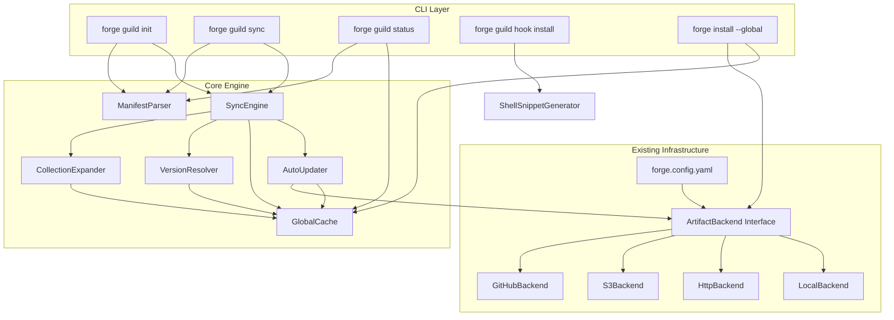

# Design Document: Team Mode Distribution

## Overview

Team Mode Distribution introduces a shared artifact distribution system under the `forge guild` command group. Rather than vendoring compiled artifacts into every repository, teams install artifacts into a global cache (`~/.forge/artifacts/`) and repos declare dependencies via a `.forge/manifest.yaml` file. The `forge guild` subcommands (`init`, `sync`, `status`, `hook`) handle manifest management, dependency resolution, materialization into harness-specific locations, and background auto-update with throttling.

The system builds on the existing `ArtifactBackend` interface and `forge.config.yaml` backend declarations, adding a manifest-driven resolution layer, collection expansion, and a global cache that decouples artifact storage from individual repositories.

### Key Design Decisions

1. **File-copy resolution (no symlinks)** — Materialized artifacts are copied into harness targets. This avoids Windows symlink permission issues and keeps each repo self-contained after sync.
2. **Manifest-level backend overrides** — Each manifest entry can specify its own backend, enabling mixed-source manifests (e.g., some artifacts from S3, others from GitHub).
3. **Collection expansion at resolve time** — Collection refs in the manifest are expanded into individual artifact refs during sync, not at parse time. This keeps the manifest compact while the sync-lock records the full expansion.
4. **Throttle-based auto-update** — Background update checks are gated by a timestamp file (`~/.forge/.last-sync`) to avoid hammering backends on every directory change.

## Architecture



### Module Breakdown

| Module | File | Responsibility |
|--------|------|----------------|
| `ManifestParser` | `src/guild/manifest.ts` | Parse/print `.forge/manifest.yaml`, Zod schema validation |
| `SyncEngine` | `src/guild/sync.ts` | Orchestrate resolve → expand → materialize pipeline |
| `CollectionExpander` | `src/guild/collection-expander.ts` | Expand collection refs into individual artifact refs using cached catalog metadata |
| `VersionResolver` | `src/guild/version-resolver.ts` | Semver matching against Global_Cache contents |
| `AutoUpdater` | `src/guild/auto-updater.ts` | Throttled remote version checks, download to Global_Cache |
| `GlobalCache` | `src/guild/global-cache.ts` | Read/write `~/.forge/artifacts/`, catalog metadata caching |
| `ShellSnippetGenerator` | `src/guild/hook-generator.ts` | Generate shell profile snippets for bash/zsh/fish/PowerShell |
| `GuildCLI` | `src/guild/cli.ts` | Commander subcommand registration for `forge guild` |

## Components and Interfaces

### ManifestParser

Responsible for parsing `.forge/manifest.yaml` into a typed `Manifest` object and serializing it back to YAML.

```typescript
// src/guild/manifest.ts
import { z } from "zod";
import { HarnessNameSchema } from "../schemas";

export const ManifestEntryModeSchema = z.enum(["required", "optional"]);

/** An individual artifact reference in the manifest. */
export const ArtifactManifestEntrySchema = z.object({
  name: z.string().min(1),
  version: z.string().min(1),
  mode: ManifestEntryModeSchema.default("required"),
  harnesses: z.array(HarnessNameSchema).optional(),
  backend: z.string().optional(),
});

/** A collection reference in the manifest. */
export const CollectionManifestEntrySchema = z.object({
  collection: z.string().min(1),
  version: z.string().min(1),
  mode: ManifestEntryModeSchema.default("required"),
  harnesses: z.array(HarnessNameSchema).optional(),
  backend: z.string().optional(),
});

export const ManifestEntrySchema = z.union([
  ArtifactManifestEntrySchema,
  CollectionManifestEntrySchema,
]);

export const ManifestSchema = z.object({
  backend: z.string().optional(),
  artifacts: z.array(ManifestEntrySchema).default([]),
}).passthrough(); // preserve unknown keys for forward-compat

export type ManifestEntry = z.infer<typeof ManifestEntrySchema>;
export type Manifest = z.infer<typeof ManifestSchema>;

/** Parse YAML string into a validated Manifest. */
export function parseManifest(yamlContent: string): Manifest;

/** Serialize a Manifest object to YAML string. */
export function printManifest(manifest: Manifest): string;

/** Check if a ManifestEntry is a collection reference. */
export function isCollectionRef(
  entry: ManifestEntry,
): entry is z.infer<typeof CollectionManifestEntrySchema>;
```

### GlobalCache

Manages the `~/.forge/artifacts/` directory structure and cached catalog metadata.

```typescript
// src/guild/global-cache.ts

export interface CachedArtifactMeta {
  name: string;
  version: string;
  backend: string;
  installedAt: string;
  harnesses: string[];
}

export interface GlobalCacheAPI {
  /** Root path of the global cache (platform-aware). */
  readonly root: string;

  /** List all versions of an artifact in the cache. */
  listVersions(artifactName: string): Promise<string[]>;

  /** Get the dist path for a specific artifact/version/harness. */
  distPath(artifactName: string, version: string, harness: string): string;

  /** Check if a specific artifact/version exists in the cache. */
  has(artifactName: string, version: string): Promise<boolean>;

  /** Store artifact files from a backend fetch into the cache. */
  store(
    artifactName: string,
    version: string,
    harness: string,
    sourceDir: string,
    backendLabel: string,
  ): Promise<void>;

  /** Read cached catalog metadata for a collection. */
  readCollectionCatalog(collectionName: string, version: string): Promise<CatalogEntry[]>;

  /** Write catalog metadata alongside cached artifact files. */
  writeCatalogMeta(collectionName: string, version: string, entries: CatalogEntry[]): Promise<void>;

  /** Read the throttle state timestamp. */
  readThrottleState(): Promise<Date | null>;

  /** Write the throttle state timestamp. */
  writeThrottleState(timestamp: Date): Promise<void>;
}
```

**Cache directory layout:**

```
~/.forge/
├── artifacts/
│   ├── <artifact-name>/
│   │   └── <version>/
│   │       ├── meta.json          # CachedArtifactMeta
│   │       └── dist/
│   │           ├── kiro/
│   │           ├── claude-code/
│   │           └── ...
│   └── collections/
│       └── <collection-name>/
│           └── <version>/
│               └── catalog.json   # cached member list
├── config.yaml                    # user-global config
└── .last-sync                     # throttle state timestamp
```

### SyncEngine

Orchestrates the full resolve → expand → materialize pipeline.

```typescript
// src/guild/sync.ts

export interface SyncOptions {
  manifestPath?: string;    // default: .forge/manifest.yaml
  autoUpdate?: boolean;
  throttleMinutes?: number; // default: 60
  dryRun?: boolean;
  harness?: string;
}

export interface SyncResult {
  resolved: ResolvedEntry[];
  warnings: string[];
  errors: string[];
  filesWritten: number;
}

export interface ResolvedEntry {
  name: string;
  version: string;
  source?: string;          // collection name if expanded from a collection
  harnesses: string[];
  mode: "required" | "optional";
}

export interface SyncLock {
  syncedAt: string;
  entries: SyncLockEntry[];
}

export interface SyncLockEntry {
  name: string;
  version: string;
  source?: string;          // collection name if from collection expansion
  harnesses: string[];
  backend: string;
}

/** Run the full sync pipeline. */
export async function sync(options: SyncOptions): Promise<SyncResult>;
```

**Sync pipeline steps:**

1. Parse manifest via `ManifestParser`
2. If `--auto-update`, run `AutoUpdater` (throttle-gated)
3. Expand collection refs via `CollectionExpander`
4. Merge expanded entries with individual entries (individual takes precedence)
5. Resolve versions via `VersionResolver` against `GlobalCache`
6. Materialize resolved artifacts into harness targets (file copy)
7. Write `.forge/sync-lock.json`
8. Update `.forge/.gitignore` with generated paths

### CollectionExpander

```typescript
// src/guild/collection-expander.ts

export interface ExpandedArtifact {
  name: string;
  version: string;
  mode: "required" | "optional";
  harnesses?: string[];
  backend?: string;
  source: string;           // originating collection name
}

/**
 * Expand a collection ref into individual artifact refs
 * by reading the collection's cached catalog metadata.
 */
export async function expandCollection(
  collectionName: string,
  version: string,
  mode: "required" | "optional",
  harnesses: string[] | undefined,
  backend: string | undefined,
  cache: GlobalCacheAPI,
): Promise<ExpandedArtifact[]>;
```

### VersionResolver

```typescript
// src/guild/version-resolver.ts

export interface ResolutionResult {
  name: string;
  requestedVersion: string;
  resolvedVersion: string | null;
  availableVersions: string[];
}

/**
 * Find the highest version in the cache that satisfies the version pin.
 * Supports exact versions ("1.2.3") and semver ranges ("^1.0.0", "~1.2.0").
 */
export function resolveVersion(
  artifactName: string,
  versionPin: string,
  availableVersions: string[],
): ResolutionResult;
```

### AutoUpdater

```typescript
// src/guild/auto-updater.ts

export interface AutoUpdateOptions {
  throttleMinutes: number;
  cache: GlobalCacheAPI;
  configBackends: Map<string, BackendConfig>;
}

/**
 * Check backends for newer versions and download to cache.
 * Respects throttle interval. Silently falls back on network failure.
 */
export async function autoUpdate(
  entries: ManifestEntry[],
  manifestBackend: string | undefined,
  options: AutoUpdateOptions,
): Promise<{ updated: string[]; skipped: boolean }>;
```

### ShellSnippetGenerator

```typescript
// src/guild/hook-generator.ts

export type ShellType = "bash" | "zsh" | "fish" | "powershell";

/**
 * Generate a shell snippet that auto-syncs on directory change.
 * The snippet detects .forge/manifest.yaml and runs
 * `forge guild sync --auto-update` in the background.
 */
export function generateHookSnippet(shell: ShellType): string;

/** Detect the current shell from SHELL env var. */
export function detectShell(): ShellType | null;
```

### GuildCLI Registration

```typescript
// src/guild/cli.ts
import { Command } from "commander";

/**
 * Register the `forge guild` command group on the root program.
 * Subcommands: init, sync, status, hook install
 */
export function registerGuildCommands(program: Command): void;
```

This function will be called from `src/cli.ts` to wire up the guild subcommands alongside existing commands.


## Data Models

### Manifest Schema (`.forge/manifest.yaml`)

```yaml
# .forge/manifest.yaml
backend: github                    # default backend for all entries
artifacts:
  - name: aws-security             # individual artifact ref
    version: "^1.0.0"
    mode: required
    harnesses: [kiro, claude-code]
    backend: internal-s3            # per-entry override

  - collection: neon-caravan        # collection ref
    version: "~0.3.0"
    mode: required

  - name: code-review-checklist
    version: "1.2.0"               # exact pin
    mode: optional
```

### Sync Lock (`.forge/sync-lock.json`)

```json
{
  "syncedAt": "2025-01-15T10:30:00Z",
  "entries": [
    {
      "name": "aws-security",
      "version": "1.2.3",
      "harnesses": ["kiro", "claude-code"],
      "backend": "internal-s3"
    },
    {
      "name": "prompt-engineering",
      "version": "0.3.1",
      "source": "neon-caravan",
      "harnesses": ["kiro", "claude-code", "cursor"],
      "backend": "github"
    }
  ]
}
```

### Global Cache Metadata (`~/.forge/artifacts/<name>/<version>/meta.json`)

```json
{
  "name": "aws-security",
  "version": "1.2.3",
  "backend": "internal-s3",
  "installedAt": "2025-01-14T08:00:00Z",
  "harnesses": ["kiro", "claude-code", "cursor", "copilot"]
}
```

### Throttle State (`~/.forge/.last-sync`)

Plain text file containing an ISO 8601 timestamp:

```
2025-01-15T10:30:00Z
```

### Harness Target Mapping

Materialized artifacts are placed in harness-specific directories. The mapping extends the existing `HARNESS_INSTALL_PATHS` from `src/install.ts`:

| Harness | Target Directory |
|---------|-----------------|
| `kiro` | `.kiro/` |
| `claude-code` | `.` (root, e.g., `.claude/`) |
| `cursor` | `.` (root, e.g., `.cursor/`) |
| `windsurf` | `.` (root, e.g., `.windsurf/`) |
| `copilot` | `.` (root, e.g., `.github/`) |
| `cline` | `.` (root, e.g., `.clinerules/`) |
| `qdeveloper` | `.` (root, e.g., `.q/`) |

Each artifact is materialized into its own subdirectory within the harness target to prevent file collisions when multiple manifest entries target the same harness.

### Zod Schema Definitions

The manifest schema uses Zod for validation, consistent with the existing `src/schemas.ts` patterns:

```typescript
// Discriminated by presence of 'name' vs 'collection' field
// Uses z.union with refinement to ensure mutual exclusivity

const ManifestEntryBaseSchema = z.object({
  version: z.string().min(1),
  mode: z.enum(["required", "optional"]).default("required"),
  harnesses: z.array(HarnessNameSchema).optional(),
  backend: z.string().optional(),
});

// Validation: entry must have exactly one of 'name' or 'collection'
// Unknown harness names emit warnings (not errors) per Req 3.5
```

### Integration Points

1. **`forge install --global`** — Extends the existing `install.ts` with a `--global` flag that routes to `GlobalCache.store()` instead of the local harness install paths.
2. **`forge.config.yaml`** — The existing `loadForgeConfig()` and `resolveBackendConfigs()` from `src/config.ts` are reused to resolve backend names in manifest entries.
3. **`ArtifactBackend` interface** — `fetchCatalog()`, `fetchArtifact()`, and `listVersions()` are called by `AutoUpdater` and `forge install --global` without modification.
4. **`src/cli.ts`** — `registerGuildCommands()` is called to add the `forge guild` command group alongside existing commands.


## Correctness Properties

*A property is a characteristic or behavior that should hold true across all valid executions of a system — essentially, a formal statement about what the system should do. Properties serve as the bridge between human-readable specifications and machine-verifiable correctness guarantees.*

### Property 1: Manifest round-trip

*For any* valid Manifest object, serializing it to YAML via `printManifest` and then parsing the result via `parseManifest` SHALL produce a Manifest object that is deeply equal to the original.

**Validates: Requirements 3.1, 3.2, 3.3**

### Property 2: Unknown top-level keys are preserved

*For any* valid Manifest object augmented with arbitrary additional top-level keys, parsing the printed YAML SHALL preserve all unknown keys in the resulting object.

**Validates: Requirements 3.4**

### Property 3: Mutual exclusivity of name and collection

*For any* manifest entry object that has both a `name` field and a `collection` field set, the manifest parser SHALL reject the entry with a validation error.

**Validates: Requirements 2.3, 2.11**

### Property 4: Unrecognized harness graceful degradation

*For any* manifest entry containing a mix of recognized and unrecognized harness names, parsing SHALL succeed, the result SHALL contain only the recognized harness names, and a warning SHALL be emitted for each unrecognized name.

**Validates: Requirements 3.5**

### Property 5: Version resolution picks highest satisfying version

*For any* non-empty list of semver version strings and any valid semver range pin, `resolveVersion` SHALL return the highest version that satisfies the range, or null if no version satisfies it.

**Validates: Requirements 5.2**

### Property 6: Mode-dependent sync behavior for missing artifacts

*For any* manifest entry whose artifact is not present in the Global_Cache, if the entry's mode is `required` then sync SHALL produce a fatal error for that entry, and if the mode is `optional` then sync SHALL emit a warning and continue without error.

**Validates: Requirements 2.4, 2.5, 5.8, 5.9**

### Property 7: Backend resolution precedence chain

*For any* combination of entry-level backend, manifest-level backend, and config-level default backend, the resolved backend for a manifest entry SHALL be the first non-undefined value in the order: entry-level → manifest-level → config-level.

**Validates: Requirements 2.9, 12.1**

### Property 8: Collection expansion with setting inheritance

*For any* collection ref with mode M, harnesses H, and backend B, and a collection with N members, expansion SHALL produce exactly N artifact refs, each with mode M, harnesses H, and backend B.

**Validates: Requirements 5.3, 11.1, 11.2**

### Property 9: Individual entry takes precedence over collection-inherited

*For any* manifest where artifact X is both individually declared (with settings S₁) and a member of a referenced collection (with inherited settings S₂), the resolved settings for X SHALL equal S₁.

**Validates: Requirements 11.3**

### Property 10: Sync-lock records collection source

*For any* artifact that was resolved via collection expansion, its sync-lock entry SHALL contain a `source` field equal to the originating collection name.

**Validates: Requirements 11.4**

### Property 11: Idempotent global install

*For any* artifact name and version that already exists in the Global_Cache, calling global install for the same name and version SHALL not modify the cached files and SHALL return a skip/already-cached result.

**Validates: Requirements 1.4**

### Property 12: Version coexistence in global cache

*For any* artifact name with version A already in the Global_Cache, installing version B (where A ≠ B) SHALL result in both versions A and B being present in the cache.

**Validates: Requirements 1.5**

### Property 13: Cache path construction

*For any* valid artifact name, version string, and harness name, the constructed cache path SHALL match the pattern `<cache-root>/artifacts/<name>/<version>/dist/<harness>/`.

**Validates: Requirements 1.6**

### Property 14: Artifact isolation in harness targets

*For any* two distinct artifacts materialized to the same harness target, their materialized file paths SHALL not overlap (each artifact occupies its own subdirectory).

**Validates: Requirements 5.10**

### Property 15: Throttle skips remote check within interval

*For any* current timestamp and last-sync timestamp where the elapsed time is less than the configured throttle interval, the auto-updater SHALL skip the remote version check and resolve from the existing cache.

**Validates: Requirements 6.4**

### Property 16: Shell snippet contains required elements

*For any* supported shell type, the generated hook snippet SHALL contain (a) a check for the presence of `.forge/manifest.yaml`, (b) an invocation of `forge guild sync --auto-update`, and (c) output redirection to suppress all stdout/stderr.

**Validates: Requirements 7.2, 7.3**

### Property 17: Path normalization to forward slashes

*For any* file path string (including those containing backslash separators), the normalized path written to manifest or sync-lock files SHALL contain only forward slashes as separators.

**Validates: Requirements 8.3**

### Property 18: Init updates existing entry without duplication

*For any* manifest already containing an entry for artifact X, running guild init for X with new settings SHALL result in exactly one entry for X in the manifest, with the updated settings.

**Validates: Requirements 4.10**

### Property 19: Unsatisfied version pin error content

*For any* artifact name, version pin, and set of available versions where no version satisfies the pin, the error message SHALL contain the artifact name, the requested version pin, and at least one available version (if any exist).

**Validates: Requirements 9.1**

## Error Handling

### Error Categories

| Category | Behavior | Example |
|----------|----------|---------|
| **Manifest parse error** | Fatal, exit 1. Display line/column from YAML parser. | Malformed YAML in `.forge/manifest.yaml` |
| **Manifest validation error** | Fatal, exit 1. List invalid entries. | Entry missing both `name` and `collection` |
| **Required artifact missing** | Fatal, exit 1. List unresolved artifacts with version pin and available versions. | `forge guild sync` with missing required artifact |
| **Optional artifact missing** | Warning, continue. | `forge guild sync` with missing optional artifact |
| **Backend unreachable (install)** | Fatal, exit 1. Display backend name and connection error. | `forge install --global` with unreachable GitHub |
| **Backend unreachable (auto-update)** | Silent fallback to cache. Debug-level log. | `forge guild sync --auto-update` with no network |
| **Unknown backend name** | Fatal, exit 1. List unknown name and available backends. | Manifest references undefined backend |
| **Unknown harness name** | Warning, skip harness. Continue with recognized harnesses. | Manifest entry lists future harness name |
| **Stale sync-lock** | Re-resolve from available versions. Warning if resolution changes. | Cached version deleted after sync-lock written |
| **Shell detection failure** | Fatal, exit 1. Ask user to specify `--shell`. | No `SHELL` env var on non-Windows system |

### Error Message Format

All error messages follow the pattern:
```
Error: <component>: <description>
  <context details>
  <suggested action>
```

Example:
```
Error: guild sync: Cannot resolve "aws-security" — no version satisfies "^2.0.0"
  Available versions in cache: 1.0.0, 1.2.3, 1.5.0
  Run `forge install --global aws-security --from-release v2.0.0` to install a matching version.
```

## Testing Strategy

### Property-Based Tests (fast-check)

The project already uses `fast-check` (listed in `devDependencies`). Each correctness property maps to a single property-based test with a minimum of 100 iterations.

**Tag format:** `Feature: team-mode-distribution, Property {N}: {title}`

| Property | Module Under Test | Generator Strategy |
|----------|------------------|--------------------|
| 1 (Round-trip) | `ManifestParser` | Generate random `Manifest` objects with 0–10 entries, mix of artifact/collection refs, random version pins, random harness subsets |
| 2 (Unknown keys) | `ManifestParser` | Extend Property 1 generator with random extra top-level keys |
| 3 (Mutual exclusivity) | `ManifestParser` | Generate entries with both `name` and `collection` set |
| 4 (Harness degradation) | `ManifestParser` | Generate entries with mix of valid harness names and random strings |
| 5 (Version resolution) | `VersionResolver` | Generate lists of 1–20 semver strings and random semver range pins |
| 6 (Mode behavior) | `SyncEngine` | Generate entries with random mode and empty mock cache |
| 7 (Backend precedence) | `SyncEngine` | Generate 3-tuple of optional backend strings |
| 8 (Collection expansion) | `CollectionExpander` | Generate collections with 1–15 members, random mode/harness/backend |
| 9 (Individual precedence) | `SyncEngine` | Generate manifests with overlapping individual + collection entries |
| 10 (Sync-lock source) | `SyncEngine` | Generate collection-expanded sync results |
| 11 (Idempotent install) | `GlobalCache` | Generate random artifact names and versions |
| 12 (Version coexistence) | `GlobalCache` | Generate pairs of distinct versions |
| 13 (Cache path) | `GlobalCache` | Generate random names, versions, harness names |
| 14 (Artifact isolation) | `SyncEngine` | Generate pairs of distinct artifact names targeting same harness |
| 15 (Throttle) | `AutoUpdater` | Generate pairs of timestamps with configurable intervals |
| 16 (Shell snippet) | `ShellSnippetGenerator` | Enumerate shell types, verify substring containment |
| 17 (Path normalization) | Path utilities | Generate paths with mixed separators |
| 18 (Init no-dup) | `GuildInit` | Generate manifests with existing entries, run init with new settings |
| 19 (Error content) | `VersionResolver` | Generate artifact names, pins, and version lists with no match |

### Unit Tests (example-based)

- Manifest schema validation: valid/invalid entries, defaults, edge cases
- CLI flag parsing for `guild init`, `guild sync`, `guild status`, `guild hook install`
- Shell snippet generation for each shell type (bash, zsh, fish, PowerShell)
- Platform-specific cache path resolution
- Dry-run mode produces no file writes
- Stale sync-lock re-resolution

### Integration Tests

- Full `forge install --global` → `forge guild init` → `forge guild sync` pipeline with mock backends
- Collection expansion end-to-end with mock catalog data
- Auto-update with mock backend returning newer versions
- Offline sync (no network, cache-only resolution)
- `.gitignore` management during init and sync
- `forge guild status` output formatting

### Test File Organization

```
skill-forge/src/guild/__tests__/
├── manifest.test.ts              # Properties 1–4, schema unit tests
├── manifest.property.test.ts     # PBT for manifest round-trip and validation
├── version-resolver.test.ts      # Property 5, 19, unit tests
├── sync.test.ts                  # Properties 6, 9, 10, 14, integration
├── collection-expander.test.ts   # Property 8
├── auto-updater.test.ts          # Property 15, throttle tests
├── global-cache.test.ts          # Properties 11, 12, 13
├── hook-generator.test.ts        # Property 16
├── path-utils.test.ts            # Property 17
├── guild-init.test.ts            # Property 18, CLI integration
└── backend-resolver.test.ts      # Property 7
```
