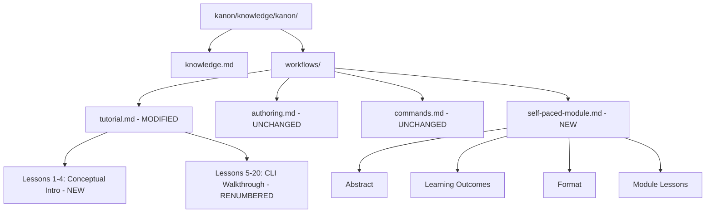

# Design Document: Tutorial Expansion

## Overview

This design describes how four new introductory lessons are prepended to the existing Kanon tutorial and how a standalone "Self-paced Module on Coding Agents and Skill Creation" document is added as a new workflow file within the Kanon knowledge artifact. The expansion targets Johns Hopkins University Libraries staff who lack development backgrounds, providing conceptual foundations about coding agents, skills, and harnesses before the CLI-focused lessons begin.

### Key Design Decisions

1. **In-place expansion**: New lessons are inserted at the beginning of `tutorial.md`, and existing lessons are renumbered (old Lesson 1 becomes Lesson 5, etc.) rather than creating a separate "intro" file. This preserves the single-document navigation experience.
2. **Self-paced Module as a new workflow file**: The module lives at `kanon/knowledge/kanon/workflows/self-paced-module.md` — co-located with existing workflows (`tutorial.md`, `authoring.md`, `commands.md`) so the Kanon build system automatically discovers and includes it.
3. **No code in introductory lessons**: Lessons 1–4 use only plain-language descriptions, analogies, and tables — no code fences, no inline code, no CLI references. This creates a clear pedagogical boundary between "understanding" (Lessons 1–4) and "doing" (Lessons 5–20).
4. **Renumbering offset of +4**: All existing lessons shift by exactly 4 positions. Old Lesson 1 (Setup & Verification) becomes Lesson 5, old Lesson 16 (Next Steps) becomes Lesson 20.

## Architecture

The expansion modifies two knowledge artifacts within the Kanon power (`kanon/knowledge/kanon/`):



### File Change Summary

| File | Action | Description |
|------|--------|-------------|
| `workflows/tutorial.md` | Modify | Prepend 4 lessons, renumber existing 16 → 5-20, update ToC and Lesson Index |
| `workflows/self-paced-module.md` | Create | New standalone educational document |
| `knowledge.md` | Modify | Add entry for the self-paced module in the "Available Steering Files" table |

## Components and Interfaces

### Component 1: Tutorial Expansion (tutorial.md)

#### Structure After Expansion

```
# Kanon Tutorial
## How to Use This Tutorial (updated intro text)
## Table of Contents (20 entries, links updated)
## Lesson Index (by Command) (links renumbered)
---
## Lesson 1: What Are Coding Agents? [NEW]
## Lesson 2: Understanding Skills and Artifact Types [NEW]
## Lesson 3: How Harnesses Work [NEW]
## Lesson 4: Getting Started with Skill Creation [NEW]
## Lesson 5: Setup & Verification [was Lesson 1]
## Lesson 6: The Guided Tutorial Command [was Lesson 2]
...
## Lesson 20: Next Steps [was Lesson 16]
```

#### New Lesson Format

Each new lesson follows the existing format established by the tutorial:

```markdown
## Lesson N: Title

**Goal:** One-sentence goal statement.

### Section Heading

Content body (plain-language for Lessons 1-4, may include code for Lessons 5+).

### Checkpoint

- [ ] Self-assessment item 1
- [ ] Self-assessment item 2

**Next:** [Lesson N+1](#lesson-n1-title)
```

#### Lesson 1: What Are Coding Agents?

| Element | Content |
|---------|---------|
| Goal | Understand what coding agents are and how they use context |
| Sections | Definition via analogy, how context shapes responses, before/after example |
| Key terms introduced | Coding Agent, context, Skill, Harness |
| Constraints | No code, no CLI, no API references |

#### Lesson 2: Understanding Skills and Artifact Types

| Element | Content |
|---------|---------|
| Goal | Learn what skills are and how they differ from other artifact types |
| Sections | Skill definition, 8 artifact types table (≤150 chars each), decision criteria, JHU scenarios, common misclassification |
| Key terms introduced | All 8 artifact types |
| Constraints | No code, decision criteria use observable use-case characteristics |

#### Lesson 3: How Harnesses Work

| Element | Content |
|---------|---------|
| Goal | Understand why Kanon compiles to multiple formats |
| Sections | Harness definition, "author once, compile to many" principle, supported harness list, side-by-side comparison (≥2 harnesses), explicit "no harness syntax needed" statement |
| Key terms introduced | Compilation target, format translation |
| Constraints | No internal pipeline references, no file-system paths, no source code |

#### Lesson 4: Getting Started with Skill Creation

| Element | Content |
|---------|---------|
| Goal | Bridge from concepts to hands-on authoring |
| Sections | Recap of Lessons 1-3, three-step overview (scaffold→edit→build) with lesson references, "You Are Ready" checklist (3-5 "I can…" items), next-steps pointers to Authoring Guide and Lesson 5 |
| Key terms introduced | None new — consolidation lesson |
| Constraints | May reference lesson numbers but no code |

### Component 2: Table of Contents & Lesson Index Updates

#### Table of Contents Transformation

The ToC table grows from 16 to 20 rows. Each row follows the format:

```
| # | [Lesson Title](#heading-id) | Covers |
```

Heading IDs are auto-generated from the lesson title following standard Markdown slug rules (lowercase, spaces→hyphens, strip special chars).

#### Lesson Index Transformation

The command-based index retains the same commands but updates all lesson references by +4:

| Original Reference | New Reference |
|-------------------|---------------|
| Lesson 1 (Setup) | Lesson 5 |
| Lesson 2 (Tutorial cmd) | Lesson 6 |
| ... | ... |
| Lesson 16 (Next Steps) | Lesson 20 |

New lessons (1-4) are conceptual and contain no commands, so they do not appear in the Lesson Index.

#### Next-Link Chain

Every lesson's `**Next:**` link is updated to form a contiguous chain:
- Lesson 1 → Lesson 2 → Lesson 3 → Lesson 4 → Lesson 5 → ... → Lesson 20

### Component 3: Self-Paced Module (self-paced-module.md)

#### Document Structure

```markdown
# Self-paced Module on Coding Agents and Skill Creation

## Abstract
(50-150 words: three topics, audience, no-programming prerequisite, time estimate)

## Learning Outcomes
(5-8 outcomes with Bloom's taxonomy verbs, levels 1-4)

## Self-Assessment Checklist
(Maps each outcome to ≥1 demonstration activity)

## Format
(Self-paced, CLI exercises, time range 2-4 hours, sequential with checkpoints, Markdown artifact, prerequisites)

## Module Lessons
### Module Lesson 1: Understanding Coding Agents
### Module Lesson 2: Skills and Knowledge Artifacts
### Module Lesson 3: The Harness Ecosystem
### Module Lesson 4: Scaffolding Your First Skill
### Module Lesson 5: Editing and Validating
### Module Lesson 6: Building and Installing
```

#### Relationship to Tutorial

The Module is a deeper, more structured educational experience that complements (but does not duplicate) the tutorial:

| Aspect | Tutorial (Lessons 1-4) | Self-Paced Module |
|--------|----------------------|-------------------|
| Depth | Overview/introduction | Full educational module |
| Format | Sequential lessons, quick checkpoints | Formal outcomes, detailed checkpoints, self-assessment |
| Audience framing | Part of CLI tutorial | Standalone learning document |
| Completion time | ~15-30 min for Lessons 1-4 | 2-4 hours total |
| Hands-on | None (conceptual only) | CLI exercises included |

### Component 4: knowledge.md Updates

The `Available Steering Files` table in `knowledge.md` gains one new row:

```markdown
| **self-paced-module** | `/module` or ask "show me the self-paced module" | Structured educational module on coding agents and skill creation — covers concepts through hands-on exercises with formal learning outcomes |
```

The tutorial description is also updated to reflect the new lesson count (20 lessons) and mention the introductory conceptual content.

## Data Models

### Tutorial Lesson Structure

Each lesson in `tutorial.md` follows this structural schema:

```
Lesson:
  number: integer (1-20, contiguous, unique)
  title: string (appears in ## heading and ToC)
  heading_id: string (auto-slug of "lesson-{number}-{title-slug}")
  goal: string (one sentence after **Goal:**)
  body: markdown content (sections with ### headings)
  checkpoint: list of checklist items (- [ ] format)
  next_link: anchor reference to lesson number+1 (null for last lesson)
  contains_code: boolean (false for lessons 1-4, true/false for 5-20)
```

### Table of Contents Entry

```
ToCEntry:
  number: integer (matches lesson number)
  title: string (matches lesson title)
  anchor: string (matches lesson heading_id)
  covers: string (brief description of lesson content)
```

### Lesson Index Entry

```
IndexEntry:
  command: string (e.g., "kanon build")
  lesson_anchor: string (points to lesson containing that command)
```

### Self-Paced Module Learning Outcome

```
LearningOutcome:
  id: integer (1-based sequential)
  verb: string (Bloom's taxonomy level 1-4)
  statement: string (full outcome text starting with verb)
  demonstration_activities: list of strings (≥1 observable activity)
```

### Artifact Type Description

```
ArtifactTypeEntry:
  name: string (one of 8 types)
  description: string (≤150 chars, one sentence, distinct purpose)
```

## Correctness Properties

*A property is a characteristic or behavior that should hold true across all valid executions of a system — essentially, a formal statement about what the system should do. Properties serve as the bridge between human-readable specifications and machine-verifiable correctness guarantees.*

### Property 1: Conceptual lessons contain no code

*For any* content section within Lessons 1 through 4 of the tutorial, the text SHALL contain no Markdown code fences (triple backticks), no inline code (single backticks), no CLI command references (e.g., patterns matching `bun run`, `kanon`, `npm`), and no programming syntax.

**Validates: Requirements 1.2, 1.4, 1.5**

### Property 2: Artifact type descriptions are concise and singular

*For any* artifact type description in the Lesson 2 artifact types table, the description SHALL have a character count of at most 150 and SHALL contain exactly one sentence (exactly one terminal period, exclamation mark, or question mark at the end).

**Validates: Requirements 2.2**

### Property 3: Checklist items use self-assessable phrasing

*For any* item in the "You Are Ready" checklist in Lesson 4, the item text SHALL begin with the phrase "I can" and the total number of items SHALL be between 3 and 5 inclusive.

**Validates: Requirements 4.3**

### Property 4: Module abstract word count is within bounds

*For any* rendering of the Module Abstract section, the word count SHALL be at least 50 and at most 150.

**Validates: Requirements 5.1**

### Property 5: Learning outcomes use Bloom's taxonomy verbs

*For any* learning outcome in the Module Learning Outcomes section, the first word SHALL be a recognized action verb from Bloom's taxonomy levels 1 through 4 (Remember, Understand, Apply, Analyze), and the total number of outcomes SHALL be between 5 and 8 inclusive.

**Validates: Requirements 6.1**

### Property 6: Learning outcomes have demonstration activities

*For any* learning outcome listed in the Module, there SHALL exist at least one corresponding entry in the self-assessment checklist that maps to an observable demonstration activity for that outcome.

**Validates: Requirements 6.7**

### Property 7: Table of Contents anchor integrity

*For any* entry in the Tutorial Table of Contents, the anchor link SHALL match the Markdown heading ID of the corresponding lesson section in the document, and every lesson heading in the document SHALL have exactly one corresponding ToC entry.

**Validates: Requirements 8.1, 8.5**

### Property 8: Contiguous lesson numbering

*For any* expanded Tutorial document, the set of lesson numbers SHALL form a contiguous sequence starting at 1 with no gaps and no duplicates, where the total count equals the number of lesson sections in the document.

**Validates: Requirements 8.2**

### Property 9: Lesson format consistency

*For any* lesson section in the Tutorial (including new lessons 1-4), the lesson SHALL contain: (a) a `**Goal:**` statement, (b) body content with at least one subsection, (c) a `### Checkpoint` subsection with at least one checklist item, and (d) a `**Next:**` link (except for the final lesson).

**Validates: Requirements 8.3**

### Property 10: Command index references correct lessons

*For any* command entry in the Lesson Index, the referenced lesson anchor SHALL point to a lesson section that contains instructional content about that specific command.

**Validates: Requirements 8.6**

### Property 11: Next-link chain integrity

*For any* lesson at position N in the Tutorial (where N is not the last lesson), the `**Next:**` link SHALL reference the heading ID of lesson N+1 in the sequence.

**Validates: Requirements 8.7**

## Error Handling

Since this feature involves static Markdown content authoring rather than runtime software, "errors" are content-quality violations detectable during validation:

| Error Condition | Detection Method | Resolution |
|----------------|-----------------|------------|
| Code syntax in Lessons 1-4 | Regex scan for backticks, CLI patterns | Remove code, replace with plain-language description |
| Broken anchor link in ToC | Parse headings, verify each ToC anchor resolves | Regenerate heading ID from lesson title |
| Non-contiguous lesson numbers | Extract all `## Lesson N` headings, check sequence | Renumber from 1 |
| Missing lesson format element | Parse each lesson for Goal/Checkpoint/Next | Add missing element following template |
| Artifact description > 150 chars | Character count per description cell | Shorten description |
| Module abstract outside word bounds | Word count of Abstract section | Edit to fit 50-150 words |
| Learning outcome missing Bloom's verb | Check first word against verb list | Rewrite outcome with appropriate verb |
| Orphaned Next link (points to nonexistent lesson) | Resolve all Next anchors against heading list | Update link target |

### Content Validation Strategy

A validation script (or manual checklist) should verify all correctness properties before the content is merged. This can be implemented as:

1. **Markdown parsing**: Use a Markdown AST parser to extract headings, links, code blocks, and table cells
2. **Regex checks**: Scan for code patterns in restricted zones (Lessons 1-4)
3. **Structural checks**: Verify each lesson has required components
4. **Cross-reference checks**: Ensure ToC ↔ headings ↔ Next links ↔ Index all agree

## Testing Strategy

### Unit Tests (Example-Based)

Unit tests verify specific concrete requirements:

- **Lesson ordering**: Verify "What Are Coding Agents?" appears as Lesson 1
- **Harness list completeness**: Verify all 7 harness names appear in Lessons 1 and 3
- **Scenario content**: Verify JHU-relevant scenarios in Lesson 2 mention cataloging/metadata
- **Module abstract topics**: Verify the abstract mentions all three topics (agents, skills, creation)
- **Prerequisites statement**: Verify "no prior programming experience" appears in the module
- **Side-by-side comparison**: Verify at least 2 harnesses shown with output format categories

### Property-Based Tests

Property-based tests verify universal properties across all content using a Markdown parser:

- **Property 1**: Generate content variants → verify no code in conceptual lessons
- **Property 2**: For each artifact type row → verify ≤150 chars and 1 sentence
- **Property 3**: For each checklist item → verify "I can" prefix and count bounds
- **Property 4**: Parse abstract → verify word count bounds
- **Property 5**: For each outcome → verify Bloom's verb start and count bounds
- **Property 6**: For each outcome → verify mapped activity exists
- **Property 7**: For each ToC entry → verify anchor resolves to heading
- **Property 8**: Extract lesson numbers → verify contiguous sequence
- **Property 9**: For each lesson → verify Goal + Checkpoint + Next present
- **Property 10**: For each index entry → verify command appears in target lesson
- **Property 11**: For each lesson N → verify Next points to N+1

### Testing Library

**Recommended**: Use `fast-check` (TypeScript/JavaScript property-based testing library) since the Kanon project uses Bun/TypeScript.

**Configuration**: Minimum 100 iterations per property test.

**Tag format**: `Feature: tutorial-expansion, Property {N}: {property_text}`

### Integration Tests

- **Full document parse**: Load the complete expanded `tutorial.md`, parse it into an AST, and run all structural validations
- **Build pipeline**: Run `kanon build` and verify the expanded tutorial compiles without errors for all harnesses
- **Navigation test**: Verify that each ToC link and each Next link resolves to actual content in the rendered output
